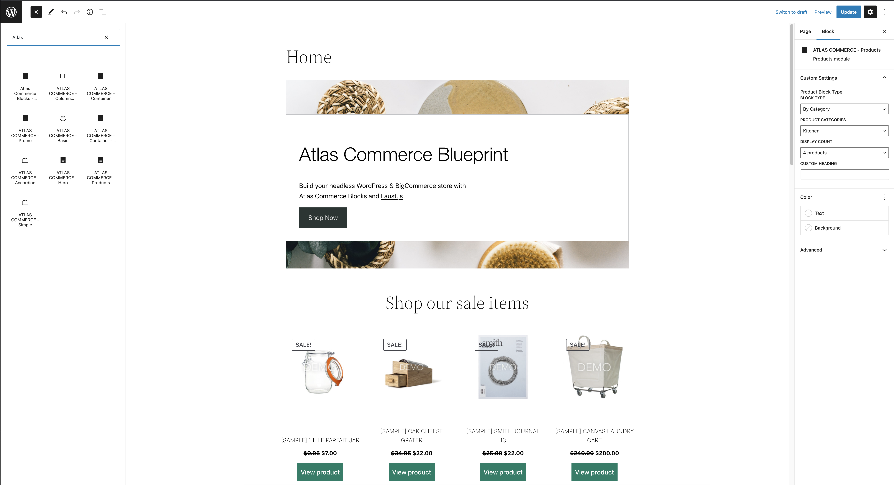

**Note**: These tutorials assume that you have already [configured the plugin with your BigCommerce API Account credentials](connecting-bigcommerce.mdx) and [performed a product sync](performing-sync.mdx).

**Atlas Commerce Blocks** lets you place products synced from BigCommerce in your WordPress content using the WordPress editor. Using the familiar blocks editor, you can build pages and posts with promo banners, accordions, product content with various configurations and more.

## Install the Atlas Commerce Connector plugin

Atlas Commerce Blocks comes pre-installed with the Atlas Commerce Blueprint option via our User Portal and via WP Local.

- Check out the demo of [Atlas Commerce Blueprint](https://atlascommerce.wpengine.com/)
- Try out a [sandbox version of Atlas](https://wpengine.com/atlas/#atlasplans) where you can install Atlas Commerce Blueprint

## Available Blocks

Choose from a variety of blocks by accessing the block editor and searching **Atlas**. This will bring up the available blocks that are connected to your BigCommerce products. Build promo banners, accordions, product content with various configurations and more.

### Troubleshooting

---

1. If there are no products showing when using the product blocks, please ensure you have [performed an up to date sync](tutorial/performing-product-sync.mdx).
