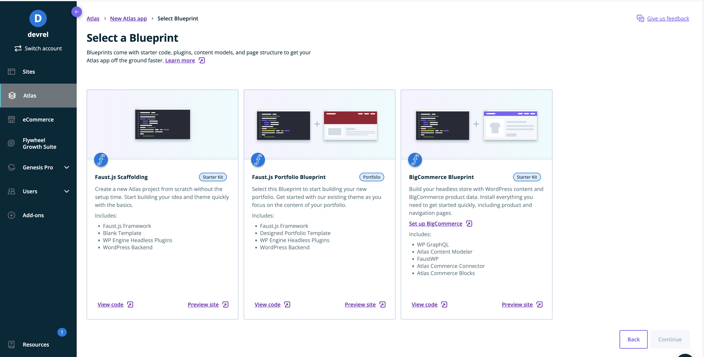
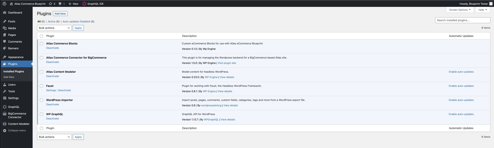

**Note**: This documentation assumes that you have already chosen and deployed the [Atlas Commerce Blueprint via our User Portal](https://developers.wpengine.com/docs/atlas/getting-started/blueprint-repository)

**Atlas Commerce Connector for BigCommerce** lets you sync product data from BigCommerce into WordPress. Using an intuitive interface, you can connect BigCommerce API Accounts to WordPress, sync your product data and use them as blocks when working in the WordPress editor or custom post types in WPGraphQL when working with headless.

## Install the Atlas Commerce Connector plugin

Atlas Commerce Connector for BigCommerce comes pre-installed with the **Atlas Commerce Blueprint** option via our User Portal and via WP Local.

- Check out the demo of [Atlas Commerce Blueprint](https://atlascommerce.wpengine.com/)
- Try out a [sandbox version of Atlas](https://wpengine.com/atlas/#atlasplans) where you can install Atlas Commerce Blueprint
