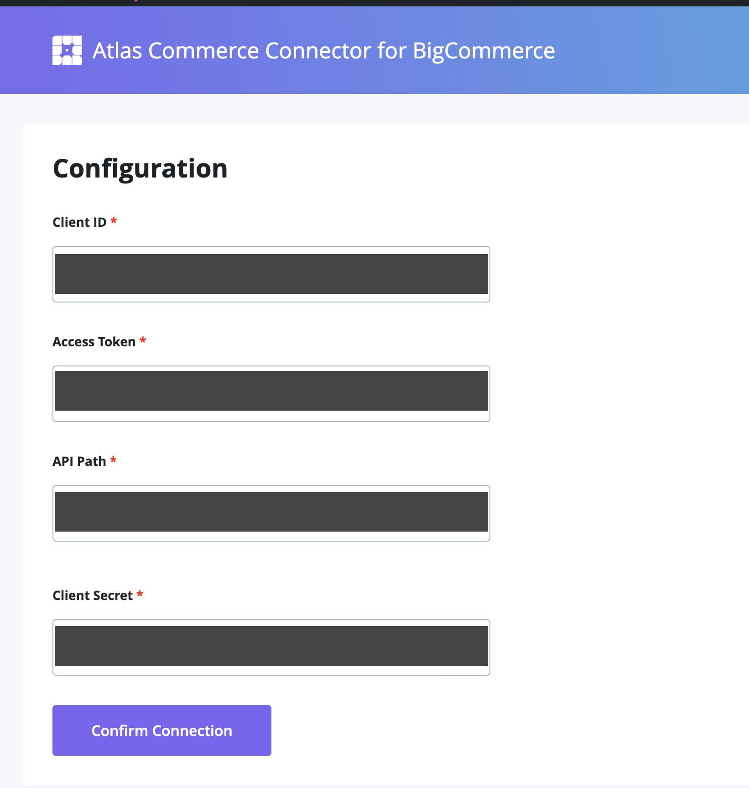

**Note**: These tutorials assume that you have already chosen and deployed the [Atlas Commerce Blueprint via our User Portal](https://developers.wpengine.com/docs/atlas/getting-started/blueprint-repository)

## Create an API Account in BigCommerce

In order to perform a sync you will first need to have an API Account created in BigCommerce which will provide you with the necessary credentials to use on the plugin admin configuration screen.

API Accounts can be used from existing BigCommerce Accounts or from trial accounts.

- [BigCommerce documentation on creating API Accounts](https://support.bigcommerce.com/s/article/Store-API-Accounts?language=en_US)
- [Setup a BigCommerce trial store](https://www.bigcommerce.com/essentials/free-trial/)

### Connect your BigCommerce API Account to WordPress

---

1. Navigate to the `Configuration` menu item under `BigCommerce Connection` option in the WP Admin toolbar.

   

2. Once you have entered the credentials you need to confirm the connection by clicking `Confirm Connection`. This is ensuring the plugin is communicating successfully with your BigCommerce API Account.

**Next step:** [Performing Product Sync](../tutorial/performing-product-sync.mdx)

### Troubleshooting

---

1. If there is an error connecting to your API Account please make sure your **Access Token** is correct.
