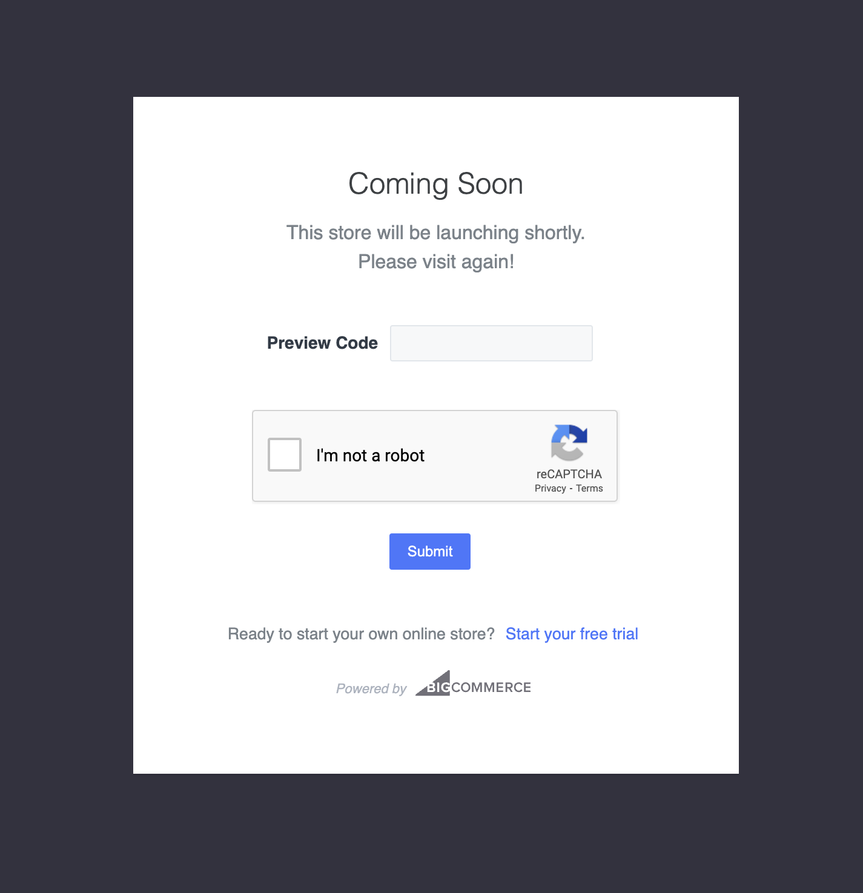
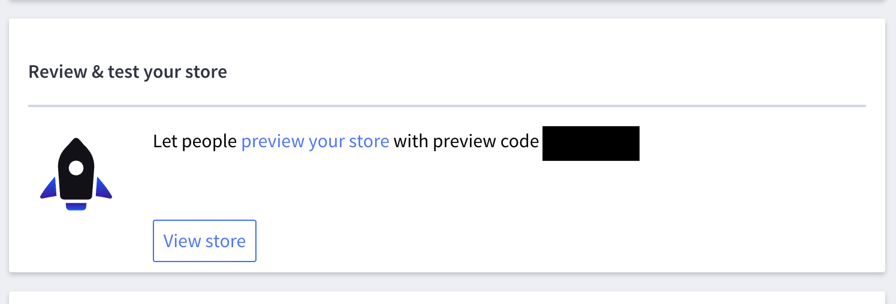

**Note**: These tutorials assume that you have already chosen and deployed the [Atlas Commerce Blueprint via our User Portal](https://developers.wpengine.com/docs/atlas/getting-started/blueprint-repository) and [configured the plugin with your BigCommerce API Account credentials](../tutorial/connecting-bigcommerce.mdx).

## Publishing the checkout page

By default your BigCommerce [stencil storefront](https://developer.bigcommerce.com/stencil-docs/ZG9jOjIyMDY5Nw-about-stencil) will be inactive and in maintenance mode after setting up a trial store.
In order to allow customers to go to the checkout page hosted on this stencil theme from the headless WordPress site you will need to provide a **preview code** which can be aquired from the BigCommerce admin.

You can also publish your stencil theme in BigCommerce by going to **Channel Manager** and making your store active.

## Linking back to your headless cart from the BigCommerce checkout page

The default checkout functionality in the headless WordPress Blueprint is to take the user to the BigCommerce checkout hosted on the stencil theme with BigCommerce.
On this page there is a link back to edit the cart which will go to the url of the stencil them in BigCommerce and not the headless WordPress site the user came from via this Blueprint.

You will need to manually change this link back to your eCommerce Blueprint by [editing the stencil theme in BigCommerce directly](https://support.bigcommerce.com/articles/Learning/Personalizing-your-New-Theme).

- [BigCommerce Stencil documentation](https://developer.bigcommerce.com/stencil-docs/ZG9jOjIyMDY5Nw-about-stencil)
