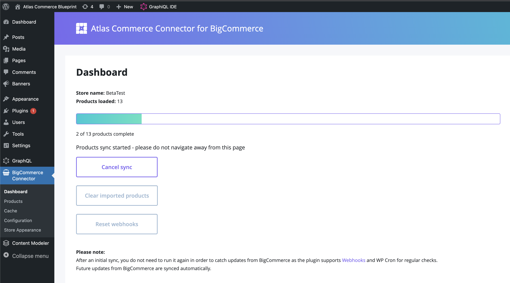
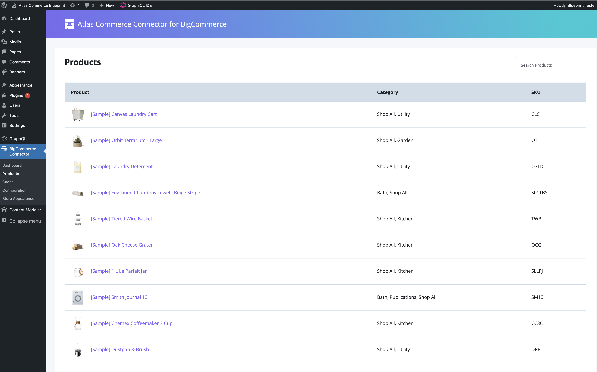
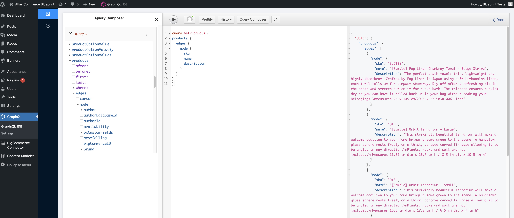

**Note**: These tutorials assume that you have already [configured the plugin with your BigCommerce API Account credentials](connecting-bigcommerce.mdx).

## Steps to perform product sync

1. Click on the **Start product sync** under the **Dashboard** menu item under **BigCommerce Connection** in the WP Admin toolbar.

2. Once started, a progress bar will be visible indicating how many products were found in your BigCommerce Account and the status of the sync. Images will sync and show progress after the initial product sync.

   

3. Once the product and images sync is complete, Webhooks will be set in your BigCommerce Account which you can confirm by navigating to **Settings > API Accounts** back in your BigCommerce Account dashboard. These webhooks will trigger a background job in WordPress to sync any updates made to your product data in BigCommerce so you don't have to.

4. Navigate to the **Products** menu item. Here you can view the results of the sync and examine the BigCommerce data that is now available to you via WPGraphQL and using our [**Atlas Commerce Blocks**](#) plugin.

   

5. To view the product data available via GraphQL navigate to the **GraphiQL IDE** menu item under **GraphQL** in the WP Admin toolbar. Click on **Query Composer** where you can view and generate queries for the data that was imported from BigCommerce to use in your headless site.

6. In the context of our **Atlas Commerce Blueprint**, once this sync is performed and your product data has been imported successfully you should now see products appearing on the **Home** and **Shop** pages of the Blueprint frontend where these GraphQL queries are being used. Missing products on the **Home** page will need to be configured using [Atlas Commerce Blocks](#).

### Troubleshooting

---

1. If there is an error performing the sync please ensure that your credentials on the **[Configuration](connecting-bigcommerce.mdx)** admin screen are correct.

2. If there is an error with the sync or missing data on the **Products** screen please ensure that your API Account has the necessary permissions for the data sets needed to be imported.

3. If there are issues with Webhooks please note that these are only set when a product sync has been performed and you wish to catch further updates. If you click **Clear imported products** this will also clear the current Webhooks so as not to sync unwanted updates from BigCommerce. Once a new sync is performed, Webhooks will be set again to catch further updates to your product data in BigCommerce.
