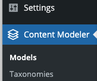

[!IMPORTANT]
We have worked hard to update ACF to be a more standardized and performant framework implementing the functionality that made Atlas Content Modeler special. We believe that ACF is already more stable and easier to maintain than ACF, and we recommend that all users currently on Atlas Content Modeler start planning their migration to ACF. We will continue to support Atlas Content Modeler to ensure it is secure and any customers who rely on it are supported to ensure time enough to migrate to ACF. While security updates will continue to be provided as long as required by our user base, no new feature development will happen on Atlas Content Modeler.

Atlas Content Modeler (ACM) is a content modeling solution for WordPress. Using an intuitive interface, you can create custom post types, as well as custom fields and taxonomies for those post types, with ease.

## Install the Atlas Content Modeler plugin

Atlas Content Manager, like other WordPress customizations, uses a plugin to enable its use.

1. In your WordPress control panel, install the **Atlas Content Modeler** plugin.
2. Install and activate the plugin on the WordPress instance you want to enable. After activation, **Content Modeler** appears in the side panel.

   

## Feedback

- **Questions/Comments?** [Content Modeler Feedback Form](https://docs.google.com/forms/d/e/1FAIpQLScc2VN-GRSJMz8zVgJLL6kiX3VeV2jkSDnmU1gnuNElEHCEVQ/viewform)
- **GitHub**: [GitHub Repo Feedback](https://github.com/wpengine/atlas-content-modeler/issues/new/choose)
