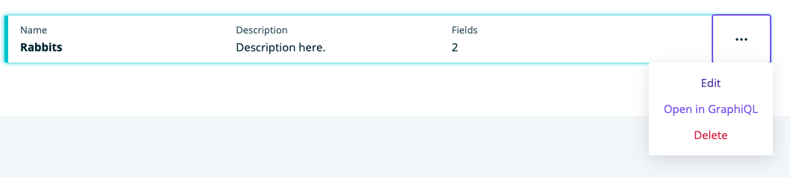
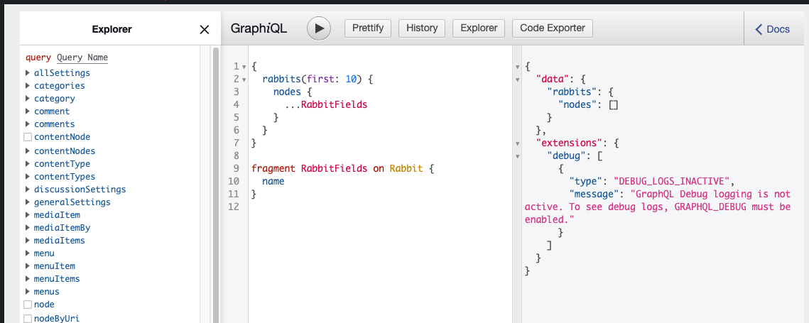

**Note**: GraphiQL is not an ACM specific plugin. It is used in conjunction with ACM.

### Reference
---
1. [GraphiQL - NPM](https://www.npmjs.com/package/graphiql)

## GraphiQL

GraphiQL is a plugin that allows you to run queries and has many other features.

### Use GraphiQL with Models
---
1. Click on Content Modeler in the WordPress side menu

    

1. If it's not on Models, click Models under Content Modeler in the WordPress side menu

1. A model is required to use GraphiQL, if you don't have one, you will have to [Create a Model](../models/create.mdx) first

1. Click on the triple dot menu next to a model and click **Open in GraphiQL** 

    

1. You will be taken to the GraphiQL screen for the chosen model

    

1. For directions on how to use GraphiQL, go to [GraphiQL Documentation](https://www.npmjs.com/package/graphiql)

## Feedback

- **Questions/Comments?** [Content Modeler Feedback Form](https://docs.google.com/forms/d/e/1FAIpQLScc2VN-GRSJMz8zVgJLL6kiX3VeV2jkSDnmU1gnuNElEHCEVQ/viewform)
- **GitHub**: [GitHub Repo Feedback](https://github.com/wpengine/atlas-content-modeler/issues/new/choose)