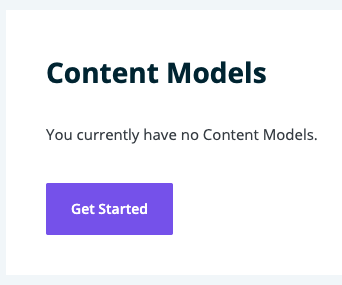
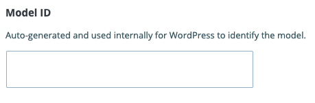
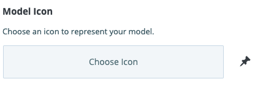
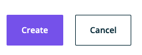

**Note**: These tutorials assume that you have already [installed the plugin](../../introduction.mdx).

## Create a Model

A model is a container that holds fields for use in content generation in publisher.

### Steps to Create a Model
---

1. Click on Content Modeler in the WordPress side menu

    

1. If it's not on Models, click Models under Content Modeler in the WordPress side menu

1. If it's your first model, click on Get Started. If it's not, click on New Model

    

1. Fill in the fields to fit your needs

1. Model Id is auto generated but you can change it to suite your needs

    

1. There is a default model icon, but you can choose your own to make locating the Models in the WordPress side menu easier

    

1. Click Create to save the model and begin adding fields, or click Cancel to undo the Model creation

    

## Feedback

- **Questions/Comments?** [Content Modeler Feedback Form](https://docs.google.com/forms/d/e/1FAIpQLScc2VN-GRSJMz8zVgJLL6kiX3VeV2jkSDnmU1gnuNElEHCEVQ/viewform)
- **GitHub**: [GitHub Repo Feedback](https://github.com/wpengine/atlas-content-modeler/issues/new/choose)