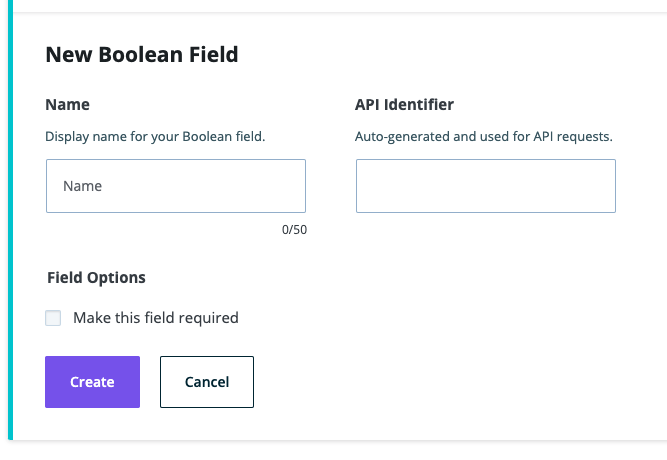

**Note**: These tutorials assume that you have already [installed the plugin](../../../../introduction.mdx).

## Boolean Field

The boolean field is used for true and false values.

### Steps to Use the Boolean Field
---
1. After navigating to a model, click the + button or if it's the first field, click on the Boolean option

    

1. Choose the Boolean Field type

1. Fill in the form fields to fit your needs

    

1. Click Create when done to save the field to the model

1. Click Cancel to stop field creation

## Feedback

- **Questions/Comments?** [Content Modeler Feedback Form](https://docs.google.com/forms/d/e/1FAIpQLScc2VN-GRSJMz8zVgJLL6kiX3VeV2jkSDnmU1gnuNElEHCEVQ/viewform)
- **GitHub**: [GitHub Repo Feedback](https://github.com/wpengine/atlas-content-modeler/issues/new/choose)