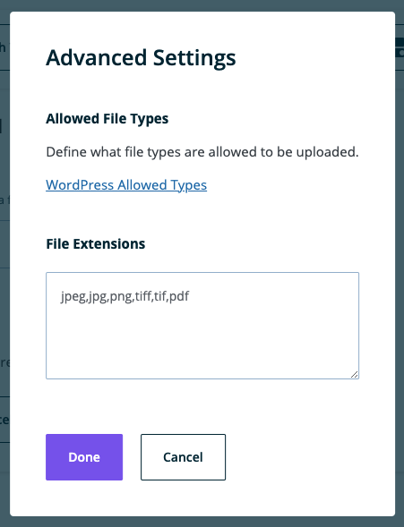

**Note**: These tutorials assume that you have already [installed the plugin](../../../../introduction.mdx).

## Media Field

The media field is used to include images and other files.

### Steps to Use the Media Field
---
1. After navigating to a model, click the + button or if it's the first field, click on the Media option

    

1. Choose the Media Field type

1. Fill in the form fields to fit your needs

    

1. To edit allowed file extensions, click on Advanced Settings

    

1. Enter in your desired list of allowed file extensions separated by a comma

1. Click Done to save the Advanced Settings or click Cancel to undo the changes. The modal will close.

1. Click Create when done to save the field to the model

1. Click Cancel to stop field creation

## Feedback

- **Questions/Comments?** [Content Modeler Feedback Form](https://docs.google.com/forms/d/e/1FAIpQLScc2VN-GRSJMz8zVgJLL6kiX3VeV2jkSDnmU1gnuNElEHCEVQ/viewform)
- **GitHub**: [GitHub Repo Feedback](https://github.com/wpengine/atlas-content-modeler/issues/new/choose)