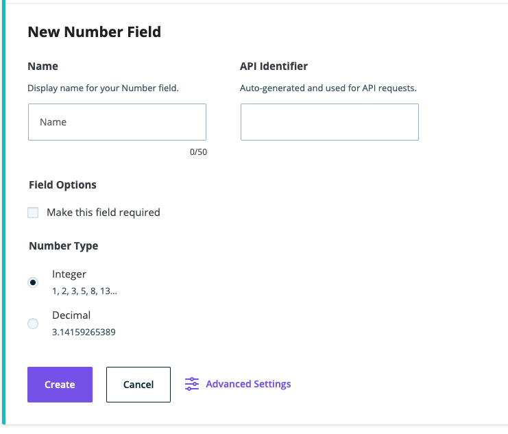
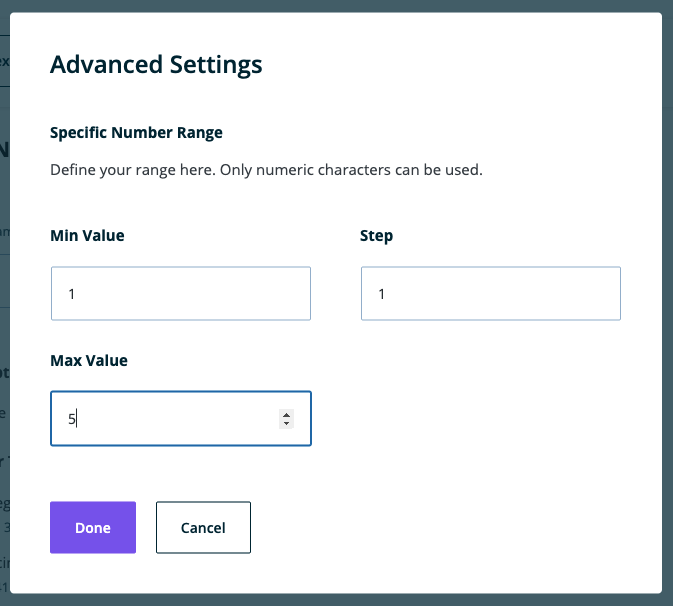

**Note**: These tutorials assume that you have already [installed the plugin](../../../../introduction.mdx).

## Number Field

The number field is used for numeric entry including integers and decimals.

### Steps to Use the Number Field
---
1. After navigating to a model, click the + button or if it's the first field, click on the Number option

    

1. Choose the Number Field type

1. Fill in the form fields to fit your needs

    

1. After choosing a Number Type of Integer or Decimal, you can click on Advanced Settings to choose the minimum, maximum, and step values for the field.

    

1. Click Done to save Advanced Settings or click Cancel to undo them. The modal will close.

1. Click Create when done to save the field to the model

1. Click Cancel to stop field creation

## Feedback

- **Questions/Comments?** [Content Modeler Feedback Form](https://docs.google.com/forms/d/e/1FAIpQLScc2VN-GRSJMz8zVgJLL6kiX3VeV2jkSDnmU1gnuNElEHCEVQ/viewform)
- **GitHub**: [GitHub Repo Feedback](https://github.com/wpengine/atlas-content-modeler/issues/new/choose)