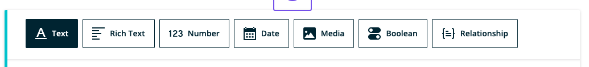
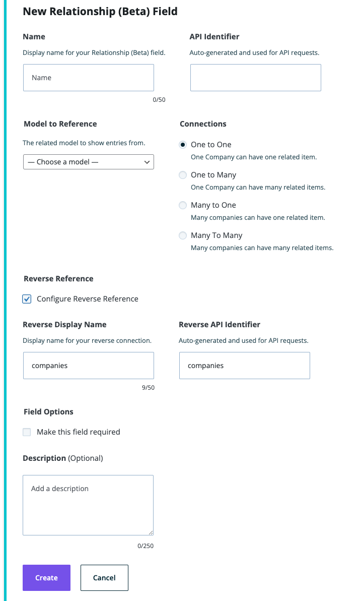
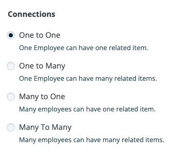

**Note**: These tutorials assume that you have already [installed the plugin](../../../../introduction.mdx).

## Relationship Field (Beta) - Cardinality

"Cardinality provides a way to set up model relationship restrictions. It provides a connection or reference between one or more model entries with one or more entries of another model. There are four types: One-to-One, One-to-Many, Many-to-One, and Many-to-Many. Cardinality types that only allow one connection use a radio button in the UI, and the types that will enable many connections to use checkboxes in the UI."

### Use the Relationship Field Cardinality

---

1. After navigating to a model, click the **+ button**. If it's the first field, click on the **Relationship** option.

   

1. Choose the Relationship Field type

1. Fill in the form fields to fit your needs

   

1. Under Connections, choose a Cardinality option:

   

   1. One-to-One: One item of this model type can have one related item
   1. One-to-Many: One item of this model type can have many related items
   1. Many-to-One: Many items of this model type can have one related item
   1. Many-to-Many: Many items of this model type can have many related items

1. Click **Create** to save the field to the model.

1. Click **Cancel** to stop field creation.

## Feedback

- **Questions/Comments?** [Content Modeler Feedback Form](https://docs.google.com/forms/d/e/1FAIpQLScc2VN-GRSJMz8zVgJLL6kiX3VeV2jkSDnmU1gnuNElEHCEVQ/viewform)
- **GitHub**: [GitHub Repo Feedback](https://github.com/wpengine/atlas-content-modeler/issues/new/choose)
