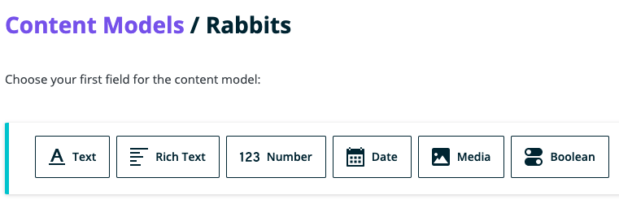
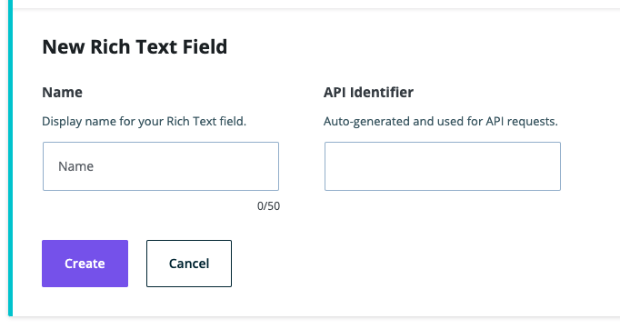

**Note**: These tutorials assume that you have already [installed the plugin](../../introduction.mdx).

## Rich Text Field

The rich text field is used for advanced text entry including HTML and a WYSIWYG editor.

### Steps to Use the Rich Text Field
---
1. After navigating to a model, click the + button or if it's the first field, click on the Rich Text option

    

1. Choose the Rich Text Field type

1. Fill in the form fields to fit your needs

    

1. Click Create when done to save the field to the model

1. Click Cancel to stop field creation

## Feedback
---
- **Questions?** Email us ce-beta@wpengine.com
- **Feedback**: Your feedback helps shape the future of Atlas Content Modeler. To provide feedback, fill out our [Atlas Content Modeler Feedback Form](https://docs.google.com/forms/d/e/1FAIpQLSecvuZ_EMiTIOlTSwcW1JnPQcFbAcCOwGlhURkzBI8Ps9vFzA/viewform).
