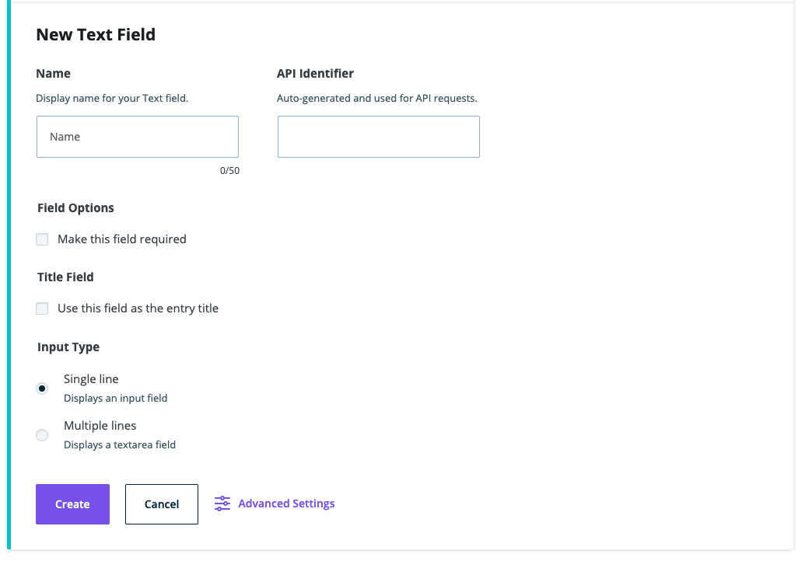

**Note**: These tutorials assume that you have already [installed the plugin](../../introduction.mdx).

## Text Field

The text field is used for any type of regular text that doesn't include HTML or markdown. You can choose single or multiple lines (textarea) as well as minimum and maximum characer count in advanced settings.

### Steps to Use the Text Field
---
1. After navigating to a model, click the + button or if it's the first field, click on the Text option

    

1. Choose the Text Field type

1. Fill in the form fields to fit your needs

    

1. To make this field the entry title for the model, check the "Use this field as the entry title" box under Title Field

1. Choose Single line for shorter text and choose Multiple lines for a textarea and longer text

1. Click on Advanced Settings to choose a minimum and maximum character length

1. Click Create when done to save the field to the model

1. Click Cancel to stop field creation

## Feedback
---
- **Questions?** Email us ce-beta@wpengine.com
- **Feedback**: Your feedback helps shape the future of Atlas Content Modeler. To provide feedback, fill out our [Atlas Content Modeler Feedback Form](https://docs.google.com/forms/d/e/1FAIpQLSecvuZ_EMiTIOlTSwcW1JnPQcFbAcCOwGlhURkzBI8Ps9vFzA/viewform).
