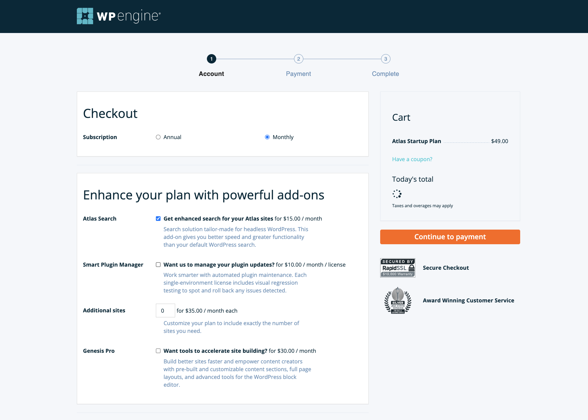
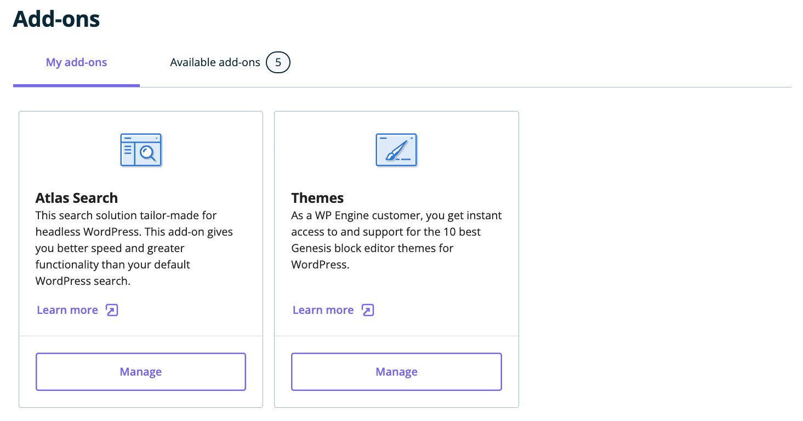
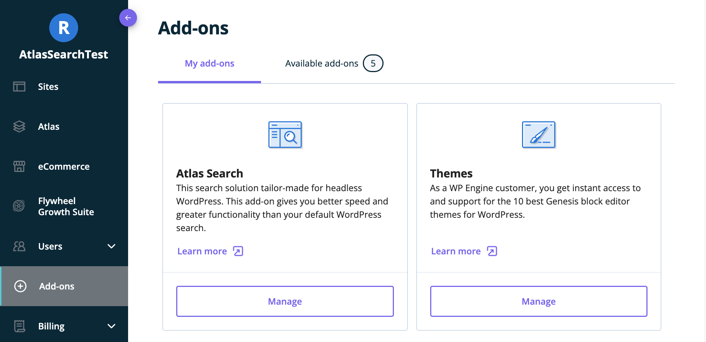
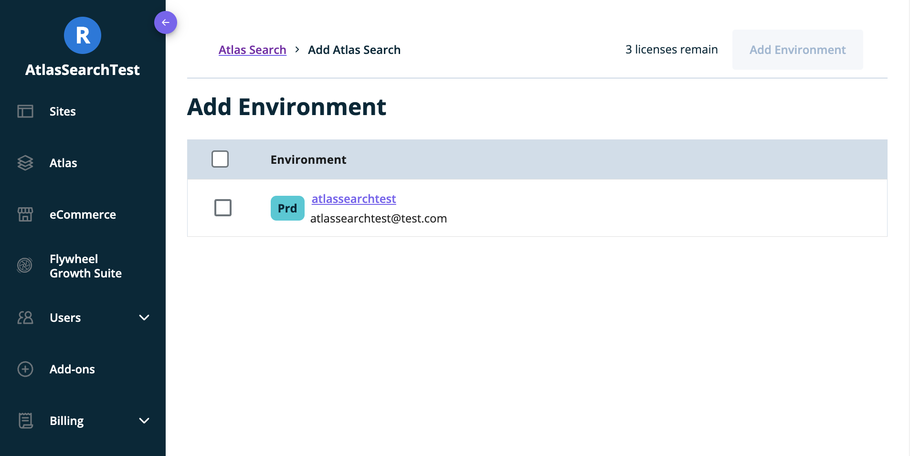
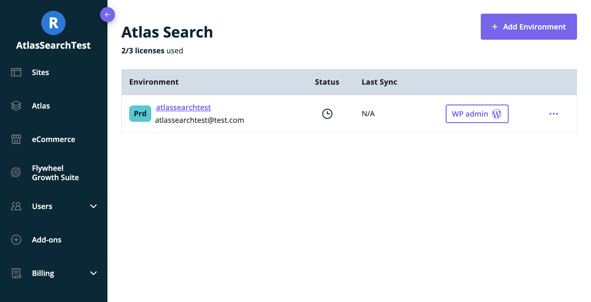
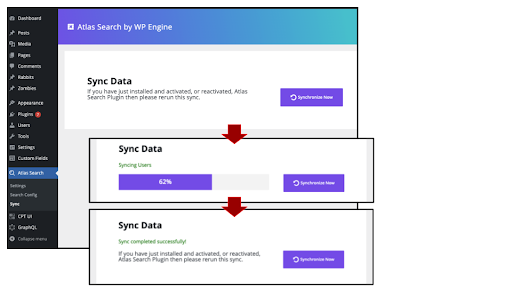

## Note for non-headless (Standard WordPress) users

Atlas Search works out-of-the box for both headless and non-headless (standard) WordPress users! If you don't know which you are, you are most likely a non-headless user (headless customers are on the WP Engine "Atlas" plans).

For standard WordPress users, adding Atlas Search to their WordPress site is simple. After purchasing the Atlas Search license, users can add the Atlas Search plugin to their environment by following the same steps listed below in the "[Applying an Atlas Search License](https://developers.wpengine.com/docs/atlas-search/getting-started#applying-an-atlas-search-license)" section.

After activating the Atlas Search plugin, users can run their first sync to index their WordPress site's data with Atlas Search. To do this, follow the instructions in the "[Content Sync](https://developers.wpengine.com/docs/atlas-search/getting-started#content-sync)" section.

Once the initial sync is complete, all searches on the WordPress site will be served by Atlas Search. Non-headless users can start using Atlas Search right away without any additional configuration. However, if they want to customize the Atlas Search configuration, they can do so by following the instructions in the "[Configuration](https://developers.wpengine.com/docs/atlas-search/using-atlas-search#configuration)" section.

## Getting an Atlas Search License

To get an Atlas Search license, you can either select Atlas Search as an Add-on when signing up for your Atlas plan or you can purchase it through the Add-ons page of your existing plan.
You are granted 3 licenses per site when you sign up for Atlas Search.

### Purchasing During Sign Up

During sign up for an Atlas plan, there is an option under the "Enhance your plan with powerful add-ons" to purchase Atlas Search.

### Purchasing After Sign Up

If you already have an Atlas plan and wish to add Atlas Search, you can purchase it as an add-on in the side-bar under the "Add-ons" option.
To do so, navigate to the "Add-ons" option, then select the "Available add-ons" tab. Here you will see Atlas Search as a purchasable add-on.

## Applying an Atlas Search License

Now that you have purchased Atlas Search as an add-on, you will see Atlas Search is available under the "My Add-ons" tab on the "Add-ons" page.
Click the Manage button to get started.

If you have no active Atlas Search enabled environments, you will be asked to "Select environments" and navigated to the "Add Environment" page. Here you will see a list of your environments, the number of Atlas Search licenses that you have, and checkboxes that can be used to select environments that you want to apply a license to.
Select the checkbox of the environment that you want to enable Atlas Search for and click "Add Environment." After confirmation, you will be navigated to the "Atlas Search" page.

On this page you can see your environments that currently have Atlas Search licenses enabled. You can also view the "Status" of your Atlas Search and the "Last Sync" which shows the last time you performed a sync on your site.

## Installing the Atlas Search Plugin

When you purchase and apply an Atlas Search license to one of your environments, Atlas Search will automatically installed on the chosen environment if possible.
This will install the [Atlas Search](https://wordpress.org/plugins/atlas-search/) plugin on your WordPress backend.

### Other Methods of Installing the Plugin

#### Blueprints

The Atlas Blueprints pipeline will have:

- Installed & activated the [WPGraphQL](https://wordpress.org/plugins/wp-graphql/) plugin.
- Installed & activated the [Atlas Search](https://wordpress.org/plugins/atlas-search/) plugin.

_Note that when installing Atlas Search this way you must apply a license to the environment where the plugin is installed to receive valid settings to use Atlas Search._

## Content Sync

Once you have installed and configured the Atlas Search plugin, you must run an initial content sync to index your WordPress site's data with Atlas Search.
_Important: You must perform an initial sync before modifying any other data, otherwise errors may occur in future syncs._

After this initial sync, the Atlas Search plugin will continue to sync content in real-time whenever content additions or modifications occur on WordPress.
_Note: if the Atlas Search plugin is deactivated or uninstalled, real-time sync will not occur._

Content sync is performed via the Atlas Search plugin’s UI, as follows:

1. From the Atlas Search environments page, navigate to the WP Admin of the environment you wish to work with by clicking the "WP Admin" button in the environment list item.
2. Click the "Atlas Search" menu item in the WordPress Admin panel. Then, click the "Sync" sub-menu item to bring up the below view.
3. Click the `Synchronize Now` button. Content Sync can take some time to complete, especially with large data sets. The content sync loading bar provides information on progress.
4. Await the "Sync Completed Successfully" status message.
5. In the event that the sync process does not complete successfully, an error message of `Unexpected sync error occurred. Please try to Resume the sync or Delete what did sync, then start the sync process again` will be displayed - at which point `Resume` and `Delete` buttons will be available for resuming from point of failure or purging & restarting the content sync respectively.

Once the Atlas Search’s Content Sync has completed, you are free to query the content via the WPGraphQL and REST APIs. The API search functions will look and feel just like they did before but will now be handled by Atlas Search.

## Removing an Atlas Search License

If you wish to remove one of the licenses that you have applied to an environment, navigate to the "Atlas Search" page through the "Add-ons" option in the sidebar.
Click on the ellipsis next to the item in the environment list to show an option to release the license from this environment.

## Next Steps

To learn how to use Atlas Search with WPGraphQL, see the [Using Atlas Search ](./using-atlas-search) section.
