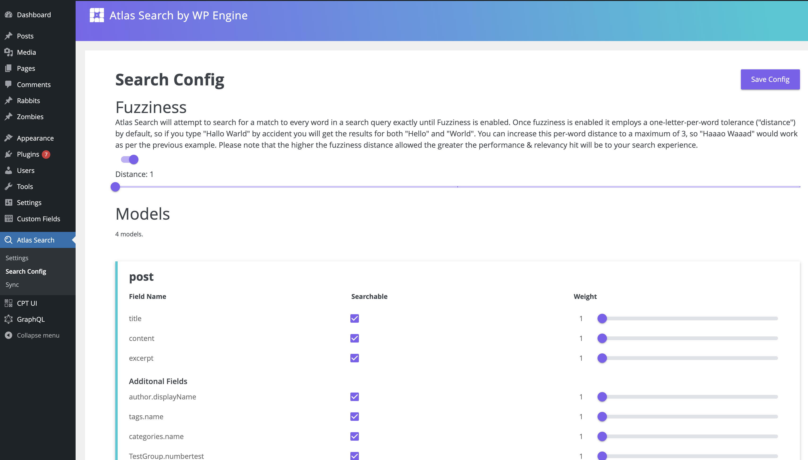

## Atlas Search (Beta)
  
Having setup WordPress and created some content, you may find that your content search has some issues:
* Unexpected search results, either not finding what you were looking for or the most relevant result is burried far down on the list
* Unable to query with search operators such as `AND`, `OR` or `NOT`
* Advanced WordPress data types e.g. ACF are not searchable without extra effort:
    + Requires another plugin for ACF (Advanced Custom Fields) types
    + Doesn’t support ACM (Atlas Content Modeler) types

Atlas Search is designed to address all these issues in one place and in an easy to use manner.
It will improve search result relevancy, support advanced search query operators and add support for advanced WordPress data types.

Atlas Search is for the headless developer using the WordPress WPGraphQL & REST APIs.
It is composed of 2 parts:
1. WordPress [Atlas Search](https://wordpress.org/plugins/atlas-search/) plugin
2. An Atlas Search provider backend

The easiest way to get started with Atlas Search (Beta) is to request an Atlas Sandbox account for free via [Atlas "Headless" WordPress site](https://wpengine.com/atlas/).
  

### Contents
* [Prerequisites](#prerequisites) - What you need ahead of following this ‘Getting Started’ guide
    + [General Prerequisites](general-prerequisites-) - Atlas specifics & other associated plugins.
    + [Atlas Search Prerequisites](#atlas-search-prerequisites--unless-configured-via--atlas-blueprints---) - Specific to the Atlas Search setup.
* [Plugin Installation](#plugin-installation) - Steps to enable your Atlas Search plugin to talk to Atlas Search engine
* [Content Data Sync](#content-data-sync) - How to clone sync WordPress content with Atlas Search engine
* [Using Atlas Search](#using-atlas-search) - A series of sample GraphQL queries that demonstrate Atlas Search’s functionality.
    + [Querying Standard WP Data Types](#querying-standard-wp-data-types-) WP Data Types - Queries with Posts, Pages, CPT
    + [Querying ACM/ ACF Types](#querying-acm-or-acf-types-) - Queries for Atlas Content Modeller or Advanced Custom Fields
    + [Getting More Specific with Queries](#getting-more-specific-with-queries) - Queries with `AND`, `NOT` & `OR`
* [Advanced Configuration of Atlas Search](#advanced-configuration-of-atlas-search) - Configure what WP Data Types & fields are searchable, & set custom weightings to prioritize what matters to you.
* [Feedback](#feedback) - Let us know what you think of Atlas Search or if you are having any issues.
  
  

### Prerequisites
#### General Prerequisites:
1. You must have an existing Atlas account
2. You have a working instance of WordPress and can access its `wp-admin`
3. You have downloaded & activated the [WP-GraphQL](https://wordpress.org/plugins/wp-graphql/) plugin from the WordPress.org plugin repository

#### Atlas Search Prerequisites (Unless configured via ‘Atlas Blueprints’):
1. You have enrolled for Atlas Search, via:
    + The [Enrolment form](https://docs.google.com/forms/d/e/1FAIpQLSeRdfLXHlAhjaBfMJOobynCwxuKFtWwzHzna_yRXFt0n_dbhA/viewform):
        - Limited to 1 instance per email account.
    + Automatic-enrollment as part of Atlas Sandbox account.
2. You have received an Atlas Search setup email with the following:
    + A link to this documentation
    + A link to download the latest [Atlas Search](https://wordpress.org/plugins/atlas-search/) plugin, from WP Plugin Store
    + Your own personal Atlas-site URL and Access Token
  
  


### Plugin Installation
Installing & configuring the Atlas Search plugin enables both the Content Sync (indexes to the Atlas Search server) & Search Querying (filtered reads from the Atlas Search server, via GraphQL) functionalities.

Atlas Search plugin can be installed & configured as follows:
1. Install & activate the Atlas Search plugin [as per its documentation](https://wordpress.org/plugins/atlas-search/#installation).
  * Note: The Atlas Search plugin may already be automatically installed if you used Atlas Blueprints to setup your Atlas app and WordPress environments
3. After successful installation & activation, the ‘Atlas Search’ menu item will appear in the left navigation panel of WP Admin.
4. Click the `Atlas Search` menu item. By default it will bring you to the default sub-menu ‘Settings’ view, where you will populate the following inputs with the values from the aforementioned setup email you have received:
    + URL (ie. `https://{atlas-env}/sync/{yoursite}/graphql`)
    + Access Token (ie. `{your-unique-access-token}`)
5. Select the ‘Save Settings’ button for the changes to take effect.


  
  

### Content Data Sync
Once you have installed & configured the Atlas Search plugin it will be necessary to run an initial content sync, which will send all pre-existing content on the WP site to Atlas Search for indexing.
After this initial sync, the Atlas Search plugin will continue to auto-sync content in real-time whenever content additions or modifications occur on WP.
Note that if any content modifications occur while the Atlas Search plugin is deactivated or uninstalled, it will be necessary to re-run this content sync to send the untracked data to Atlas Search.

Content sync is performed via the Atlas Search plugin’s UI, as follows:
1. Click the ‘Atlas Search’ menu item in WP Admin, then click the ‘Sync’ sub-menu item to bring up the below view
2. Click the ‘Synchronize Now’ button. Content sync can take some time to complete, especially with large data sets. The content sync loading bar provides information on progress
3. Await the ‘Sync Completed Successfully’ status message
4. In the event that the sync process does not complete successfully, an error message of ‘Unexpected sync error occurred. Please try to Resume the sync or Delete what did sync, then start the sync process again’ will be displayed - at which point Resume & Delete buttons will be available for resuming from point of failure or purging & restarting the content sync respectively


Once the Atlas Search’s Content Sync has completed you are free to query the content data, via the WPGraphQL and REST APIs.
The API search functions will look & feel just like they did before but behind the scenes the WordPress Search is now intercepted and delegated to the Atlas Search provider backend.
  
  

### Using Atlas Search
Once the initial content sync has completed & while the Atlas Search plugin remains “active”, Atlas Search will enhance the WP search experience.

The WP-GraphQL plugin is a good place to test the search functionality. That plugin includes an instance of the ‘GraphiQL’ IDE, where one can interface in the browser with their WordPress data, via GraphQL queries. Atlas Search overrides the default search functionality for WPGraphQL queries on all Atlas Search supported WP data types.

Below is a screenshot of WP-GraphQL plugin & GraphiQL view, where Atlas Search has overridden the default WP search behavior, followed by some sample queries:


  

#### Querying Standard WP Data Types:
For querying standard WordPress data types (Posts, Pages & Custom Post Types (CPT)) some examples with Atlas Search are:

* Querying Posts/ Pages:
```
{
  {either ‘posts’ or ‘pages’}(where: {search: "CSS"}) {
    nodes {
      id
      status
      title
    }
  }
}
```
* Querying CPTs:
```
{
  branches(where: {search: "Austin"}) {
    nodes {
      address
    }
  }
}
```
  

#### Querying ACM or ACF Types:
Atlas Search also integrates with the [Atlas Content Modeler](https://developers.wpengine.com/blog/what-is-atlas-content-modeler) (ACM) & [Advanced Custom Fields](https://wordpress.org/plugins/advanced-custom-fields/) (ACF). Default WP search requires plugins for ACF & doesn’t support ACM at all.

* Querying ACM type of `project`, with fields of  `streetAddress`, `contactName` & `workOrderNumber`:
```
{
  projects(where: {search: "Austin"}) {
    nodes {
      streetAddress
      contactName
      workOrderNumber
    }
  }
}
```
  

#### Getting More Specific with Queries:
Atlas Search treats spaces as ‘OR’ by default, whereas the default WordPress search treats spaces as `AND`. With Atlas Search, however, you can explicitly specify the `AND`, `OR` and `NOT` keywords within your search query and you can combine them too - this provides enhanced specificity for your querying needs:

* Using `NOT` search operator:
```
{
  projects(where: {search: "Austin NOT Minnesota"}) {
    nodes {
      streetAddress
      contactName
      workOrderNumber
    }
  }
}
```

* Using `AND` search operator:
```
{
  projects(where: {search: "New York AND Texas"}) {
    nodes {
      streetAddress
      contactName
      workOrderNumber
    }
  }
}
```

* Using `OR` search operator:
```
{
  projects(where: {search: "New York OR Texas"}) {
    nodes {
      streetAddress
      contactName
      workOrderNumber
    }
  }
}
```  
  


### Advanced Configuration of Atlas Search
Atlas Search, by default, will search all supported WP Data Type objects (Posts, Pages, CPTs, ACFs, ACMs, etc.) by all of their supported fields (string, number, boolean, other WP Data Type objects).

Atlas Search will then return results where each field-match to the search query term(s) are given an equal weighting (1), thus the objects with most search-match occurrences will rise to the top. In some cases this may not be the desired behavior, for example:
* It may not be correct to consider some specific fields as searchable
* Searches matching some fields should be considered more relevant than others
To cater for these type of use cases, Atlas Search provides both a field-level filter (‘searchable’ field toggle), and a field-level weighting slider, which can be found in the plugin menu’s ‘Search Config Settings’.
The field-level filter permits the configuration for each field to be included/excluded from consideration in search queries.
The field-level weighting slider permits the configuration of some fields to be considered more relevant than others when decising on ordering of search results. The higher the weighting, the more relevant it is deemed to be.
Remember to press the ‘Save’ button to persist any configuration modifications.


  
  

### Feedback
Questions or feedback? Reach us via [what is the email](todo@wpengine.com) or on Slack: [atlas-search-onboarding](https://wpengine.slack.com/archives/C033XG6ACF3)
