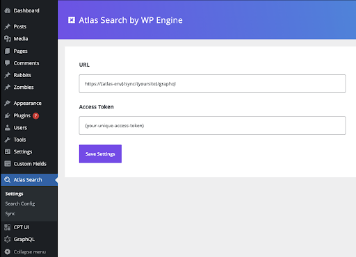

# Mutations Documentation

## Overview

The public API includes mutations:

- [index](#creating-or-updating-a-document) mutation for creating or updating a document
- [delete](#deleting-a-document) mutation for deleting a document
- [deleteAll](#deleting-all-documents) mutation for deleting all documents

To use a mutation you need to [authenticate](#authentication).

---

## Authentication

Clients calling the API mutations are required to add an authentication header with the valid authentication token.

```
Authorization: Bearer {ACCESS_TOKEN}
```

Data needed to consume API you can find in your WordPress Atlas Search Plugin in admin area in section `Settings`.



---

## Creating or Updating a Document

To create or update a document in the index using the mutation, you need to:

1. Use the `index` mutation.
2. Provide a `DocumentInput` object as a parameter.
3. In the `DocumentInput` object, provide the necessary document data as a `JSON` object.
4. To ensure a document has a unique identifier in the `DocumentInput` object, follow these guidelines:
   - The `id` field of the `DocumentInput` object should be used to provide a unique identifier for the document. This field is required for updating a document.
   - If an `id` is provided in the `DocumentInput` object, the system checks whether a document with that `id` already exists. If it does, the existing document is updated with the new data instead of creating a new document.
   - In cases where no `id` is provided in the `DocumentInput` object, the system automatically generates a unique identifier for the document. This ensures that each document has a unique identifier, even if one is not explicitly provided. By following these guidelines, you can effectively handle document creation and updates, ensuring uniqueness of identifiers and appropriate handling based on the presence of an `id` in the `DocumentInput` object.
   - The `data` field is required and contains all the index data.
5. Optionally, you can include metadata by using the `meta` field. This allows you to provide additional information that will be logged on the server. Metadata can be helpful for analyzing and understanding the logs more effectively. Meta data includes optional fields:
   - `system` - should be the name of the client "atlas-search-plugin"
   - `action` - the name of the action performed e. g. "manual-index"
   - `source` - hostname from where action has been performed e. g. "atlasce.wpengine.com"

### GraphQL example to create a document

```graphql
mutation CreateIndexDocument($input: DocumentInput!) {
  index(input: $input) {
    success
    code
    message
    document {
      id
      data
    }
  }
}
```

GraphQL Variables

```json
{
  "input": {
    "data": {
      "ID": 1,
      "post_title": "Post Title",
      "post_excerpt": "Post Excerpt",
      "post_content": "Post Content",
      "post_date": "11-06-2023T12:33:00",
      "post_type": "post",
      "post_status": "publish"
    },
    "meta": {
      "system": "atlas-search-plugin",
      "action": "manual-index",
      "source": "postman"
    }
  }
}
```

Mutation Response

```json
{
  "data": {
    "index": {
      "success": true,
      "code": "200",
      "message": "Document was indexed successfully",
      "document": {
        "id": "yMI9vogB0FEetE6QV9fh",
        "data": {
          "ID": 1,
          "post_title": "Post Title",
          "post_excerpt": "Post Excerpt",
          "post_content": "Post Content",
          "post_date": "11-06-2023T12:33:00",
          "post_type": "post",
          "post_status": "publish"
        }
      }
    }
  }
}
```

In this example, we’re creating a new document with fields: `ID, post_title, post_excerpt, post_content, post_date, post_type, post_status`. The mutation returns a `DocumentMutationResponse` object that includes fields:

- `success` - a boolean says if operation is successful or not
- `code` - string with number of response code (200 - is success)
- `message` - human readable operation status
- `document` with `id` and `data`.

To create a new document with a provided `id` or update an existing document, you can use the index mutation. The behavior depends on whether a document with the provided id already exists:

- If a document with the provided `id` doesn't exist, a new document will be created with the specified `id`.
- If a document with the provided `id` already exists, the existing document will be updated with the new data.

To create a new document with a provided `id` or update an existing document, you need to provide the `id` of the document you want to update in the `DocumentInput` object.

### GraphQL example to update a document

```graphql
mutation UpdateIndexDocument($input: DocumentInput!) {
  index(input: $input) {
    success
    code
    message
    document {
      id
      data
    }
  }
}
```

GraphQL Variables

```json
{
  "input": {
    "id": "yMI9vogB0FEetE6QV9fh",
    "data": {
      "post_title": "Post with updated title"
    },
    "meta": {
      "system": "atlas-search-plugin",
      "action": "manual-index",
      "source": "postman"
    }
  }
}
```

Mutation Response

```json
{
  "data": {
    "index": {
      "success": true,
      "code": "200",
      "message": "Document was indexed successfully",
      "document": {
        "id": "yMI9vogB0FEetE6QV9fh",
        "data": {
          "post_title": "Post with updated title"
        }
      }
    }
  }
}
```

In this example, we’re updating an existing document with the `id` of `yMI9vogB0FEetE6QV9fh`. We are mutating `post_title` field of the document. The mutation returns a `DocumentMutationResponse` like for creating.

The same behavior would occur even if the document did not already exist. In that case, it would be created with the provided `id` and the `DocumentMutationResponse` would include this `id`.

**IMPORTANT Rest of the fields not specified in the input will be removed.**\
In this case it will remove `ID, post_excerpt, post_content, post_date, post_type, post_status` and only `post_title` will be added.

---

## Deleting a Document

To delete a document from the index, you need to:

1. Use the `delete` mutation.
2. Provide the `id` of the document you want to delete.
3. Optionally provide metadata by using the `meta` field. This allows you to provide additional information that will be logged on the server. Including metadata can be helpful for analyzing and understanding the logs more effectively.
   Meta data includes optional fields:
   - `system` - should be the name of the client "atlas-search-plugin"
   - `action` - the name of the action performed e. g. "manual-index"
   - `source` - hostname from where action has been performed e. g. "atlasce.wpengine.com"

### GraphQL example to delete a document

```graphql
mutation deleteDocument($id: ID!, $meta: MetaInput) {
  delete(id: $id, meta: $meta) {
    code
    success
    message
    document {
      id
      data
    }
  }
}
```

GraphQL Variables

```json
{
  "id": "yMI9vogB0FEetE6QV9fh",
  "meta": {
    "system": "atlas-search-plugin",
    "action": "manual-delete",
    "source": "postman"
  }
}
```

GraphQL Response

```json
{
  "data": {
    "delete": {
      "code": "200",
      "success": true,
      "message": "Document was deleted successfully",
      "document": {
        "id": "yMI9vogB0FEetE6QV9fh",
        "data": {}
      }
    }
  }
}
```

We are deleting a document with the `id` of `yMI9vogB0FEetE6QV9fh`.\
The mutation returns a `DocumentMutationResponse` object that includes the `id` and `data` fields of the deleted document.

---

## Deleting All Documents

To delete all documents from the index you need to:

1. Use `deleteAll` mutation.
2. Optionally provide metadata by using the `meta` field. This allows you to provide additional information that will be logged on the server. Including metadata can be helpful for analyzing and understanding the logs more effectively.

### GraphQL Example to Delete All Documents

```graphql
mutation deleteAllDocuments($meta: MetaInput) {
  deleteAll(meta: $meta) {
    code
    success
    message
  }
}
```

GraphQL Variables

```json
{
  "meta": {
    "system": "atlas-search-plugin",
    "action": "reset-data",
    "source": "postman"
  }
}
```

GraphQL Response

```json
{
  "data": {
    "deleteAll": {
      "code": "200",
      "success": true,
      "message": "Delete all documents was successful"
    }
  }
}
```
