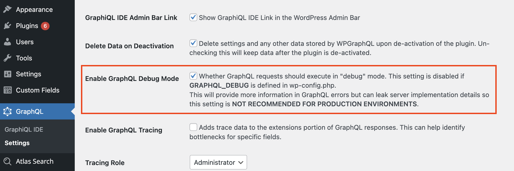
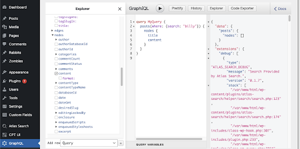
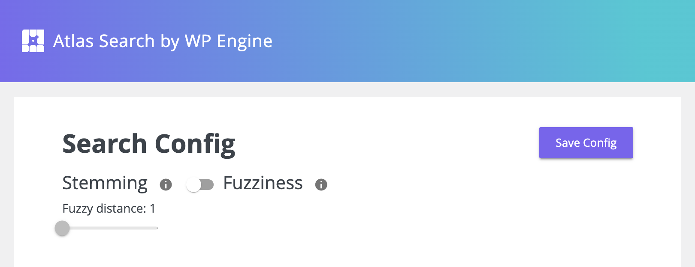
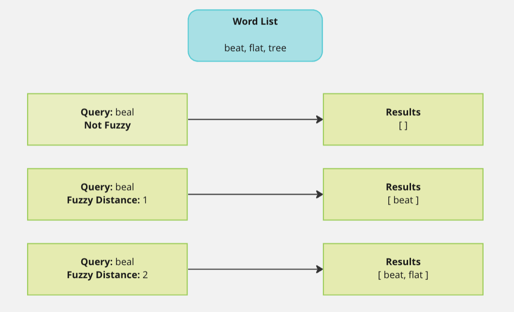
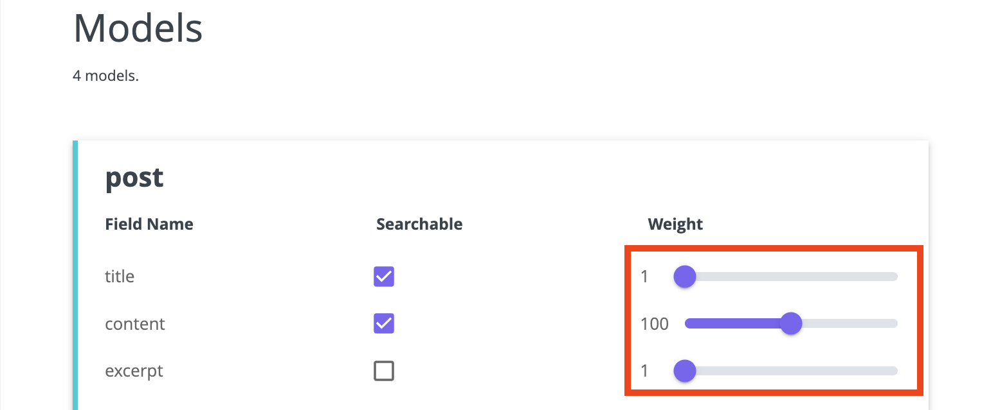

## Prerequisites

Atlas Search requires the [WPGraphQL](https://wordpress.org/plugins/wp-graphql/) plugin.

### Debug Information

Atlas Search adds debug information to WPGraphQL queries. To enable this, navigate to the WPGraphQL settings page and check the setting `Enable GraphQL Debug Mode`.



### Query Monitoring for non-WPGraphQL users

Atlas Search works seamlessly with the Query Monitor plugin for non-WPGraphQL users (see ["Debug Information" above](https://wordpress.org/plugins/query-monitor/) for how to access logs if you are using WPGraphQL).

The query monitoring plugin will allow users to view detailed information about the Atlas Search queries being made on their site, including the query string, the time it took to execute the query, and more. This information can be used to optimize search performance and ensure that searches are working as expected.

To use Query Monitor with Atlas Search, follow these steps:

1. Install the [Query Monitor](https://wordpress.org/plugins/query-monitor/) plugin on your WordPress site.
2. Activate the plugin.
3. Click the Query Monitor that has appear in your WordPress Admin Top Nav.
4. In the dashboard that appears, click on "Logs."
5. Run Atlas Search and see the data appear.

## Querying with Atlas Search

Once your site is set up with an Atlas Search license and the initial content sync has completed, Atlas Search will take over the default WordPress search functionality and enhance your WordPress search experience.

The WPGraphQL plugin is a good place to test search queries. WPGraphQL provides a ‘GraphiQL IDE' in the WordPress dashboard where you can interact with the WPGraphQL Schema in the browser. Atlas Search overrides the default search functionality for WPGraphQL queries on all Atlas Search supported WordPress data types.

Below is a screenshot of the WPGraphQL plugin & GraphiQL IDE view, where Atlas Search has overridden the default WP search behavior, followed by some sample queries:



### Querying Standard WordPress Data Types

Here are examples of querying standard WordPress data types (Posts, Pages, and Custom Post Types (CPT)):

- Querying Posts/Pages:

```graphql
{
  {either "posts" or "pages"}(where: {search: "CSS"}) {
    nodes {
      id
      status
      title
    }
  }
}
```

- Querying Custom Post Types:

```graphql
{
  branches(where: { search: "Austin" }) {
    nodes {
      address
    }
  }
}
```

### Querying for various post types and ACF fields
**Please note that Atlas Search has stopped support for ACM since version v.0.2.14.**

Atlas Search also integrates with the [Advanced Custom Fields](https://wordpress.org/plugins/advanced-custom-fields/) (ACF) plugin.

Here is an example of querying for a custom data type:

- Querying ACF type of `project`, with fields of `streetAddress`, `contactName` & `workOrderNumber`:

```graphql
{
  projects(where: { search: "Austin" }) {
    nodes {
      streetAddress
      contactName
      workOrderNumber
    }
  }
}
```

### Advanced Query Example

You can query fields that appear on the plugin's Search Config page, including ACF fields, tags and categories, etc. Consider the following query:

```
seats.count:>4 tags.name:Cars hello AND world OR 123 4.56
```

This search string uses a combination of search terms and filters.

It searches for records that match the following criteria:

- The `seats.count` field has a value greater than 4.
- The `tags.name` field contains the value Cars.
- The text **“hello”** appears in the record.
- The text **“world”** appears in the record.
- The record contains either the number **123** or the number **4.56**.

The search string uses the following syntax:

- **Search terms:** Any word that does not contain a special character is considered a search term. In this example, **“hello”** and **“world"** are search terms.
- **Filters:** A filter is used to search for records that meet specific criteria. Filters are specified using the format {'<'}field name{'>'}: {'<'}value{'>'}. In this example, `seats.count:>4` and `tags.name: Cars` are filters. The `seats.count` filter searches for records where the value of the `seats.count` field is greater than **4**, while the `tags.name` filter searches for records where the `tags.name` field contains the value **Cars**.
- **Logical operators:** The search string uses the logical operators **AND** and **OR** to combine search terms and filters. The **AND** operator is used to require that both search terms or filters appear in a record, while the **OR** operator is used to search for records that contain either one or the other.

### Query Operators

Atlas Search treats spaces as an `OR` operator by default, whereas the default WordPress search treats spaces as an `AND` operator. With Atlas Search, you can explicitly specify the `AND`, `OR` & `NOT` keywords within your search query & you can combine them too - this provides enhanced specificity for your querying needs.

Here is an example of querying using different search operators:

- Using `NOT` search operator:

```graphql
{
  projects(where: { search: "Austin NOT Minnesota" }) {
    nodes {
      streetAddress
      contactName
      workOrderNumber
    }
  }
}
```

- Using `AND` search operator:

```graphql
{
  projects(where: { search: "New York AND Texas" }) {
    nodes {
      streetAddress
      contactName
      workOrderNumber
    }
  }
}
```

- Using `OR` search operator:

```graphql
{
  projects(where: { search: "New York OR Texas" }) {
    nodes {
      streetAddress
      contactName
      workOrderNumber
    }
  }
}
```

## Configuration

For users who have more specific functionality needs, Atlas Search provides a series of advanced configurations to give you the most control on your data search. To manage these configurations, navigate to the 'Search Config' tab of Atlas Search.
The Atlas Search Config page shows options for changing your search method along with a list of models which is populated from your standard WordPress post types, custom post types and Atlas Content Modeler models. The models also show ACF groups and fields attached to each model.

### Search Method

Atlas Search provides two methods for searching - `stemming` and `fuzzy` - which can be used to tune the search results for your needs.



#### High Relevancy with Stemming Search

Stemming is the process of reducing a word to its root form or base word. This is the default search method of Atlas Search. Using stemming can increase search relevancy as it will search for both exact matches and matches on stemmed words.
For example, a search for the word `running` will return results where running is in the queried field first but it will also return results that include variations of the word `run`.

#### Handling Typos with Fuzzy Search

The fuzzy search method can be toggled in the Search Config menu as an alternative to stemming.

Fuzzy search can be used to handle typos in a search query. With fuzziness enabled, a search query for "Hallo Warld" would return results for both "Hello" and "World".

You can specify the per-word 'distance' setting for Fuzziness to either 1 or 2 on the slider, which determines how many letters can be off in each word. If you set the 'Fuzzy distance' to the maximum distance of 2, a search query of "Haalo Waald" would work as per the previous example, still yielding the results for both "Hello" and "World".

_Note: The higher the fuzziness distance allowed the greater the performance & relevancy hit will be to your search experience._

The image below shows how having your fuzzy distance too high can lead to incorrect results:


### Filtering And Boosting Searchable Content

By default, Atlas Search will search all supported WordPress Data Type objects (Posts, Pages, CPTs, ACFs, etc.) by all of their supported fields (string, number, boolean, and other WordPress Data Type objects).

The search will return results where each field-match to the search query term(s) are given an equal weighting (1), thus the objects with most search-match occurrences will rise to the top. In some cases this may not be the desired behavior. For example:

- It may not be correct to consider some specific fields as searchable.
- Searches matching some fields should be considered more relevant than others.

In these cases, Atlas Search provides both a field-level searchable toggle and weighting slider. The searchable toggle allows for the inclusion/exclusion of a field from the search. The field-level weighting slider permits the configuration of some fields to be considered more relevant than others when determining the order of search results. The higher the weighting, the more relevant it is determined to be.




### Saving Configuration Changes

Remember to press the "Save" button to persist any configuration modifications!
