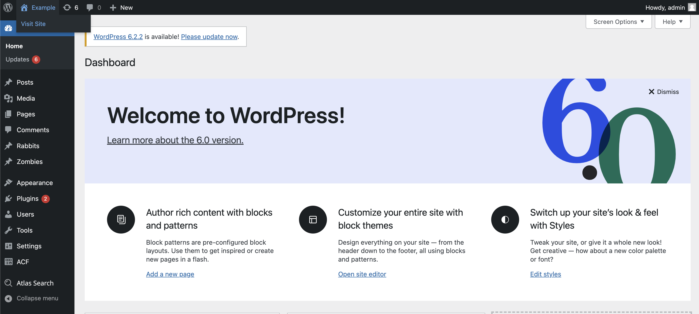
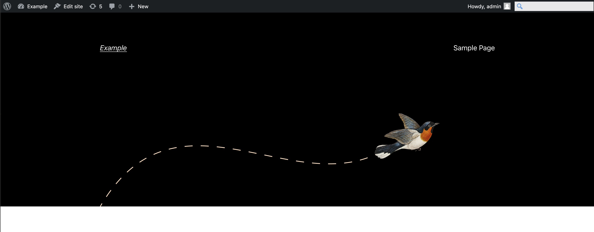
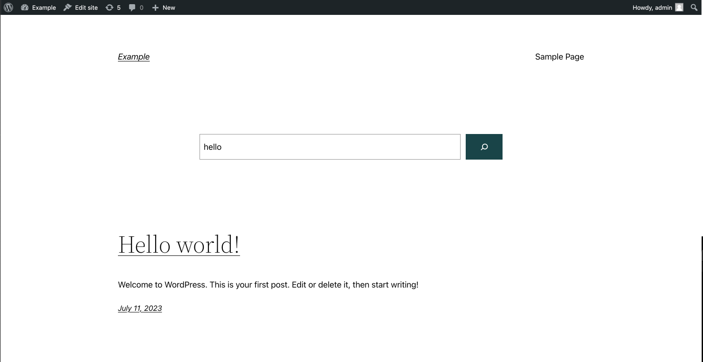
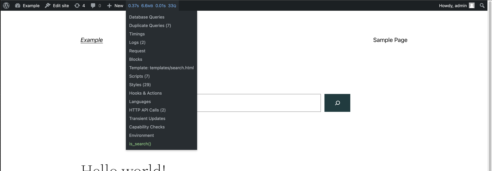
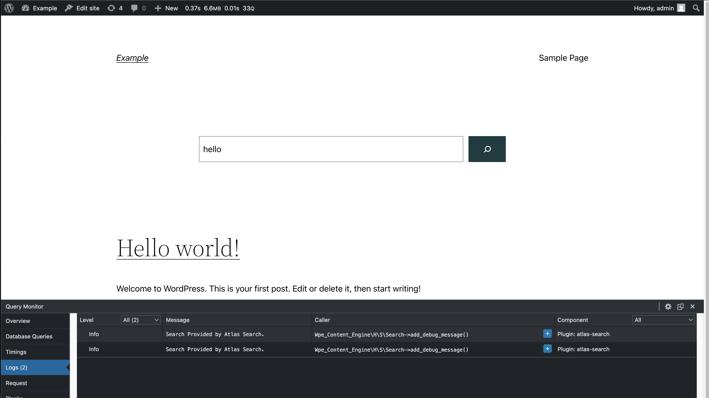

## WP Engine Search (beta)

### About WP Engine Search

WP Engine Search is a beta Add-on for WP Engine managed WordPress customers that provides smarter, more relevant, and more accurate search results with better relevancy, advanced search query operators, and support for advanced WordPress data types.

<em>
  **Note:** WP Engine Search is the extension of an existing plugin called Atlas
  Search. Atlas search was initially built for headless customers, who use our
  Atlas platform. And because we're piloting the extension of Atlas Search
  capabilities into non-headless use cases, you'll still see this plugin called
  "Atlas Search" throughout the Portal during this beta period!
</em>

### Getting Started

WP Engine Search works out-of-the box for WordPress sites of all kinds! For standard WordPress users, adding WP Engine Search to their WordPress site is simple.

After signing up for the beta program, users will log in to the WP Engine User Portal (once again, the plugin will be called "Atlas Search."). Users can add the search plugin to their environment by following the same steps listed below in the ["Applying a License"](https://developers.wpengine.com/docs/atlas-search/getting-started#applying-an-atlas-search-license) section.

After activating the plugin, users should run their first sync to index their WordPress site's data. To do this, follow the instructions in the ["Content Sync"](https://developers.wpengine.com/docs/atlas-search/getting-started#content-sync) section.

Once the initial sync is complete, all searches on the WordPress site will be served by WP Engine Search, without any additional configuration. However, if they want to customize the configuration, they can do so by following the instructions in the ["Configuration"](https://developers.wpengine.com/docs/atlas-search/using-atlas-search#configuration) section.

### Getting a License

To get a WP Engine Search beta license, you should get a confirmation email with a link to the WP Engine User Portal. Give it a click, and you should see "Atlas Search" available in your Add-On's tab.

If you did not receive this email or are having issues with your license, contact "wpesearchbeta@wpengine.com".

### Applying a License

Now you will see Atlas Search is available under the "My Add-ons" tab on the ["Add-ons" page](https://my.wpengine.com/addons). Click the Manage button to get started.


From that page, you will be asked to "Select environments" and navigate to the "Add Environment" page. Here you will see a list of your environments and checkboxes that can be used to select environments that you want to apply a license to. Select the checkbox of the environment that you want to enable WP Engine Search for and click "Add Environment." After confirmation, you will be taken to the "Atlas Search" page.


On this page you can see your environments that currently have WP Engine Search licenses enabled. You can also view the "Status" of your WP Engine Search plugin installation and the "Last Sync" which shows the last time you performed a sync on your site.

Please wait until the status displays a green check mark that says, "Atlas Search is ready to use," before you navigate to WP Admin and run your first sync.


### Installing the Atlas Search Plugin

When you add search to one of your environments, the plugin will automatically install on the chosen environment if possible.

### Content Sync

Once you have installed and configured the plugin, you must run an initial content sync to index your WordPress site's data with Atlas Search.

<em>
  **Important:** You must perform an initial sync before modifying any other
  data, otherwise errors may occur in future syncs.
</em>

After this initial sync, the search plugin will continue to sync content in real-time whenever content additions or modifications occur on WordPress. <em>**Note:** if the WP Engine Search plugin is deactivated or uninstalled, real-time sync will not occur.</em>

<em>
  **Note:** You may need to wait for the plugin to install properly before
  accessing the plugin on your WordPress site or performing a content sync. This
  may take just a couple minutes.
</em>

Content sync is performed via the plugin’s UI, as follows:

1. From the [environments page](https://my.wpengine.com/products/atlas_search#/assign) in your WP Engine portal, navigate to the WP Admin of the environment you wish to work with by clicking the "WP Admin" button in the environment list item.
2. Click the "Atlas Search" menu item in the WP Admin panel. Then, click the "Sync" sub-menu item to bring up the view below.
3. Click the "Synchronize Now" button. Content Sync can take some time to complete, especially with large data sets. The content sync loading bar provides information on progress.
4. Wait for the "Sync Completed Successfully" status message.
5. In the event that the sync process does not complete successfully, an error message of "Unexpected sync error occurred. Please try to Resume the sync or Delete what did sync, then start the sync process again" will be displayed - at which point "Resume" and "Delete" buttons will be available for resuming from point of failure or purging & restarting the content sync respectively.


Once WP Engine Search’s Content Sync has completed, you are free to query the content via the WPGraphQL and REST APIs. The API search functions will look and feel just like they did before but will now be handled by WP Engine Search.

### Removing a License

If you wish to remove one of the licenses that you have applied to an environment, navigate to the "Atlas Search" page through the "Add-ons" option in the sidebar. Click on the ellipsis next to the item in the environment list to show an option to release the license from this environment.

### Configuration

For users who have more specific functionality needs, WP Engine Search provides a series of advanced configurations to give you the most control on your data search. To manage these configurations, navigate to the 'Search Config' tab in WP Admin. The Config page shows options for changing your search method along with a list of models which is populated from your standard WordPress post types, custom post types, and ACF groups and fields.

#### Search Method

WP Engine Search provides two methods for searching - `stemming` and `fuzzy` - which can be used to tune the search results for your needs.


##### High Relevancy with Stemming Search

Stemming is the process of reducing a word to its root form or base word, and is the default search method. Using stemming can increase search relevancy as it will search for both exact matches and matches on stemmed words. For example, a search for the word "running" will return results where running is in the queried field first but it will also return results that include variations of the word "run".

##### Handling Typos with Fuzzy Search

The fuzzy search method can be toggled in the Search Config menu as an alternative to stemming.

Fuzzy search can be used to handle typos in a search query. With fuzziness enabled, a search query for "Hallo Warld" would return results for both "Hello" and "World".

You can specify the per-word 'distance' setting for Fuzziness to either 1 or 2 on the slider, which determines how many letters can be off in each word. If you set the 'Fuzzy distance' to the maximum distance of 2, a search query of "Haalo Waald" would work as per the previous example, still yielding the results for both "Hello" and "World".

<em>
  **Note:** The higher the fuzziness distance allowed the greater the
  performance & relevancy hit will be to your search experience.
</em>

The image below shows how having your fuzzy distance too high can lead to incorrect results:


#### Filtering and Boosting Searchable Content

By default, WP Engine Search will search all supported WordPress Data Type objects (Posts, Pages, CPTs, ACFs, etc.) by all of their supported fields (string, number, boolean, and other WordPress Data Type objects).

The search will return results where each field-match to the search query term(s) are given an equal weighting (1), thus the objects with most search-match occurrences will rise to the top. In some cases this may not be the desired behavior. For example:

- It may not be correct to consider some specific fields as searchable.
- Searches matching some fields should be considered more relevant than others.

In these cases, WP Engine Search provides both a field-level searchable toggle and weighting slider. The searchable toggle allows for the inclusion/exclusion of a field from the search. The field-level weighting slider permits the configuration of some fields to be considered more relevant than others when determining the order of search results. The higher the weighting, the more relevant it is determined to be.


#### Saving Configuration Changes

Remember to press the "Save" button to persist any configuration modifications!

### Querying with WP Engine Search

1. First, visit our site:



2. Toggle the search bar on the right-hand side:



3. Then, perform a search query, i.e. **"hello"**. Once the search is executed, we are redirected to the active theme's search results page:



To understand if the query with Atlas Search was successful, we can install a plugin called Query Monitor. WP Engine Search works seamlessly with the [Query Monitor plugin](https://wordpress.org/plugins/query-monitor/) for non-WPGraphQL users (see "Debug Information" above for how to access logs if you are using WPGraphQL).

The query monitoring plugin will allow users to view detailed information about the Atlas Search queries being made on their site, including the query string, the time it took to execute the query, and more. This information can be used to optimize search performance and ensure that searches are working as expected.

To use Query Monitor with WP Engine Search, follow these steps:

1. Install the [Query Monitor plugin](https://wordpress.org/plugins/query-monitor/) on your WordPress site.
2. Activate the plugin.
3. Click the Query Monitor that has appear in your WordPress Admin Top Nav.
4. In the dashboard that appears, click on "Logs."
5. Run Atlas Search and see the data appear.

Once Query Monitor is activated, visit the site and run the **"hello"** search again from steps **1**, **2** and **3** above.



With Query Monitor enabled, we get access to a new admin bar item that reveals several pieces of information including how the page was loaded. We are interested in the **Logs** section.



Once we click the Logs section, a new window will open from the bottom of the screen with a log that states if the search was successful. These logs can provide helpful information if there was an issue with the search request being performed.

#### Search with Order By
You can use search to order by results on `date` and `modified`, using order: `asc`, `desc`(default) as well.

Let's assume that your website is `example.com`. If you are searching for `hello`, the search url will be:

```example.com/?=hello```

Now in order to order by the results by date, the search url would be:
```example.com/?=hello&orderby=date&order=asc```

Or to order by date `modified` `desc` ( if `order` is omitted `desc` is the default):
```example.com/?=hello&orderby=modified```

#### Advanced Query Example

You can query fields that appear on the plugin's Search Config page, including ACF fields, tags and categories, etc. Consider the following query:

```
seats.count:>4 tags.name:Cars hello AND world OR 123 4.56
```

This search string uses a combination of search terms and filters.

It searches for records that match the following criteria:

- The `seats.count` field has a value greater than 4.
- The `tags.name` field contains the value Cars.
- The text **“hello”** appears in the record.
- The text **“world”** appears in the record.
- The record contains either the number **123** or the number **4.56**.

The search string uses the following syntax:

- **Search terms:** Any word that does not contain a special character is considered a search term. In this example, **“hello”** and **“world"** are search terms.
- **Filters:** A filter is used to search for records that meet specific criteria. Filters are specified using the format {'<'}field name{'>'}: {'<'}value{'>'}. In this example, `seats.count:>4` and `tags.name: Cars` are filters. The `seats.count` filter searches for records where the value of the `seats.count` field is greater than **4**, while the `tags.name` filter searches for records where the `tags.name` field contains the value **Cars**.
- **Logical operators:** The search string uses the logical operators **AND** and **OR** to combine search terms and filters. The **AND** operator is used to require that both search terms or filters appear in a record, while the **OR** operator is used to search for records that contain either one or the other.

#### Query Operators

Atlas Search treats spaces as an `OR` operator by default, whereas the default WordPress search treats spaces as an `AND` operator. With Atlas Search, you can explicitly specify the `AND`, `OR` & `NOT` keywords within your search query & you can combine them too - this provides enhanced specificity for your querying needs.

Here is an example of querying using different search operators:

- Using `NOT` search operator:

```
Austin NOT Minnesota
```

- Using `AND` search operator:

```
New York AND Texas
```

- Using `OR` search operator:

```
New York OR Texas
```
