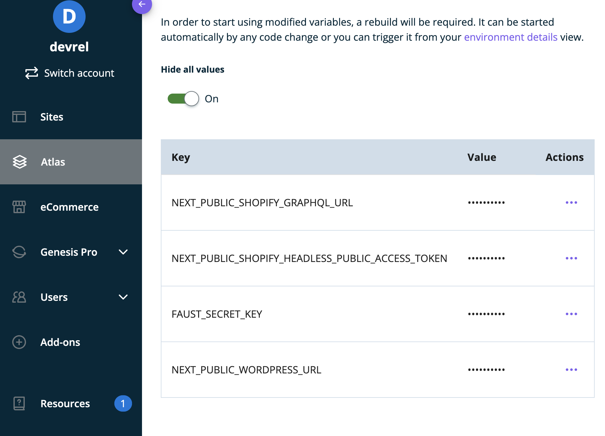

## Configuring Shopify

In order to list products from your **Shopify** store in the Blueprint once it has been deployed, you need to add your [Shopify Headless Public Access Token](https://shopify.dev/docs/api/usage/authentication#getting-started-with-public-access) and [Shopify GraphQL URL](https://shopify.dev/docs/api/storefront#endpoints) as Environment Variables.

The Environment Variables that need to be set in addition to the default ones should be named as follows:

- `NEXT_PUBLIC_SHOPIFY_TOKEN`: See [Getting started with public access](https://shopify.dev/docs/api/usage/authentication#getting-started-with-public-access)
- `NEXT_PUBLIC_SHOPIFY_URL`: See [Storefront API Endpoints](https://shopify.dev/docs/api/storefront#endpoints)

The following guide walks through the process of creating Environment Variables in the **Atlas** Dashboard as well as for local development:

[Configuring Atlas Environment Variables &#8594;](https://developers.wpengine.com/docs/atlas/local-app-development/frontend-app-config#2--define-environment-variables)

Once the above **Environment Variables** have been added to the Blueprint, you should manually rebuild the site.

Once completed this should show your products listed on various pages on the frontend.

**Note**: If you are not seeing products listed after a rebuild please try and clear the cache in your browser or in the Atlas Dashboard itself. [See here for more detailed tips on troubleshooting builds &#8594;](https://developers.wpengine.com/docs/atlas/additional-guides/troubleshooting-builds)

- Check out the demo of [Atlas Shopify Blueprint](https://atlasshopify.wpengine.com/)
- Try out a [sandbox version of Atlas](https://wpengine.com/atlas/#atlasplans) where you can install Atlas Commerce Blueprint
