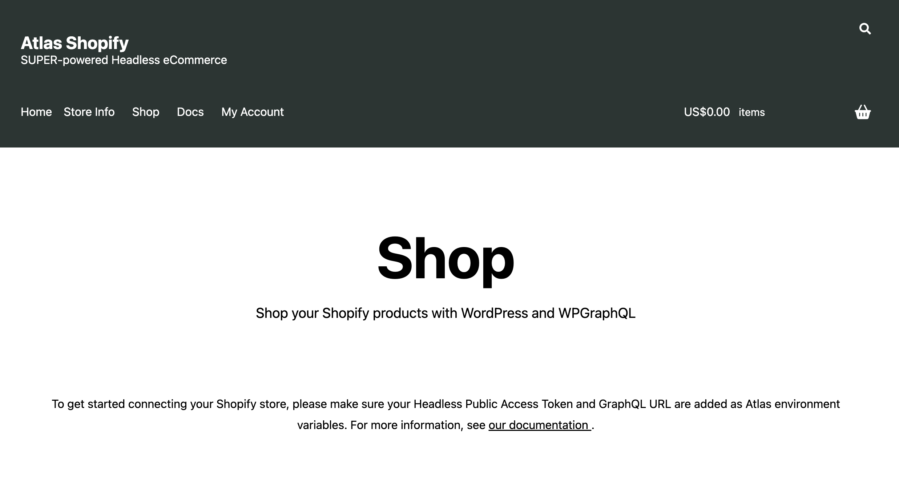

**Note**: This documentation asssumes your already have a [Shopify Store setup](https://help.shopify.com/en/manual/intro-to-shopify/initial-setup/setup-your-store) containing products and a public API access token.

The **Atlas Shopify Blueprint** allows you to deploy a **Faust.js** template featuring products from your Shopify store.
The Blueprint contains components and configurations that connect to the [Shopify Storefront API](https://shopify.dev/docs/api/storefront), so all you have to do is add your credentials and everything is connected.

## Getting Started

In order to create and deploy a Shopify Blueprint via the tile in the above image follow the below guide before coming back to this text and completing the next step:

[Creating a Blueprint in Atlas Dasboard &#8594;](https://developers.wpengine.com/docs/atlas/getting-started/create-app)

Once the Blueprint has been built and deployed you will see the following message on the frontend in places where product data should be listed:

## Next Step

[Configure Shopify API via Atlas Environment Variables &#8594;](../atlas-shopify-blueprint/configuring-shopify.mdx)

- Check out the demo of [Atlas Shopify Blueprint](https://atlasshopify.wpengine.com/)
- Try out a [sandbox version of Atlas](https://wpengine.com/atlas/#atlasplans) where you can install Atlas Commerce Blueprint
