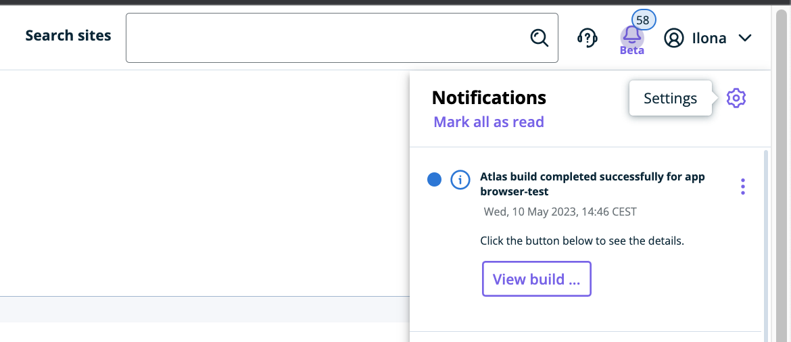
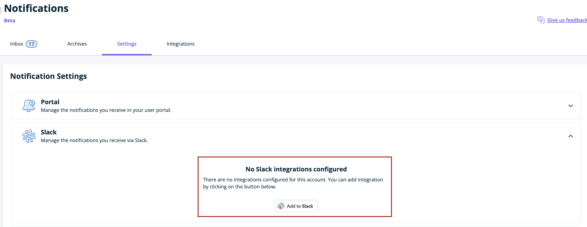
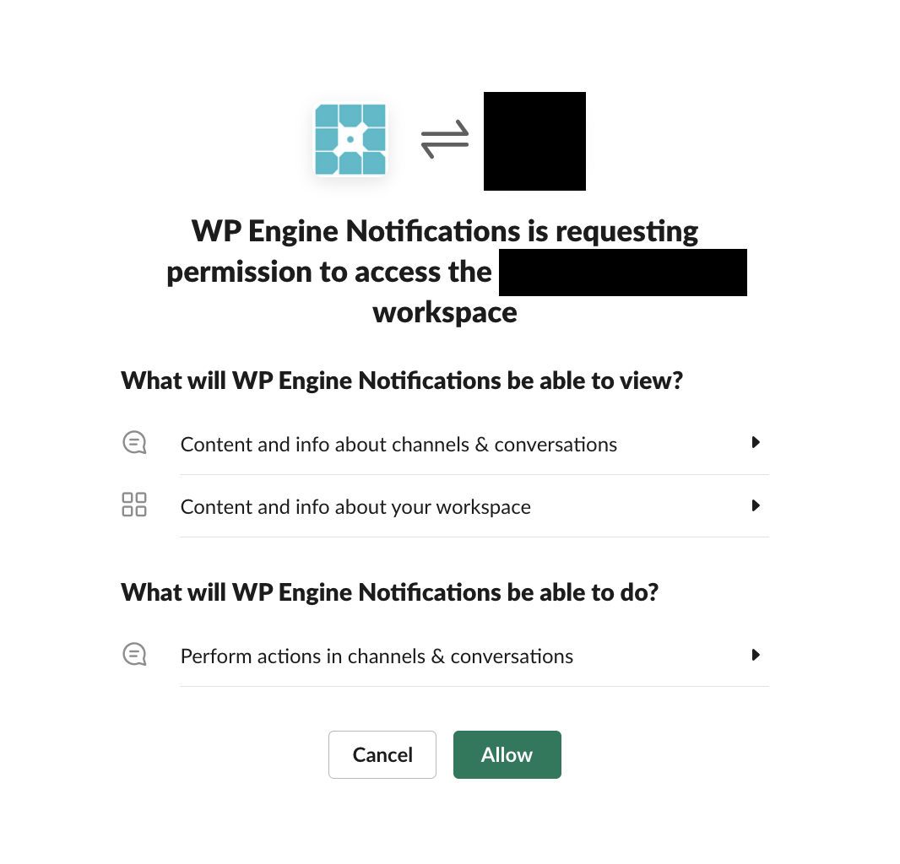
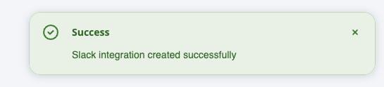
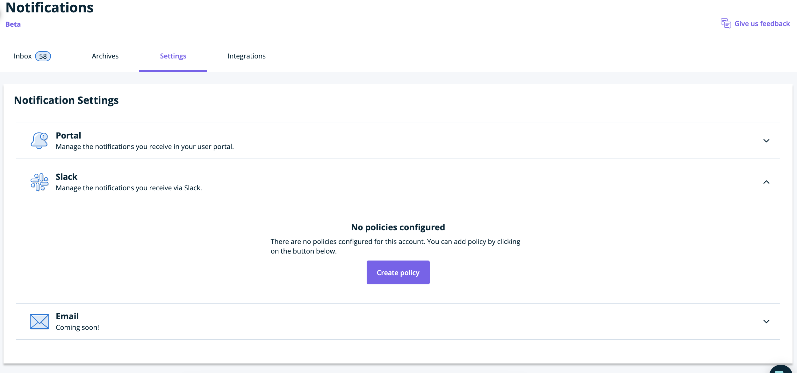
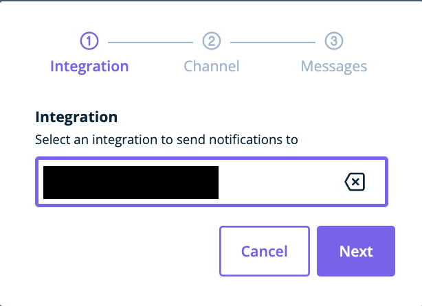
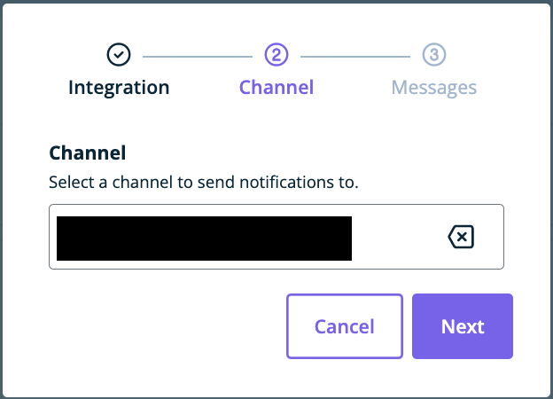
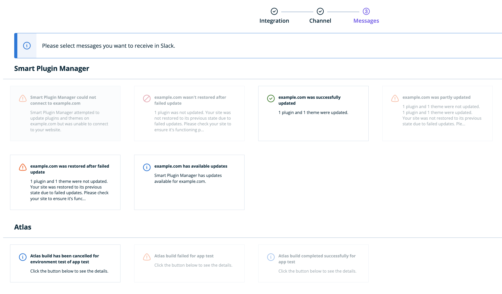
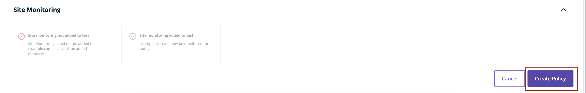
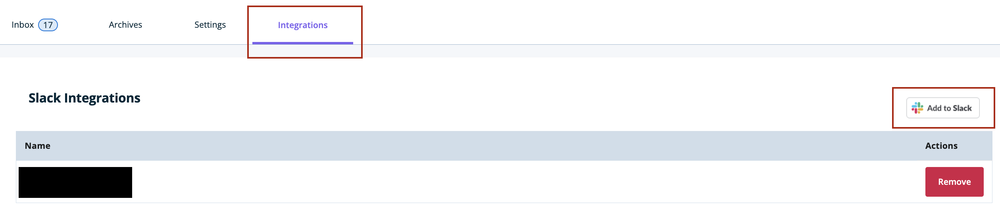

There's a number of ways you can get notified about finished Atlas builds

## E-mail notifications based on GitHub comments

**Please note:** comments on commit pages aren't available for Atlas applications built from Bitbucket or GitLab repositories at the moment.

Atlas posts comments on commit pages once a build is complete. These comments contain information about the status of the build as well as a link to the build logs and to the Atlas environment.

If you wish to receive an e-mail update once this happens, make sure you configure your [GitHub settings](https://docs.github.com/en/account-and-profile/managing-subscriptions-and-notifications-on-github/setting-up-notifications/configuring-notifications#customizing-your-email-notifications) accordingly.

## Notifications in the User Portal
Once your build is finished, you'll be notified about this event in the Atlas User Portal. To browse notifications, click on the bell icon on top of the page:

Clicking on `View build...` button is going to take you to the build logs page. 

## Slack notifications

To configure rules for Slack notifications about Atlas builds, go to notification settings screen by clicking on the cogwheel icon in the notifications menu:

Under "Slack" menu, click on "Add to Slack" button to configure Slack integration:

Accept the details of the connection to confirm integration with your workspace:

Upon successful connection, you should see a message on top of the screen:

Under "Slack" menu you'll now see the "Create policy" button:

Once clicked, select workspace that your policy will apply to:

Then, select a public channel where your notifications should be sent:

After that, select which messages you want to receive by clicking on each of the types of messages you're interested in:

Scroll down and click the "Create policy" button to finish the setup:

If you wish to add more integrations with other Slack workspaces, you can do so by going to "Integrations" tab and configuring additional connections by clicking "Add to Slack" button

