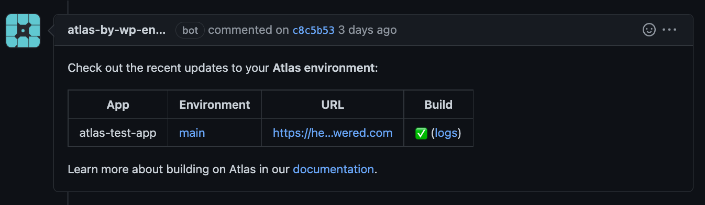
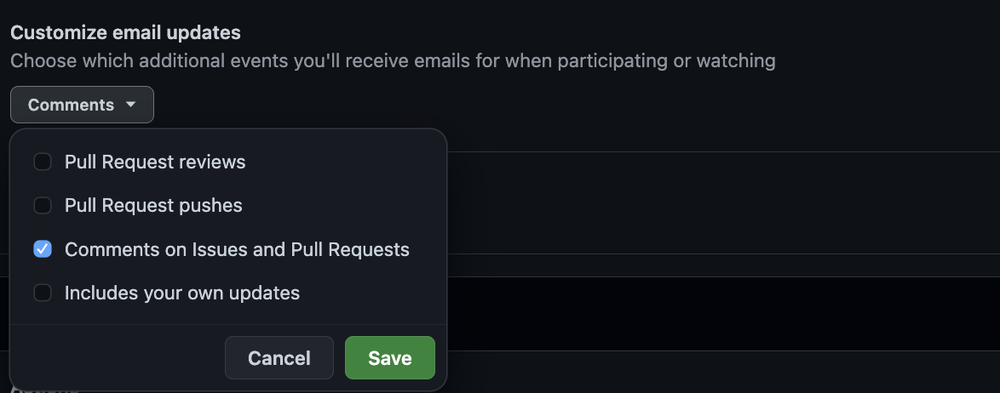
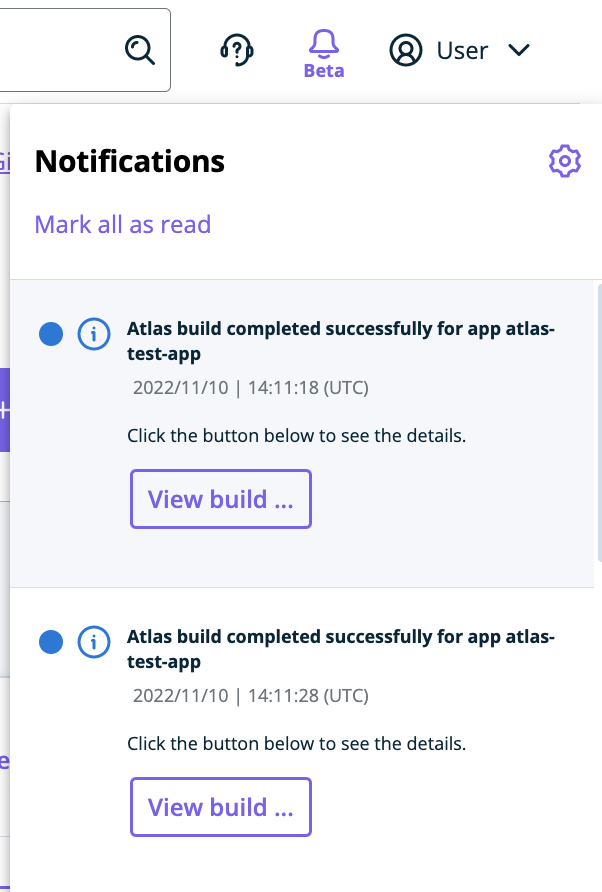

There's a number of ways you can get notified about finished Atlas builds

## E-mail notifications based on GitHub comments
Atlas posts comments on commit pages once a build is complete. These comments contain information about the status of the build as well as a link to the build logs and to the Atlas environment.

If you wish to receive an e-mail update once this happens, make sure you configure your [GitHub settings](https://docs.github.com/en/account-and-profile/managing-subscriptions-and-notifications-on-github/setting-up-notifications/configuring-notifications#customizing-your-email-notifications) accordingly.

## Notifications in the User Portal
Once your build is finished, you'll be notified about this event in the Atlas User Portal. To browse notifications, click on the bell icon on top of the page:

Clicking on `View build...` button is going to take you to the build logs page.
