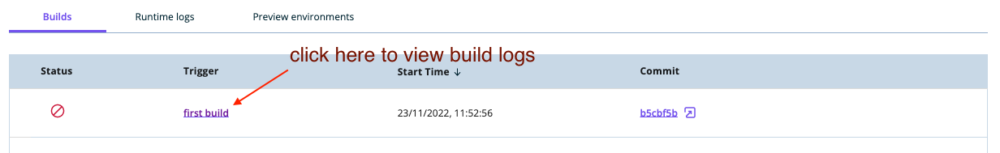
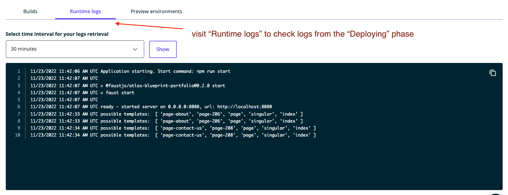

In this guide, you'll learn more about the process of pushing new changes to your Atlas environments and understand its phases.

## I push a new commit to my branch. What happens next?
On Atlas, the process of pushing new changes to your site is split into two or three phases:

### WordPress provisioning phase
In case you created your app using Atlas Blueprints, you'll go through WordPress provisioning phase during the initial set-up process. During WordPress provisioning phase: 
- a new WordPress site with a production WordPress install is created and linked it to your Atlas environment, 
- plugins relevant to Blueprint of your choice are installed and activated
- sample data is pushed to the WordPress install
- environment variables required for the site to work properly are set

This phase is run only once and will not be triggered with new changes you introduce to your site. Is it neither triggered if you create your app through the `Pull from repo` flow.

### Code build phase
During the Code build phase Atlas pulls the code from your repository, installs your projects dependencies such as Node.js and npm packages, runs your project's `build` script and sets its `start` script.

### Deploying phase
During the Deployment phase Atlas starts your project using the start script and confirms it is running before pointing traffic at it.

## I see that the `WordPress provisioning` and `Code build` phase failed. What should I do?
If either of these 2 phases failed, the first thing you should do is to check logs generated during the process. You can find them by clicking on the link in the "trigger" column that corresponds to the failed operation:

If `WordPress provisioning` phase failed, it means that at least one of the 4 things mentioned in the `WordPress provisioning phase` section was not executed properly. Depending on the severity of the issue, it can cause the data to not be displayed properly on the site you created.

If the `Code build` phase failed, the most likely reason for that is some problem in your code that needs to be fixed before your project can build properly. Build logs generated during the attempt to build your environment should guide you to what the problem is and how to fix it.

## I see that the `Deploying` phase failed. What should I do?
If the `Deploying` phase failed, that means that your application was built properly, but it couldn't start. This can occur for number of reasons, such as a problem with your code, a missing environment variable or the WordPress you're using as your data source not being able to handle the number of requests. To get more information about what happened, visit the `Runtime logs` tab and request logs from the time window during which the failure happened.

