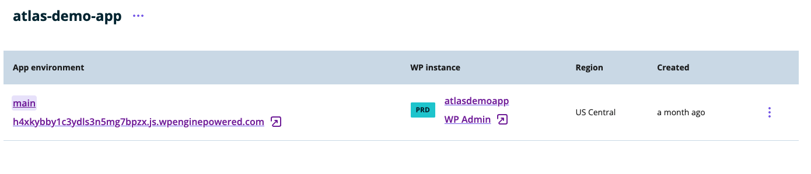
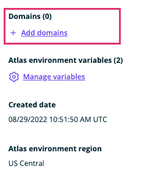
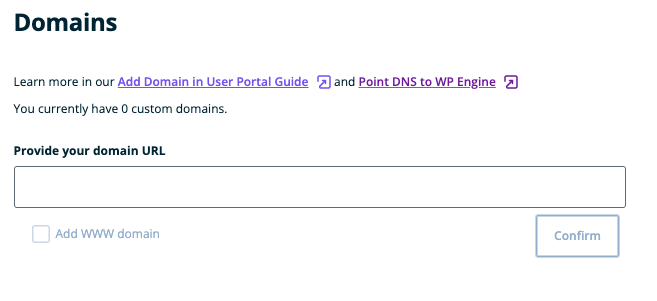
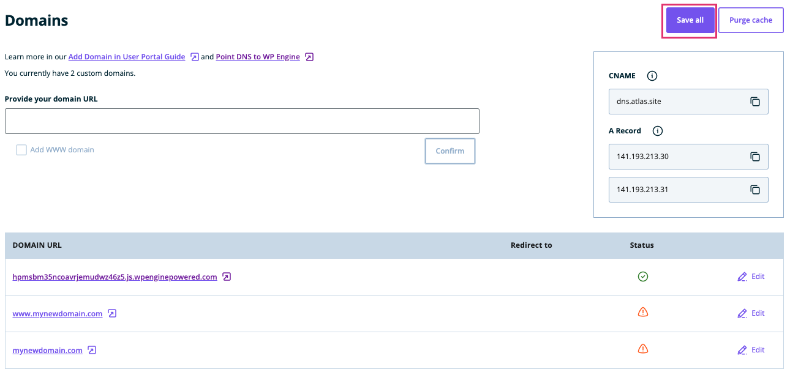
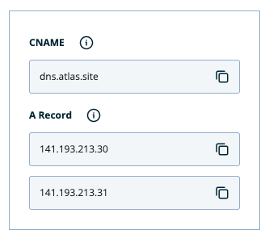
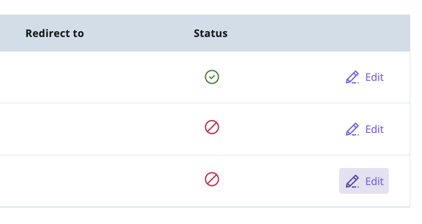
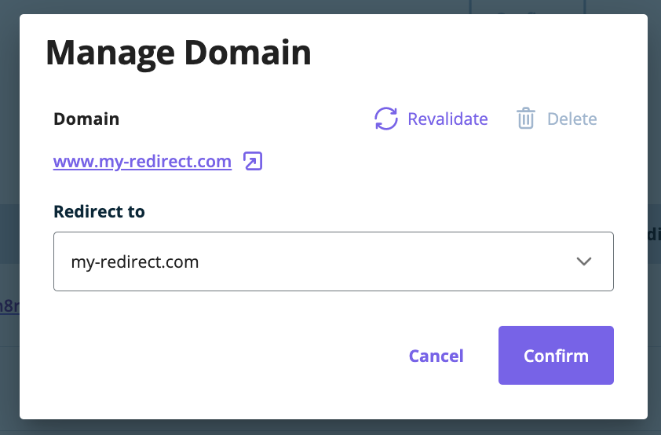
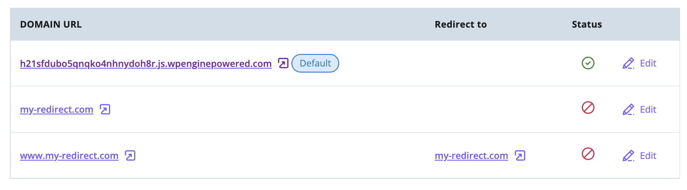
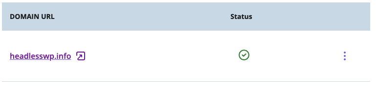
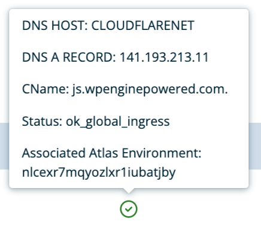

In this guide, you will learn how to map a custom domain name to an environment in your Atlas application. Custom domains allow you to make production environments available at a user-friendly URL like `mydomain.com`, but also allow some flexibility in defining how to access other environments like `staging.mydomain.com` or `dev.mydomain.com` depending on your needs.

While some users may wish to customize non-production environment URLs as well, doing so is not required; the URLs that Atlas automatically generates for environments can continue to be used.

## Choose Atlas Environment

Once you are in the Atlas portal, choose the app and environment that you want to map to a custom domain. When you map a custom domain, you are mapping it to a specific environment. This allows you to customize your domains based on your usage, e.g. `mydomain.com`, `staging.mydomain.com`.

## Add a Domain to the Environment

1. After selecting your environment, locate the `+ Add domains` button on the environment detail panel.
   
2. Locate the text input labeled `Domain URL` and add your desired domain name to that input field. As you type it will validate the URL for you. Click the `Confirm` button below the input to confirm your new domain.
   
3. To apply all of your changes, click the `Save All` button in the top right of this panel. You will get a success message once the settings have been saved, but there may still be processes running behind the scenes to make your app available across our network.  
   **NOTE:** The `Add Domain` button above this panel is used for adding multiple domains to an environment, not saving the current custom domain settings.
   
4. Copy the `CNAME` and `A` records on this page for your DNS provider.
   **NOTE:** Do not use the `CNAME` and `A` records shown in this image. Instead, copy the ones you see in the User Portal that are specific to your app.
   

## Update DNS records

After updating the custom domain settings in your Atlas environment, you will need to point your domain's DNS records to WP Engine servers to finish the connection. This step will vary based on your particular DNS provider, so be sure to reference their documentation on how to add a `CNAME` or `A` record.

## Set domain redirects

Once your domains are added to an environment (which requires adding them in the User Portal and clicking `Save All` to trigger a redeployment of your app), you can define domain-level redirect rules in the same screen. You can do it by clicking on the `Edit` button next to your domain name:

   
   
To specify a redirect rule, select a domain from the dropdown that will be the destination domain for the redirect. 

   
   
Once confirmed, you can inspect your rules in the `Redirects to` column. For changes to take place, you need to click the `Save All` button and redeploy your app. Your redirect rules will work as expected only if both your target and destination domain are properly configured (including the DNS details).

   

Note: at the moment it is not possible to define redirect rules through the Atlas CLI. If changes done through CLI are expected to conflict with redirect rules set in the User Portal, this operation will be stopped and changes requested through CLI will not take place.

## Troubleshooting

DNS can be inherently difficult to troubleshoot. Depending on your provider and your TTL (time to live) settings, it could take up to 24 hours for changes to your DNS records to propogate across the web.
When in doubt, waiting an appropriate length of time can be a better troubleshooting step than making lots of changes very quickly.

If you click `Manage Domains` from the main environment screen, you should see an icon that reflects the status of your custom domain.  

A green check mark indicates that everything is configured appropriately, but other statuses are possible. To get additional details, you can hover over the status icon to reveal a tooltip.

If your domain name resolves but shows either a Cloudflare error or an error regarding SSL versions, its possible that the Atlas platform is still provisioning the resources required to support your custom domain name. If either of these errors persist, please reach out to support.

## Additional Resources

[Smart Plugin Manager Compatibility](https://wpengine.com/support/smart-plugin-manager/#Atlas_Support)
