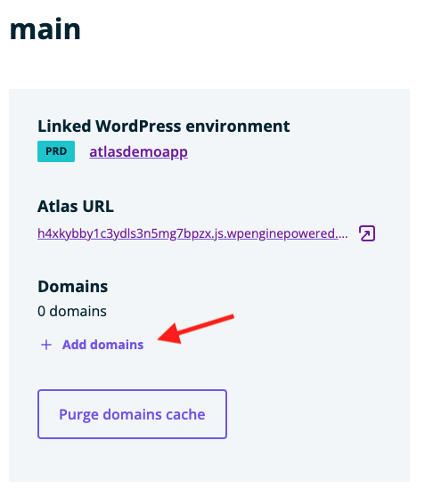
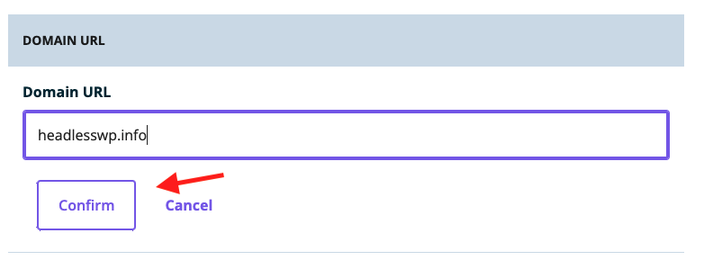
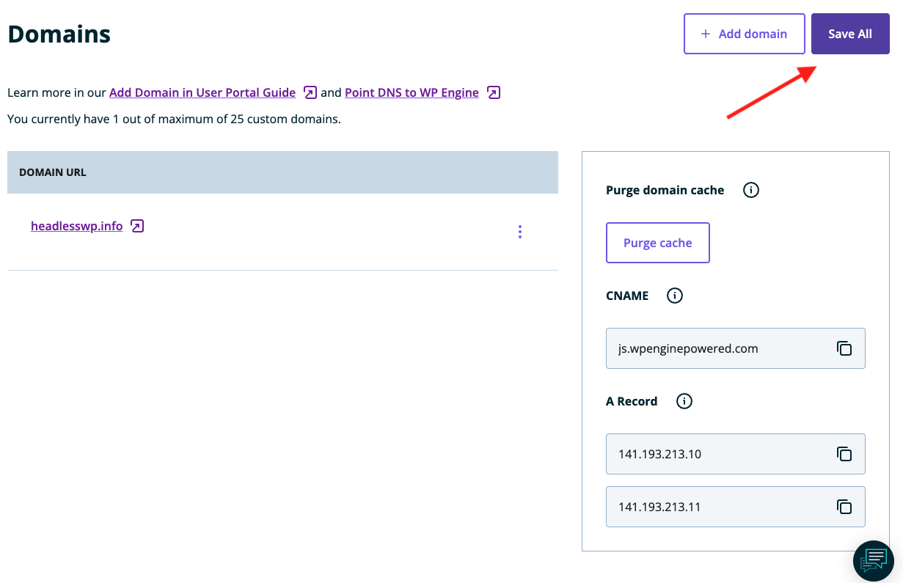
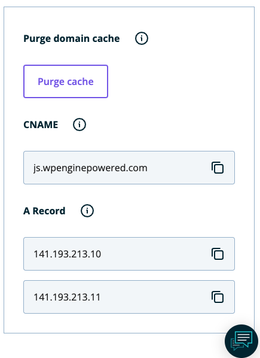

In this guide, you will learn how to map a custom domain name to environments in your Atlas application. Custom domains allow you to make production environments available at a user-friendly URL like *mydomain.com*, but also allow some flexibility in defining how to access other environments like *staging.mydomain.com* or *dev.mydomain.com* depending on your needs. While some users may wish to customize non-production environment URLs, the WP Engine urls that are automatically generated when you create an environment will remain stable.

## Choose Atlas Environment

Once you are in the Atlas portal, choose the app and environment that you want to map to a custom domain. When you map a custom domain, you are mapping it to a specific environment. This allows you to customize your domains based on your usage, e.g. *mydomain.com*, *staging.mydomain.com*.

## Add a Domain to the Environment

1. After selecting your environment, locate the `+ Add domains` button on the environment detail panel. 

2. Locate the text input labeled `Domain URL` and add your desired domain name to that input field. As you type it will validate the URL for you. Click the `Confirm` button below the input to save your new domain.

3. To apply all of your changes, click the `Save All` button in the top right of this panel. You will get a success message once the settings have been saved, but there may still be processes running behind the scenes to make your app available across our network.  
**NOTE:** The `Add Domain` button above this panel is used for adding multiple domains to an environment, not saving the current custom domain settings.

4. Copy the CNAME and A records on this page for your DNS provider. **NOTE:** Don't assume the A and CNAME records in this image are the same for your app.  

## Update DNS records

After updating the custom domain settings in your Atlas environment, you will need to point your domain's DNS records to WP Engine servers to finish the connection. This step will differ based on your particular DNS provider, so be sure to reference their documentation on how to add an A or CNAME record.

## Troubleshooting

DNS can be inherently difficult to troubleshoot. Depending on your provider and your TTL (time to live) settings, it could take up to 24 hours for changes to your DNS records to propogate across the web. 
When in doubt, waiting an appropriate length of time can be a better troubleshooting step than making lots of changes very quickly. 
If your domain name resolves but shows either a Cloudflare error or an error regarding SSL versions, its possible that the Atlas platform is still provisioning the resources required to support your custom domain name. If either of these errors persist, please reach out to support. 
