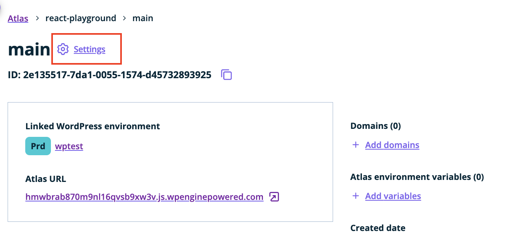
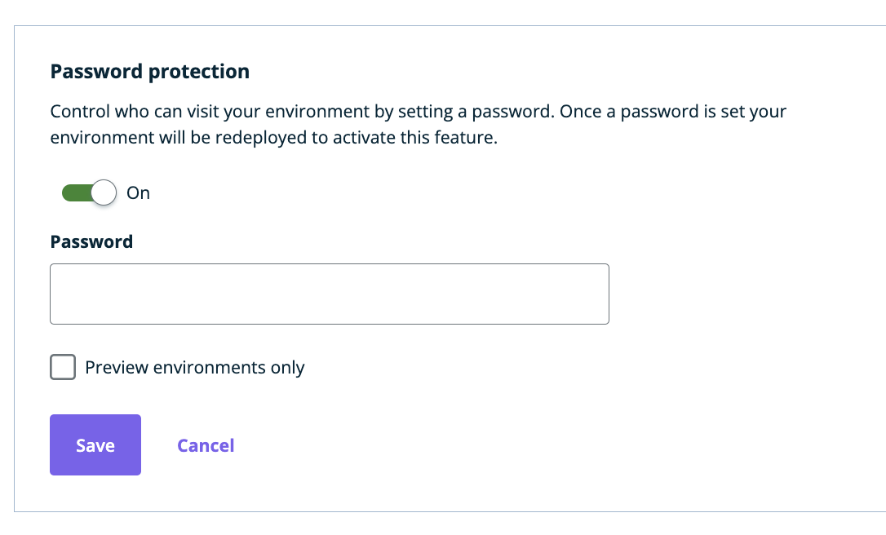
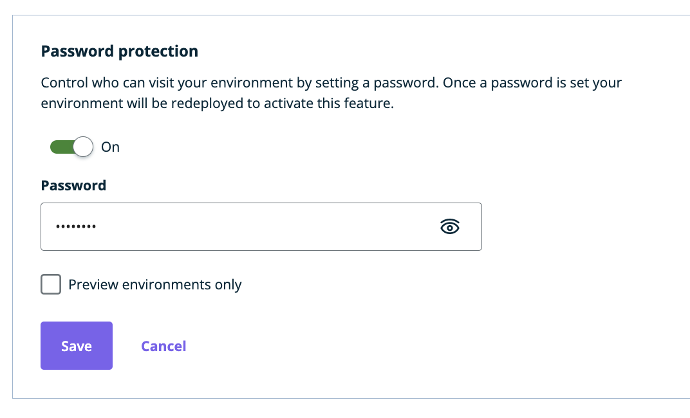
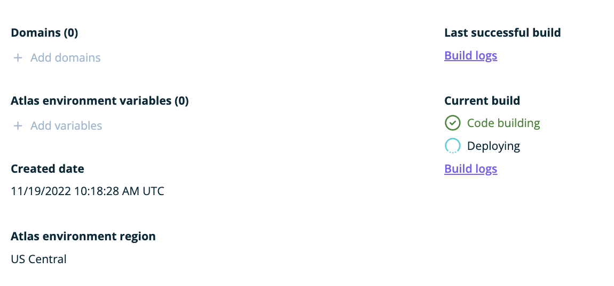
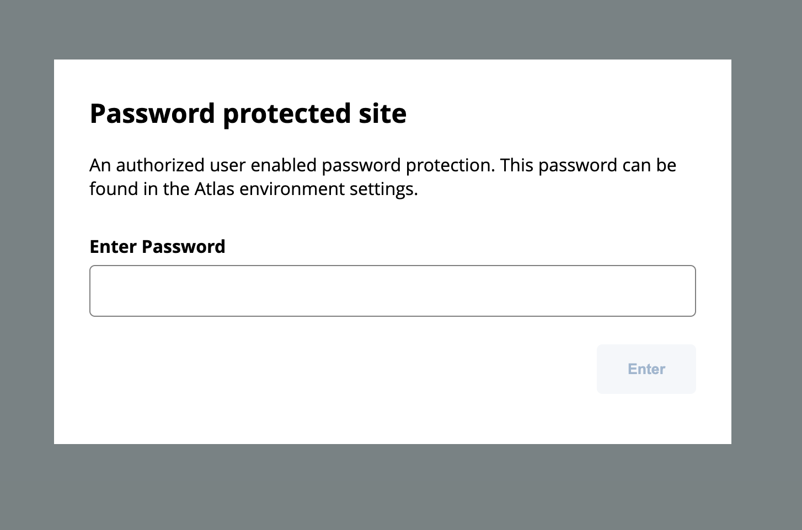
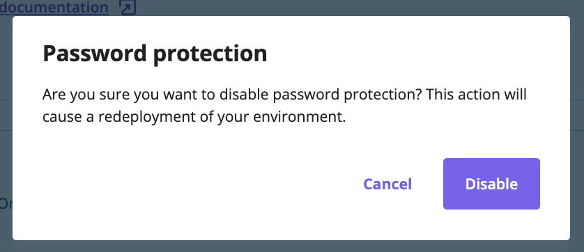

On Atlas, you can choose to protect your environments with a password. This can be configured in your environment's `Settings` screen:

  
 
Once there, scroll down to the `Password protection` section and turn the feature on with the toggle:

  
Specify the password you want to use for your site (minimum 8 characters). By default, the environment and all of its preview environments will be protected with the same password. If you wish to apply password protection to preview environments only, then make sure to check the `Preview environments only` checkbox.

  
Click `Save` - for password protection to take place, all of the affected environments must be redeployed. This will be triggered automatically once you click the `Save` button. Any changes in the settings, like changing your password or turning the protection off, will also result in a redeploy of affected environments.

  
  
Once the redeploy is complete, your sites will be protected with the specified password. When someone uses the password to access the protected site, the cookie will be persisted in their browser for the next 24 hours. While this cookie is valid, you won't be asked to retype the password as long as you're accessing your site from the same browser.

  
  
To turn the password protection off, go back to the settings screen and change your password setting. This change will trigger a redeploy of affected environments. Once complete, the site will no longer be protected with password.

