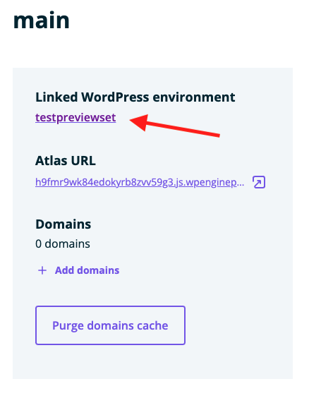
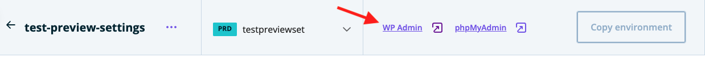
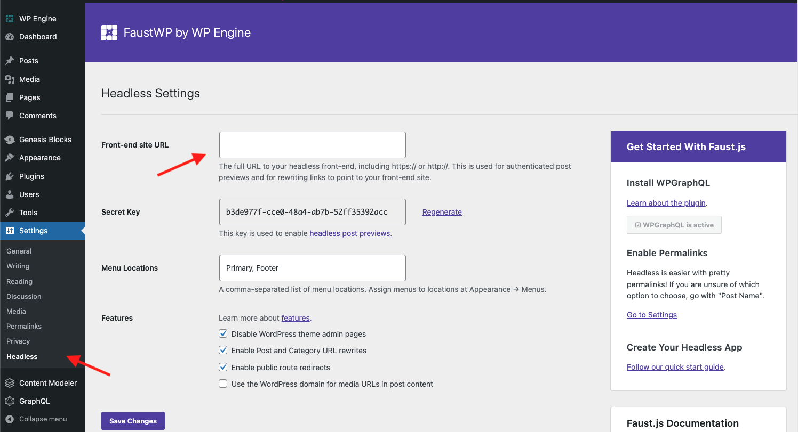
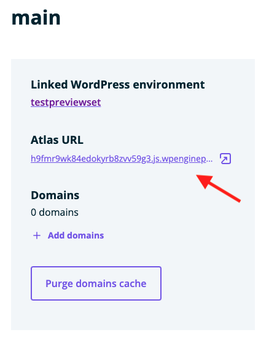
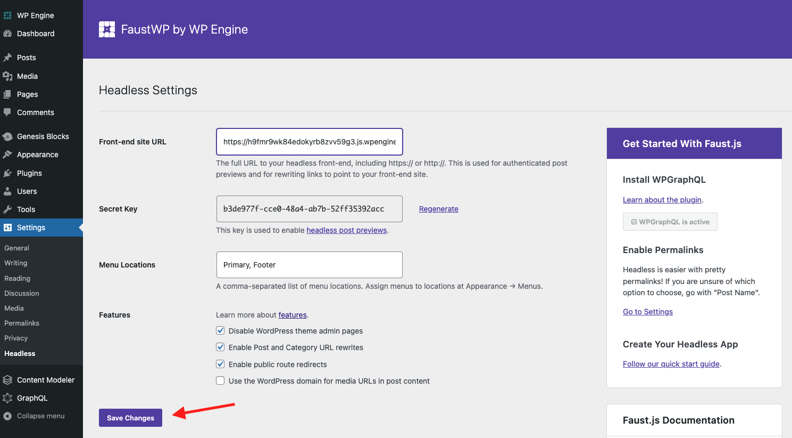
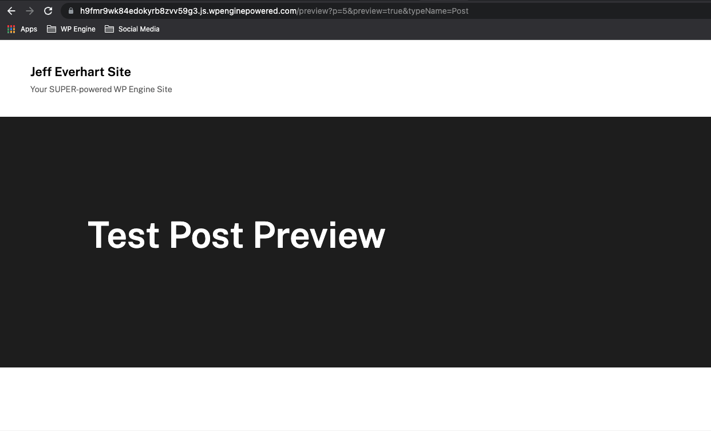

In this guide, you'll learn configure post and page previews for your headless WordPress site running on the Atlas platform. This guide assumes that you are using the Faust.js starter template. If you are using another framework, you will likely need to create your own method of rendering post and page previews that is specific to your application. If you did not user the starter template when creating your Atlas site, but are still using Faust.js, it might be helpful to reference thosed [docs for post/page previews](https://faustjs.org/docs/next/guides/post-page-previews) as well

## Set Front-end URL in WP Admin

To get post and page previews to work correctly with Faust.js, we need to configure the plugin's `Front-end site URL` setting. Follow the steps below to get started.

1. In the Atlas platform, locate the URL to your linked WordPress environment on the main environment detail panel.  

2. With the dashboard for your connected WordPress site open, find the link to your `WP Admin` area on the dashboard.

3. Inside of the WP Admin area, locate the FaustWP settings menu in `Settings > Headless` and find the text input labeled `Front-end site URL` at the top of the settings list.

4. Navigate back to the Atlas dashboard for your environment and locate the link to the `Atlas URL` on the main details panel. Click that link to open it in a new tab and copy the URL to your clipboard.

5. With the `Atlas URL` stored in your clipboard, head back to the FaustWP Settings menu in your WordPress admin area. Past the `Atlas URL` into the input labeled `Front-end site URL` and click the `Save Changes` button to update these settings.

6. Create a new post and generate a preview. With the `Front-end site URL` setting saved, Faust will rewrite all of your preview links to point towards your Atlas application and let you view them in that context.

