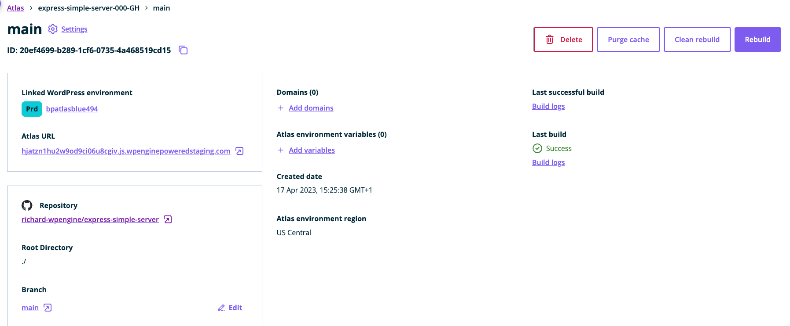
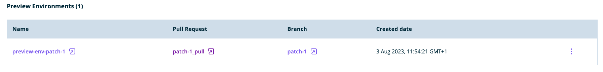

In this guide, you'll learn how to configure preview environments for your Atlas sites. 

## What are preview environments?
To make your Atlas workflow easier, you can now dynamically create new Atlas environments to test your changes when you open a pull request (PR), without having to go through all the configuration steps in the User Portal.

If you decide to turn this feature on, every PR opened against the 'source branch' (the branch linked to your Atlas environment) will automatically create a preview environment - based on the code of the branch that is looking to merge into your source branch in the PR. Closing or merging the PR will shut the environment down.

This feature is available for all supported repository hosting service provider (GitHub, GitLab or Bitbucket).

## Enable the 'preview environments' feature
This feature is enabled through a per-environment setting. To enable this setting, visit the `Settings` page of your Atlas environment:

Once you enable this feature via the toggle, every PR to the source branch for the environment will create a new preview environment automatically:

## Create a preview environment
Once the setting is turned on, you can test the process by opening a PR to the environment's source branch. When the preview environment is created, a comment will be posted, from the WP Engine bot, on the pull request page - this comment will include the new environment's URL, build logs, and other details (GitHub example shown here):

In this comment you are provided with the status of the build, whether it succeeded or failed, and links directly to the build logs, the preview environment site, and access the preview environment's details page (Portal).

You can also view all current preview environments for a given environment on that environment's details page, under the 'Preview Environments' tab:

## Delete a preview environment
The action of closing or merging the pull request will automatically shut the preview environment down.

You can also delete your preview environment through the User Portal - to do so, visit the preview environment details page and click the `Delete` button.

## Important notes
1. Preview environments inherit both the environment variables and the link to WordPress from their 'parent' environment. You can modify the environment variables of a given preview environment on its details page in the User Portal.
2. To protect users from creating Atlas environments by unauthorised users, pull requests coming from forked repositories are ignored at the moment.
