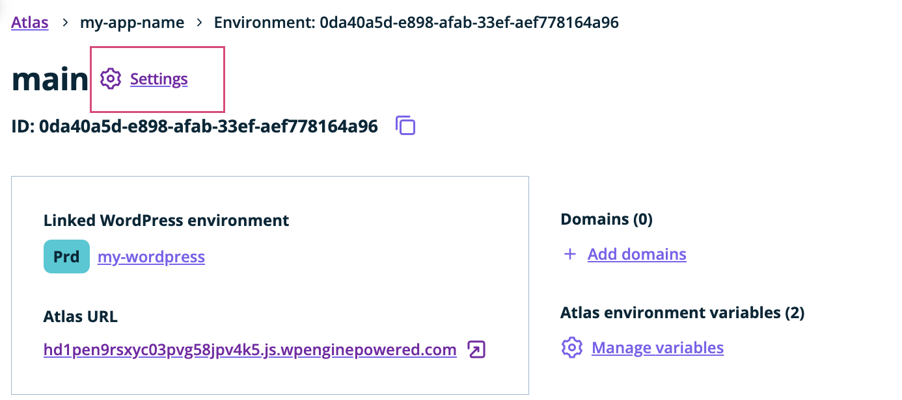
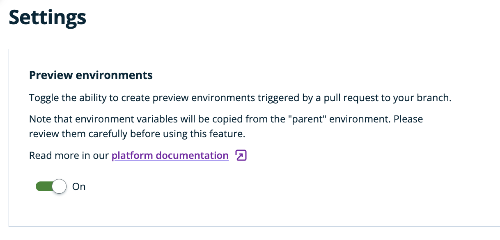
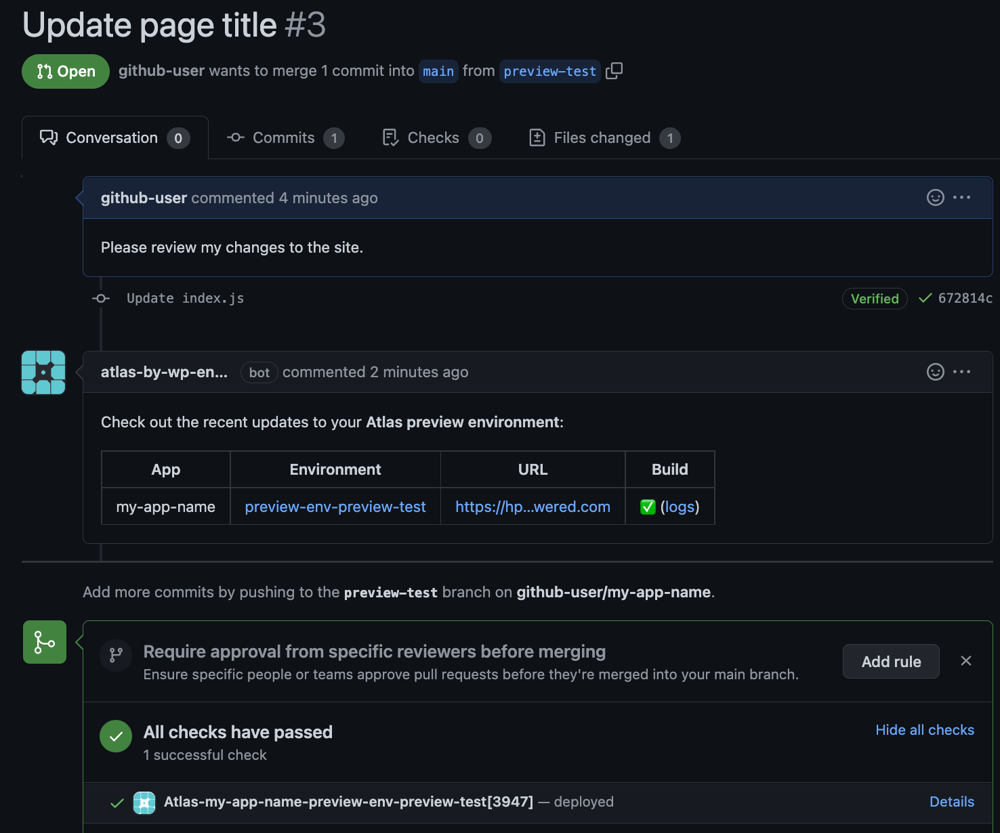
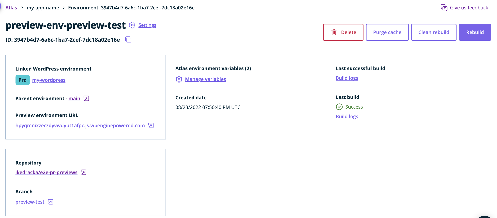
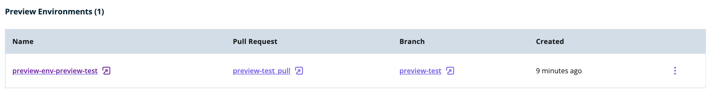

In this guide, you'll learn how to configure preview environments for your Atlas sites. 

## What are preview environments?
To make your Atlas workflow easier, you can now dynamically create new Atlas environments to test your changes from GitHub pull requests, without having to go through all the configuration steps in the User Portal.

If you decide to turn the feature on, every pull request opened to a branch that is used as a source branch for your Atlas environment will create a preview environment based on the branch that is being compared to your source branch. Closing or merging the PR will shut the environment down.

## Enable the 'preview environments' feature
This feature is enabled through a per-environment setting. To enable this setting, visit the `Settings` page of your Atlas environment:

Once you enable this feature via the toggle, every pull request to the source branch for the environment will create a new preview environment automatically:

## Create a preview environment
Once the setting is turned on, you can test the process by opening a pull request to the environment's source branch. When the preview environment is created, a GitHub comment will be posted on the pull request page that includes the new environment's URL, build logs, and other details:

From there, you can view your preview environment details and access the environment URL:

You can also view all current preview environments for a given environment on that environment's details page:

## Delete a preview environment
The action of closing or merging the pull request will automatically shut the preview environment down.

You can also delete your preview environment through the User Portal - to do so, visit the preview environment details page and click the `Delete` button.

## Important notes
1. Preview environments inherit both the environment variables and the link to WordPress from their 'parent' environment. You can modify the environment variables of a given preview environment on its details page in the User Portal.
2. To protect users from creating Atlas environments by unauthorised users, pull requests coming from forked repositories are ignored at the moment.
