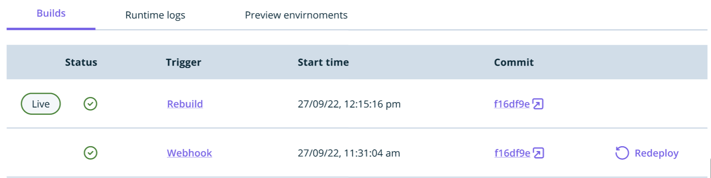
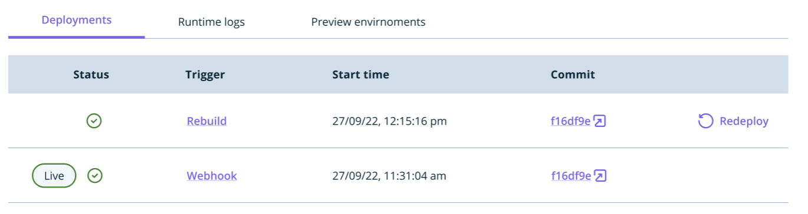

In this guide, you will learn how to redeploy an older version of your site if you need to rollback your code.

If you deploy a new version of your site that has broken graphics, errors, or other unwanted behavior, you can quickly revert back to one of the previous versions by clicking on the `Redeploy` button next to the build you want to redeploy.

Once you hit the button, you'll be asked to confirm the operation:

When confirmed, a previous build of your choice will be redeployed. 

**NOTE:** When redeploying a previous build, the application will not be rebuilt and the existing assets from the previous build will be redeployed. If your framework statically generates pages at build time, content changes you introduced in between deploys will not be reflected in a redeployed site version. 

Once complete, the previous version of your site will now be available under your environment's URL and you'll see the `Live` tag moves to the now published build:

It's possible to request a rollback operation when the build and deployment of a given version of your environment are complete.
