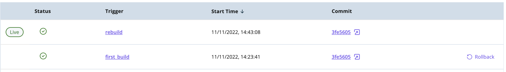
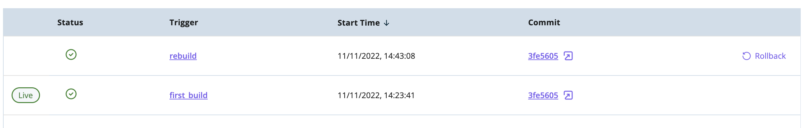

## Redeploying a previous version of your site

In case you deployed a new version of your site that shows some broken graphics or behavior, you can quickly come back to one of the previous versions by clicking on the "Redeploy" button next to the build you want to redeploy.

Once you hit the button, you'll be asked to confirm the operation:

When confirmed, a past build of your choice will be redeployed. A rebuild of the previous version will not be done, which means that, in case you fetch your content during build, changes in content you introduced between builds might disappear. 

Once complete, the previous version of your site will now be available under your environment's URL and you'll see the "Live" tag moves to the now published build:

It's possible to request a rollback operation when build and deployment of a given version of your environment is complete.
