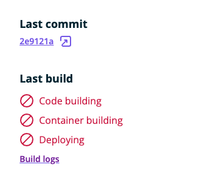
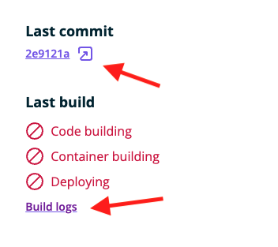
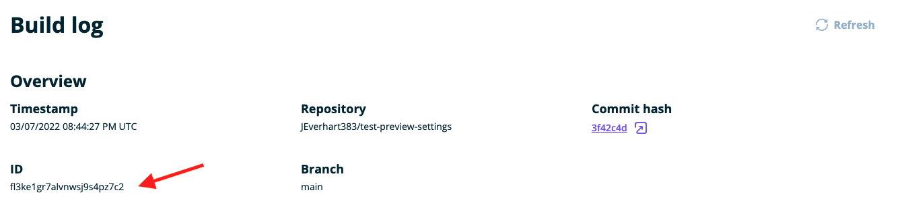
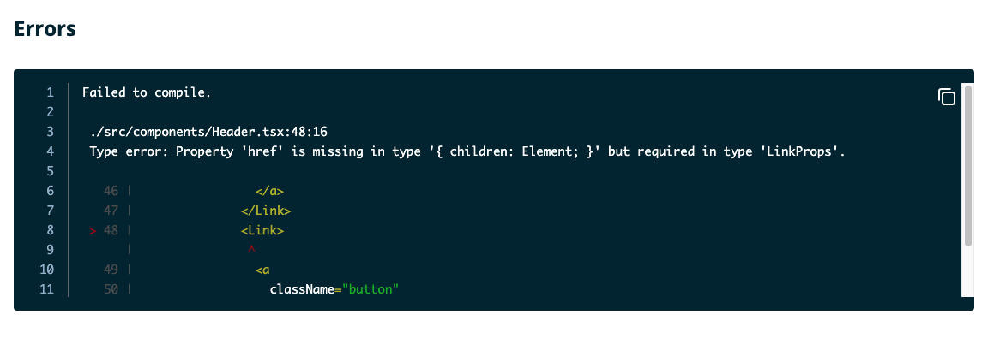
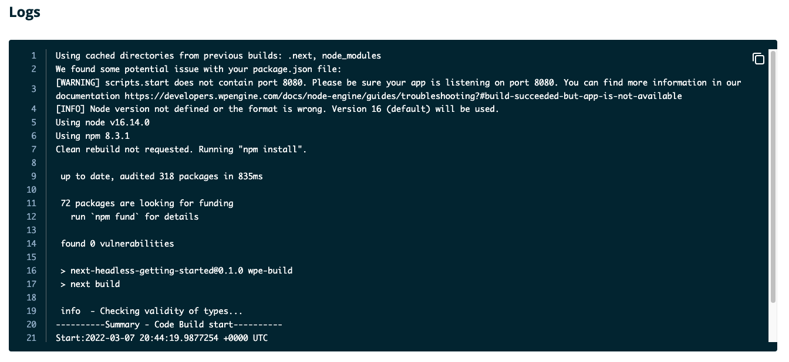

In this guide, you'll learn how to troubleshoot failing builds by examining build logs and comparing logs across your commit history.

## Responding to Failed Builds

When you push new code to your Atlas project repository on GitHub and trigger a new build on the platform, you can inspect the progress of that build in realtime via the [User Portal](https://my.wpengine.com/atlas).

As the build progresses, it can either succeed or fail at any of the stages in the build -> deploy checklist. If the project fails to build, the build details on your Atlas dashboard will look like this:

Since Atlas accepts a wide variety of frontend application frameworks (Faust.js, Next.js, Nuxt, Svelte, React, Remix, etc.), there are many different ways that building a particular application could fail. Since there are few commonalities in these failure modes, this guide will focus on giving you the tools to inspect and diagnose your own app's failure state.

After you've pushed a failing build, there are quick ways to start troubleshooting your app from the Atlas dashboard by inspecting the GitHub commit or looking at the build logs directly.

When looking at the build checklist, regardless of whether the build has failed or not, you will always have two quick links to either the commit hash, in this example `2e9121a`, that triggered the build or directly to the `Build logs` detail panel. Let's take a look at each option and how they can be used to diagnose the issues behind your failed build.

### GitHub Commit 
If you click on the commit hash link in the above screenshot, you will be taken directly to the GitHub commit diff for that particular commit. This view provides you with an easily scannable summary of everything that changed. If you scroll below your code changes, you will see an automated message from the WP Engine GitHub bot with some details about your build. It should tell you the status of the build, whether it succeeded or failed, and also provide you with links directly to the build logs and your public environment URL.

### Build Logs

If you click the `Build logs` link, you will be taken to a page that gives you more details about the build itself, as well as access to the errors and logs for your build. 

At the top of that page, there is a section with additional details about a particular build. You can see things like the time the build started, the repo and branch that Atlas tried to build from, as well as another commit hash link to GitHub. Each individiual build is also given a unique ID, and this might be needed if you try to escalate continued failing builds with support. 

#### Error Output

Below this detail panel, you will also find two areas that contain console output for your build process. The topmost area on the page contains error output, and this will typically be the best place to look when assessing a failed build.

In the screenshot above, we can see that this particular build exited with a `Failed to compile` error because a `Link` element was malformed or missing required properties. This example points us directly to the offending file and line of code, which makes addressing the issue straighforward. 

Using the `copy` button in the top right of the error output area, you can copy the logs to your clipboard for further analysis in a text editor or to share with your team or support. Unfortunately, not all failed builds will be for such an obvious reason, but the error output in your app's build logs is the best starting place for investigation. While there are additional logs that you can review to get to the bottom of failing builds, the error output captures all error message output.  

#### Logging Output

Below the error output area, there is another pane that contains logging out labeled `Logs` that provides you with a record of more general console output. While the error above is dedicated to output of thrown `Errors`, this section captures output from things like `console.log`, `console.info`, and `console.warn`.

