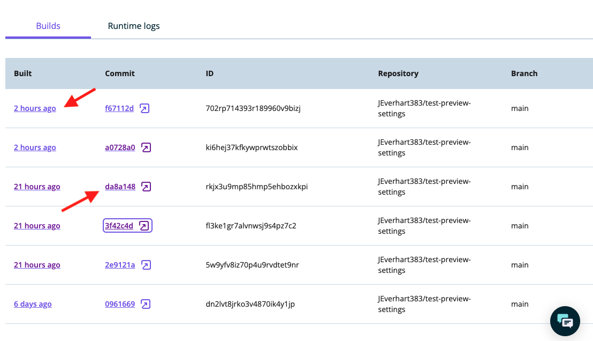
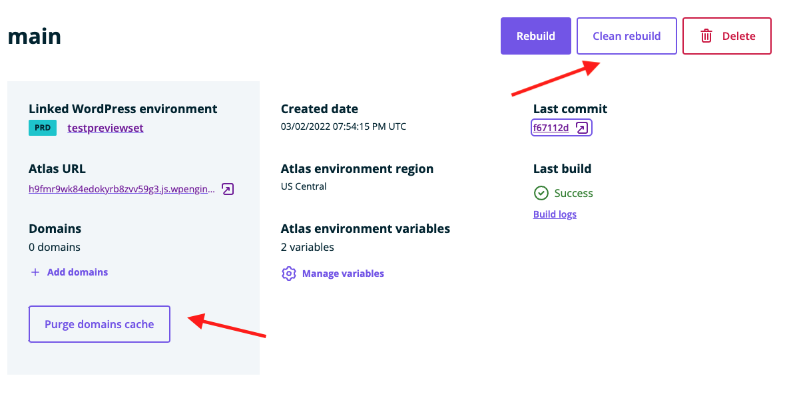

In this guide, you'll learn how to troubleshoot failing builds by examining build logs, comparing logs across your commit history and clearing app and CDN caches.

## Responding to Failed Builds

When you push new code to your Atlas project repository on GitHub and trigger a new build on the platform, you can inspect the progress of that build in realtime via the [User Portal](https://my.wpengine.com/atlas).

As the build progresses, it can either succeed or fail at any stage in the build -> deploy checklist. If the project fails to build, the build details on your Atlas dashboard will look like this:

Since Atlas accepts a wide variety of frontend application frameworks (Faust.js, Next.js, Nuxt, Svelte, React, Remix, etc.), there are many different ways that building a particular application could fail. Since there are few commonalities in these failure modes, this guide will focus on giving you the tools to inspect and diagnose your own app's failure state.

After you've pushed a failing build, there are quick ways to start troubleshooting your app from the Atlas dashboard by inspecting the GitHub commit or looking at the build logs directly.

When looking at the build checklist, regardless of whether the build has failed or not, you will always have two quick links to either the details of the GitHub commit (`2e9121a`) that triggered the build or directly to the `Build logs` detail panel. Let's take a look at each option and how they can be used to diagnose the issues behind your failed build.

### GitHub Commit 
If you click on the commit hash link in the above screenshot, you will be taken directly to the GitHub commit diff for that particular commit. This view provides you with an easily scannable summary of everything that changed. If you scroll below your code changes, you will see an automated message from the WP Engine GitHub bot with some details about your build. It should tell you the status of the build, whether it succeeded or failed, and also provide you with links directly to the build logs and your public environment URL.

### Build Logs

If you click the `Build logs` link, you will be taken to a page that gives you more details about the build itself, as well as access to the errors and logs for your build. 

At the top of that page, there is a section with additional details about a particular build. You can see things like the time the build started, the repo and branch that Atlas tried to build from, as well as another commit hash link to GitHub. Each individiual build is also given a unique ID, and this might be needed if you try to escalate continued failing builds with support. 

#### Error Output

Below this detail panel, you will also find two areas that contain console output for your build process. The topmost console output area on the page contains error output, and this will typically be the best place to look when assessing a failed build.

In the screenshot above, we can see that this particular build exited with a `Failed to compile` error because a `Link` element was malformed or missing required properties. This example points us directly to the offending file and line of code, which makes addressing the issue straightforward. 

Using the `copy` button in the top right of the error output area, you can copy the logs to your clipboard for further analysis in a text editor or to share with your team or support. Unfortunately, not all failed builds will be for such an obvious reason, but the error output in your app's build logs is the best starting place for investigation. While there are additional logs that you can review to get to the bottom of failing builds, the error output captures all error message output.  

#### Logging Output

Below the error output area, there is another pane that contains logging output labeled `Logs` that provides you with a record of more general console output. While the error area above is dedicated to output of thrown `Errors`, this section captures output from things like `console.log`, `console.info`, and `console.warn` that may be important but not critical.

In the screenshot above, we can see a few examples of this in action, and there are a few details we can pick out of the logging output:
1. Atlas tells us that it is using cached directories `.next` and `node_modules` from previous builds because we did not request a clean rebuild 
1. Atlas logs a `WARNING` regarding the lack of a specified port for our application; it expects `8080`
1. Atlas logs an `INFO` message regarding the lack of a specified Node.js version and defaults to `v16`
1. After those messages, we begin to see output from running `npm install` and the commands our app is using to build itself in `wpe-build`

Even though there aren't any errors here, the logging output available in this pane can be extremely useful for tracking down any issues that are related to your dependencies or their installation.

### Accessing Prior Builds

If you have examined the logging and error output for your build, and still aren't sure what the issue is, a helpful next step could be to compare the logging or commit histories between your current failed build and the last successful build. You can find a list of your environment's build history on the detail page for that environment. 

Through this panel, you can access links to the build logs via the leftmost time-based link, ex. `2 hours ago`, and the GitHub commit details via the commit hash link. Comparing errors and logging across different builds can help you isolate when and how breaking changes were introduced. 

## Other Build Issues

In some cases, your application will successfully build, but you may not see the correct visual results on the live site, or code that *should* be a part of you application isn't working. If this is the case, a good next step would be to clear out any assets from previous builds and make sure that no older files are still being served from a CDN.

### Clean Rebuild and Clear Domain Cache

Since Atlas is a flexible hosting platform for a number of different JavaScript apps, it is outside the scope of this guide to discuss all of the ways various frameworks create local caches or generate static assets. However, it is important to remember that rebuilding your app from a GitHub commit does not trigger a `Clean Rebuild`, meaning that Atlas will use previously cached folders to rebuild your app using your latest commit. 

To process a `Clean Rebuild` you can click that button in the main details panel of your Atlas environment, which will remove all previously cached folders, pull the latest commit from your repo, and rebuild the app. 

In some cases, you may also want to clear the domain cache using the button labeled `Purge domain cache`, which clears the CDN cache for your Atlas domain. Both of these steps can be helpful if your site is building, but might not reflect the most recent changes. 

