In this guide, you'll learn how to troubleshoot failing builds by examining build logs, comparing logs across your commit history and clearing app and CDN caches.

## Currently Published Build
You can check which version of your site is currently live by navigating to the table in the Atlas environment details screen and looking for a version that is marked as `Live`
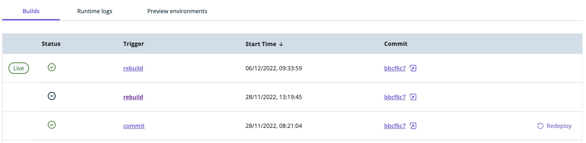

## Cancelling a Build Process
In case you want to stop an ongoing build, you can click on the "Cancel build" button displayed in the top right corner of your environment details screen:

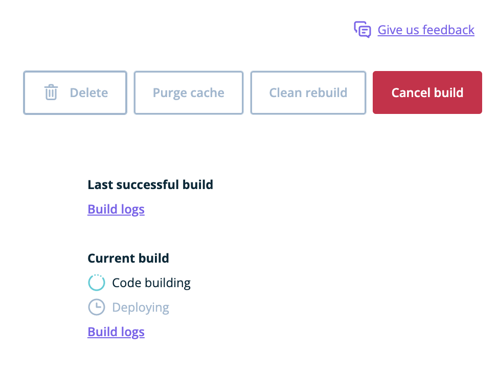

Your build will be displayed in the `Builds` table with the status `Cancelled` - and the changes that were supposed to be rolled out will not be pushed to your site.


**Note:** the process can only be stopped as long as the environment is in the `Code build` phase. If the `Code build` phase has passed, the new version of your Atlas environment will be published upon successful deploy. If you wish to redeploy an older version, follow the instructions for [Atlas quick rollbacks](/docs/atlas/additional-guides/redeploy-previous-version).

## Responding to Failed Builds

When you push new code to your Atlas project repository on GitHub and trigger a new build on the platform, you can inspect the progress of that build in realtime via the [User Portal](https://my.wpengine.com/atlas).

As the build progresses, it can either succeed or fail at any stage in the build -> deploy checklist. If the project fails to build, the build details on your Atlas dashboard will look like this:

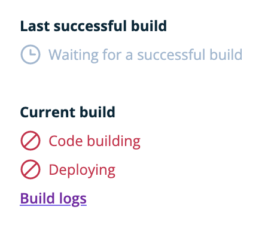

Since Atlas accepts a wide variety of frontend application frameworks (Faust.js, Next.js, Nuxt, Svelte, React, Remix, etc.), there are many different ways that building a particular application could fail. Since there are few commonalities in these failure modes, this guide will focus on giving you the tools to inspect and diagnose your own app's failure state.

After you've pushed a failing build, there are quick ways to start troubleshooting your app from the Atlas dashboard by inspecting the GitHub commit or looking at the build logs directly.

When looking at the build checklist, will have a quick link to the `Build logs` detail panel. Let's take a look at each option and how they can be used to diagnose the issues behind your failed build.

### Build Logs

If you click the `Build logs` link, you will be taken to a page that gives you more details about the build itself, as well as access to the errors and logs for your build.

At the top of that page, there is a section with additional details about a particular build. You can see things like the time the build started, the repo and branch that Atlas tried to build from, as well as another commit hash link to GitHub. Each individual build is also given a unique ID, and this might be needed if you try to escalate continued failing builds with support.

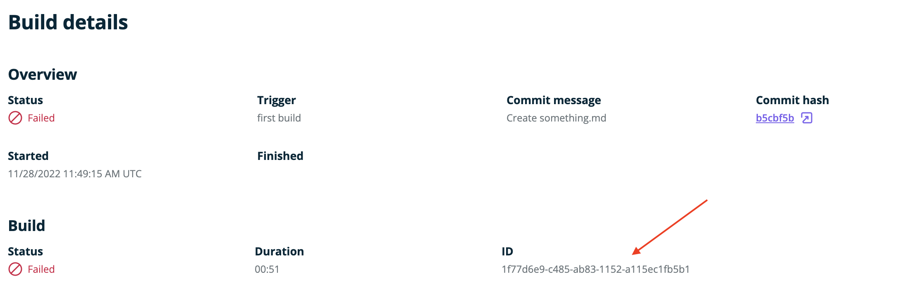

If you click on the commit hash link in the build details screen, you will be taken directly to the GitHub commit diff for that particular commit. This view provides you with an easily scannable summary of everything that changed. If you scroll below your code changes, you will see an automated message from the WP Engine GitHub bot with some details about your build. It should tell you the status of the build, whether it succeeded or failed, and also provide you with links directly to the build logs and your public environment URL.

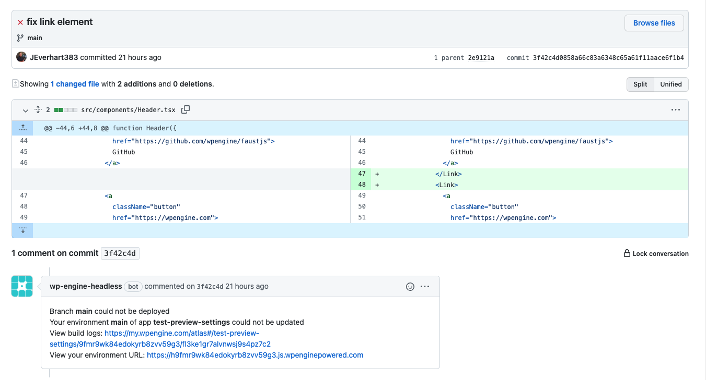

#### Logging Output

The logging output pane labeled `Logs` captures all of the logging output from your build.

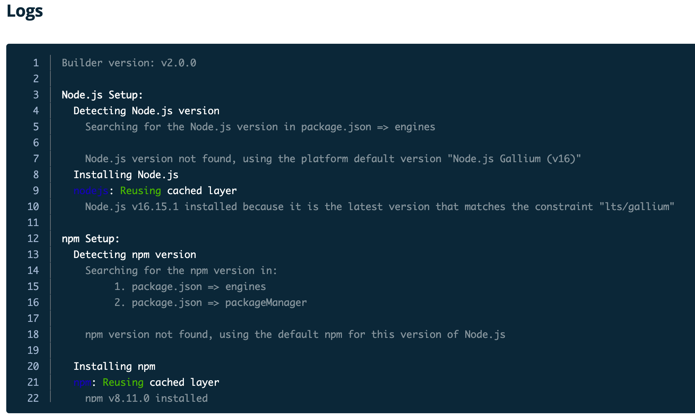

The logging output available in this pane can be extremely useful for tracking down any issues that are related to your dependencies or their installation.

#### Logging Debug Mode

Debug logging can be enabled for builds to aid with troubleshooting issues. This adds extra information to the log output such as listing npm installed packages and prints your `package.json`. This is useful if you are contacting support.

To enable debug mode for a build, set the environment variable `ATLAS_BUILD_DEBUG=true` and rebuild your app. The log output will start with this line once debug mode is enabled:
```
Debug mode enabled this can cause builds to be slow
```

### Accessing Prior Builds

If you have examined the logging and error output for your build, and still aren't sure what the issue is, a helpful next step could be to compare the logging or commit histories between your current failed build and the last successful build. You can find a list of your environment's build history on the detail page for that environment.

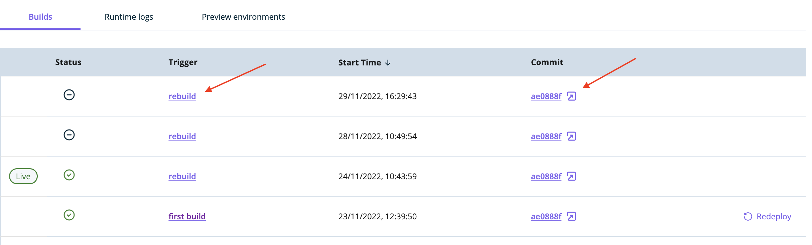

Through this panel, you can access links to the build logs via the leftmost trigger-based link, ex. `rebuild`, and the GitHub commit details via the commit hash link. Comparing errors and logging across different builds can help you isolate when and how breaking changes were introduced.

## Resolving Common Issues


### Make sure the branch and repository you're pulling from exists

If you've deleted your branch or repository, you'll see the following message on the environment details screen:

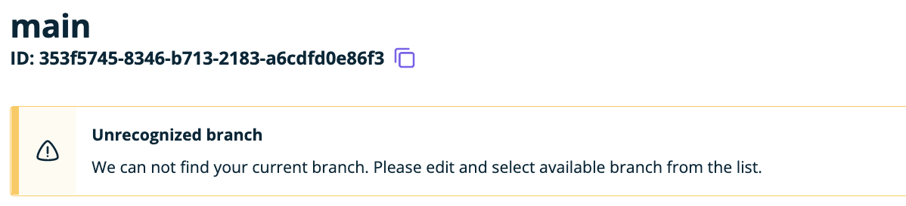

You will also see an alert next to the branch name:

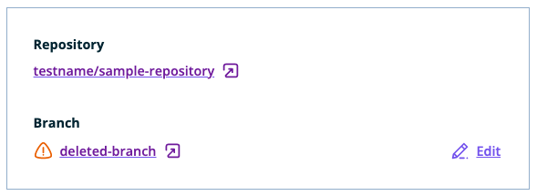

If you delete your branch or want to build from a different branch, you can do it by clicking on the `Edit` button next to the branch name, selecting a branch and clicking `Save`:

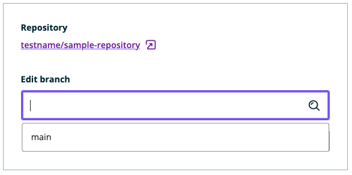

Saving this setting will trigger a rebuild. For all subsequent builds the code will be sourced from the new branch you selected and all commits to this branch will cause the environment to rebuild.

At the moment, there's no way to change the repository your application is pulling code from. If you've deleted the repository, you will have to delete your environments and your application and then create a new one, pulling code from your new repository.


### Creating an Atlas Blueprint Fails

1. If you selected to create a repository within a GitHub organisation, make sure the GitHub user you're authenticated as has enough permissions to create new repositories in this GitHub org.
2. For Blueprints to work properly, we - for now - require your default branch to be called 'main'. You can change this setting globally for all new repositories in your [GitHub repository settings](https://github.com/settings/repositories).

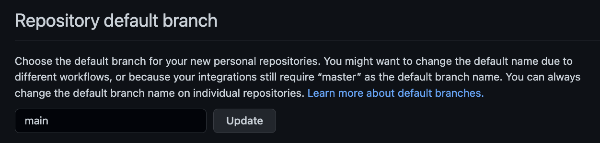


## Other Build Issues

In some cases, your application will successfully build, but you may not see the correct visual results on the live site, or code that _should_ be a part of your application isn't working. If this is the case, a good next step would be to clear out any assets from previous builds and make sure that no older files are still being served from a CDN.

### Clean Rebuild and Clear Domain Cache

Since Atlas is a flexible hosting platform for a number of different JavaScript apps, it is outside the scope of this guide to discuss all of the ways various frameworks create local caches or generate static assets. However, it is important to remember that rebuilding your app from a GitHub commit does not trigger a `Clean Rebuild`, meaning that Atlas will use previously cached folders to rebuild your app using your latest commit. For a list of folders the platform will cache by default, reference the [Framework Build Assets Cache](../customization/builds#framework-build-assets-cache) section of the build docs.

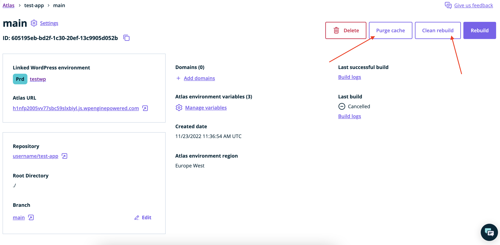

To process a `Clean Rebuild` you can click that button in the main details panel of your Atlas environment, which will remove all previously cached folders, pull the latest commit from your repo, and rebuild the app.

In some cases, you may also want to clear the domain cache using the button labeled `Purge cache`, which clears the CDN cache for your Atlas domain. Both of these steps can be helpful if your site is building, but might not reflect the most recent changes.
