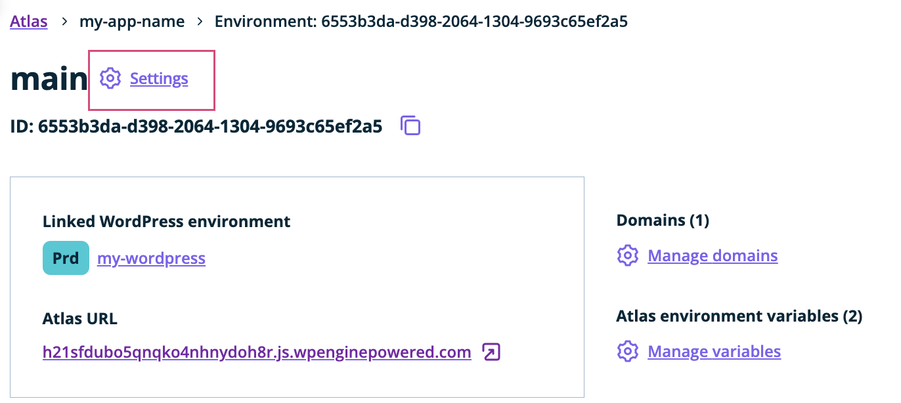
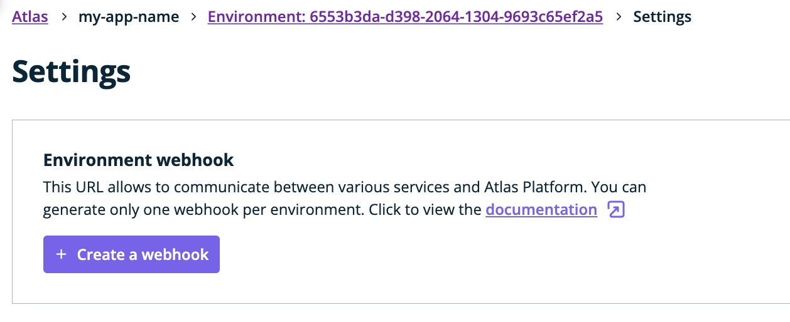
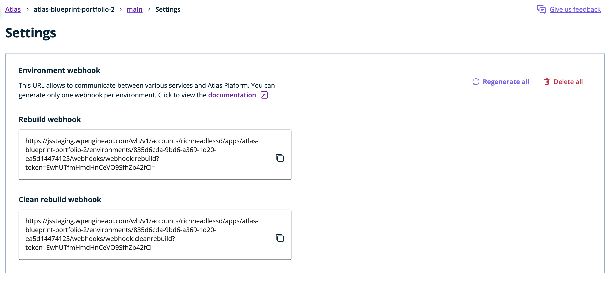

This guide describes how to configure the Atlas build system for your applications.

## Setting a custom version of Node.js, npm and Yarn

### Node.js

By default, Atlas uses the latest v16 LTS release of Node.js. Currently Atlas supports Node.js v12, v14, v16 and v18. 

New LTS Node.js versions become available for use within one month of the ‘Initial Release’ and become the default version within one month of the ‘Active LTS Start.’ Please consult [Node.js release dates](https://nodejs.dev/en/about/releases/) as needed. 

To set a custom version of Node.js, use the [engines field](https://docs.npmjs.com/cli/v8/configuring-npm/package-json#engines) in the `package.json` file. For example, here is how to deploy your application using Node.js 16:

```json
"engines": {
  "node": ">=16.0.0 <17.0.0"
},
```

Note: Atlas builds use [Semantic Versioning](https://docs.npmjs.com/about-semantic-versioning) to specify the Node.js version. This can be used to specify a specific versions, a range of versions or a major version. If a range is used, ensure that an upper bound is set (e.g. {'<'}17.0.0) as the build may use the new node version unexpectedly. For example, a clean rebuild will clear the cached version of Node.js.

The version of Node.js in use on your builds can be found in the build output:

```
Node.js Setup:
  Detecting Node.js version
    Searching for the Node.js version in package.json => engines
    Using Node.js ">=16.0.0 <17.0.0" from the package.json engines field

  Installing Node.js
  nodejs: Contributing to layer
    Node.js v16.19.0 installed because it is the latest version that matches the constraint ">=16.0.0 <17.0.0"
```

To see what version of Node.js you are using on your local machine use the following command:

```bash
$ node --version
v16.15.0
```

### npm

The builds use the default version of npm that comes with the Node.js release selected. You can use [this page](https://nodejs.org/en/download/releases/) to search which version of npm comes with a particular version of Node.js.

You can set a custom version of npm used in Atlas builds in two places. The first is the `engines` field in the `package.json` file. Similar to Node.js versions above, Atlas uses semver to specify the version used. Here is how to set it to use the latest version of npm v8:

```json
"engines": {
  "npm": "8"
}
```

An alternative way to set npm is to use the `packageManager` field in the `package.json` file. Note the difference in format compared to the `engines` field above where the version must be an exact version of npm:

```json
"packageManager": "npm@8.11.0"
```

The version of npm being used on your builds can be found in the build output:

```
npm Setup:
  Detecting npm version
    Searching for the npm version in:
     1. package.json => engines
     2. package.json => packageManager
    Using npm "8" from package.json engines field

  Installing npm
    npm: Contributing to layer
      npm v8.13.2 installed because it is the latest version that matches the constraint "8"
```

To see what version you have installed locally use:

```bash
$ npm --version
8.11.0
```

### Yarn

If the `yarn.lock` file is committed then yarn is used instead of npm to build your application. Currently only Yarn Classic (v1) is supported on Atlas builds.

If you want to set an exact version of Yarn use the `packageManager` field in `package.json`:

```json
"packageManager": "yarn@1.22.16"
```

The version of Yarn being used on your builds can be found in the build output:

```
Yarn Setup:
  Determining yarn version
  Yarn v1.22.16 installed
```

Use this command to see what version you are using locally:

```bash
$ yarn --version
1.22.16
```

## Installing Dependencies

It is recommended to commit your `package-lock.json` file to version control. Once committed Atlas uses the lock file to run `npm ci` to install package dependencies which builds your app with the same dependencies used in your local dev environment.

If the `package-lock.json` file is not present then `npm install` is run.

## Custom Build Commands

This is the command which is run to build your application. Custom build commands can be set on Atlas and per environment.

The build command can be configured 3 ways. In order of priority they are:

1.  `ATLAS_BUILD_SCRIPT` - Atlas builds look for the `ATLAS_BUILD_SCRIPT` environment variable. For example, `ATLAS_BUILD_SCRIPT=my-build` means `npm run my-build` will be run if using npm
2.  `wpe-build` - if it exists in `package.json` then `npm run wpe-build` is run if using npm
3.  `build` - if it exists in `package.json`

Below is an example of how to set each build command:

```json
"scripts": {
    "my-build": "next build",  // only run if ATLAS_BUILD_SCRIPT is set
    "wpe-build": "next build",
    "build": "next build",
},
```

## Custom Start Commands

The start command is run to start your Node application once it is deployed. By default Atlas runs the `start` script in `package.json`. This can be overridden by setting the `ATLAS_START_SCRIPT` environment variable. For example, `ATLAS_START_SCRIPT=start-dev` means `next dev` will be run instead of `next start` with the package.json below:

```json
"scripts": {
    "start": "next start",
    "start-dev": "next dev",
},
```

## Rebuild an environment via webhook

To generate a webhook that will rebuild your Atlas environment when triggered, visit the environment settings page and click on the `Settings` button:



Click the `Create a webhook` button:



This creates one webhook with 2 `Webhook URL` options: `Rebuild` and `Clean Rebuild`; The `Clean Rebuild` will clear all cached assets, but is otherwise idential to `Rebuild`. Copy one of the webhook URLs to use in your custom workflows:



Once generated, you can use this URL to configure a WordPress plugin that can trigger your webhook based on certain WordPress actions, like adding a new post or page. Examples of such plugins are [JAMstack deployments](https://wordpress.org/plugins/wp-jamstack-deployments/) and [WPGatsby](https://wordpress.org/plugins/wp-gatsby/). Alternatively, you can configure a POST request to be sent from the service you want to integrate with Atlas or trigger such request yourself:
```
curl -X POST 'https://js.wpengineapi.com/wh/v1/accounts/{your-account}/apps/{your-app}/environments/{your-env-id}/webhooks/webhook:rebuild?token={your-token}'
```

If for any reason you want to regenerate the webhook URLs so that old URL will no longer trigger rebuilds, click the `Regenerate all` button and confirm your action:


To delete your webhook, click the `Delete all` button. If you do so, the URLs you previously used will no longer work when attempting to trigger a rebuild.

## Framework Build Assets Cache

Atlas caches common framework assets between builds to optimise build times. 

The folders that are cached currently are: 

* `.cache`
* `.next/cache`
* `.nuxt`
* `.wordpress-cache`
* `public`

If any of the above folders are in the projects root directory at the start of the build, the build will **not** override them. 

Performing a clean rebuild, either through a webhook or through User Portal, will remove any previously cached files. For instructions on how to [perform a clean rebuild](../additional-guides/troubleshooting-builds#clean-rebuild-and-clear-domain-cache) you can reference the guide on troubleshooting builds.
