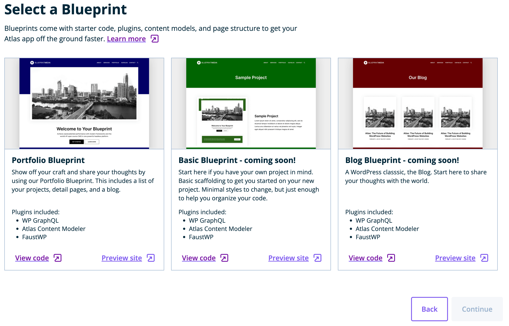

## Choose a blueprint or repository

Choose `Start with Blueprint` if you do not have a headless WordPress frontend site in GitHub, or want to try WP Engine's pre-built templates.

Choose `Pull from repo` if you have a headless WordPress frontend site in GitHub ready to deploy.

## Starting with a blueprint

Press `Start with Blueprint` and `Continue`, then select a Blueprint to use and press `Continue`:

## Pulling from a repo

Press `Pull from repo` and `Continue`, then set your repository settings in the next step.

## Next Steps

Whether you start from a blueprint or pull from a repo, the next step is to set your repo settings:

[Set your repository settings &#8594;](./repository-settings)
