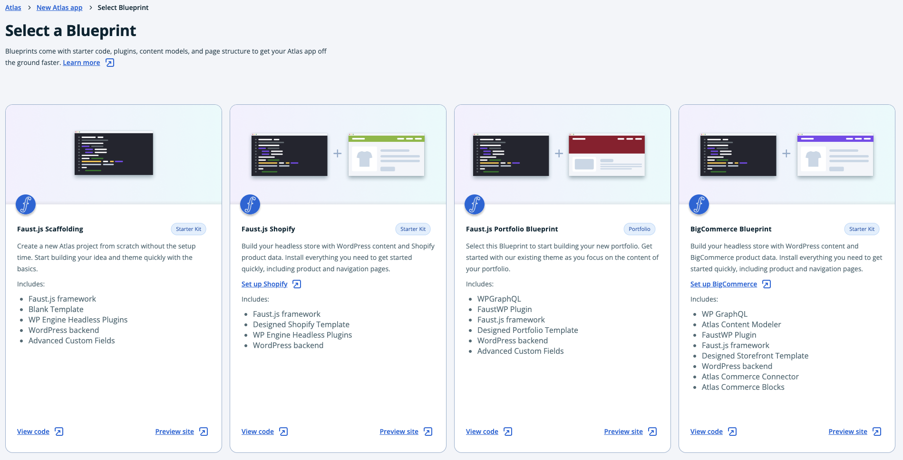

The Atlas platform allows you to deploy custom JavaScript applications, but also provides you with deployable blueprints for popular types of sites.

Choose `Start with Blueprint` if you do not have a headless WordPress frontend site yet, or want to try WP Engine's pre-built templates.

Choose `Pull from repo` if you have a headless WordPress frontend site in your repository, ready to deploy.

## Starting with a blueprint

Note - at the moment, it's not possible to create an application from Blueprint while using Bitbucket or GitLab.

1. Press `Start with Blueprint` and `Continue`.
2. Select Portfolio blueprint and press `Continue`.
3. Next, learn how to [deploy your blueprint &#8594;](./deploy-from-blueprint)

## Pulling from a repo

1. Press `Pull from repo` and `Continue`.
2. Next, learn how to [deploy your repo &#8594;](./deploy-from-existing-repo)
