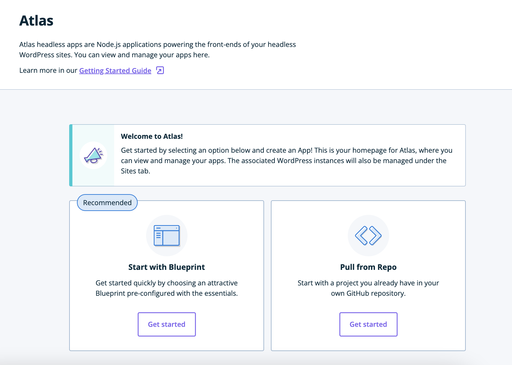

Follow the steps below to create a new Atlas app.

1. Log into the WP Engine [User Portal](https://my.wpengine.com/).

2. Select the `Atlas` tab.

3. Click the `Create app` button.

The `Create Atlas App` page appears.

## Next Step

[Choose a blueprint or repository &#8594;](./blueprint-repository)
