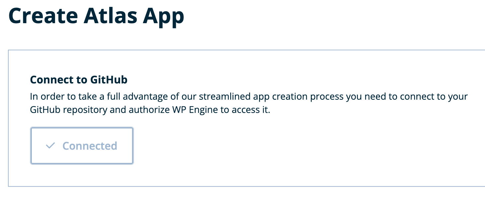
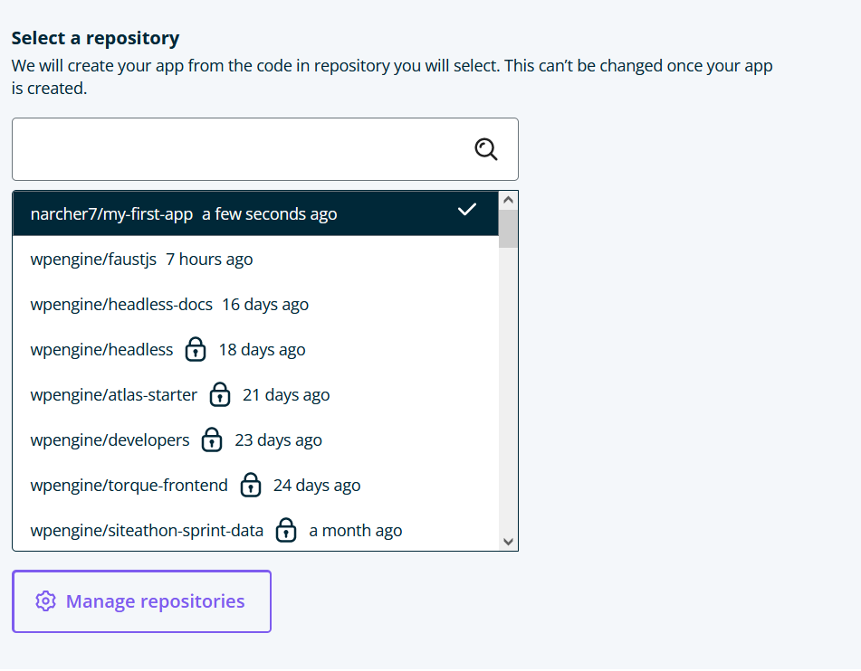

Now that you have [chosen a blueprint](./blueprint-repository), you can clone it in GitHub and deploy it to Atlas. Pushing to your main branch in GitHub will then deploy updates to Atlas automatically.

Atlas blueprints use the [Faust.js](https://faustjs.org/) framework based on [Next.js](https://nextjs.org/). Atlas also supports other frameworks that run on Node.js.

## Create Atlas App

### 1. Connect to GitHub

Connect your GitHub account so you can clone Atlas blueprints.

1. Under `Connect to GitHub`, select `Connect`.

2. GitHub opens in another tab of your web browser. Give WP Engine permission to access your repositories.

After Atlas connects to your GitHub account, the `Connect` button indicates that you are `Connected`.

### 2. Clone the blueprint and choose the repository

Now that GitHub is connected, it's time to create a repository by cloning a blueprint.

1. Select `Clone Blueprint`. This option opens another tab in GitHub.

2. On the `Create a new repository` page, set your new git repository settings.

- Under `Owner`, select the username you associated with your repository.
- For `Repository name`, enter a name in a format similar to `repository-name`. Avoid capitalization or spaces to make it easy to navigate your repository in the future.
- (Optional) Enter a `description` for your repository.
- Choose whether to make your repository `Public` or `Private`.
- Leave `Include all branches` unchecked.

3. With your new repository named, select `Create repository from template`.

4. Navigate back to the WP Engine User Portal by closing the GitHub tab.

5. Select your new repository from the repository list when it refreshes.

6. Select a region for your Atlas app. The region you select will be used for all of your app's environments (production/staging/etc.) and cannot be changed once your Atlas application has been deployed.

7. Click `Create App`.

That's it! Track the initial build progress on the next screen that loads automatically.

### 3. Find the link to your frontend site and WordPress admin

A link to visit your live frontend using a temporary domain will appear under “Atlas URL” when the deploy completes.

To log in to the WordPress site linked to your Atlas app:

1. Click the link below the “Linked WordPress environment” title on your Atlas App environment page.

2. Click the WP Admin link at the top of the WordPress environment page.

## Next Steps

To make changes to the look and functionality of your app, see our [Local App Development](../local-app-development/overview) guide.
