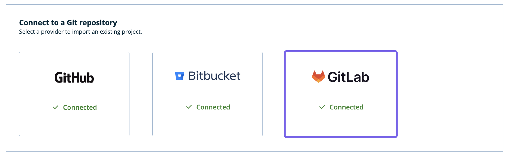
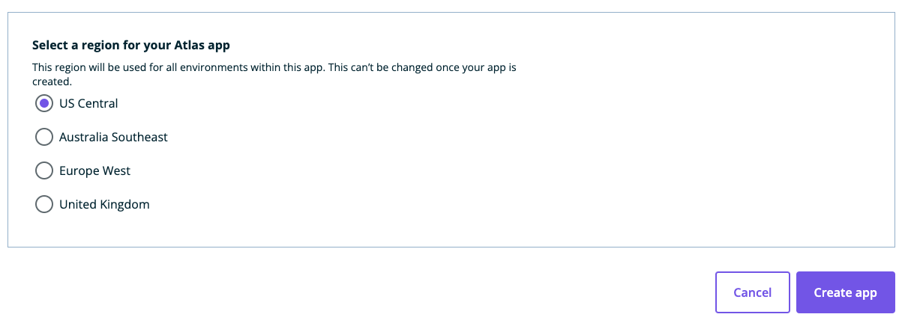
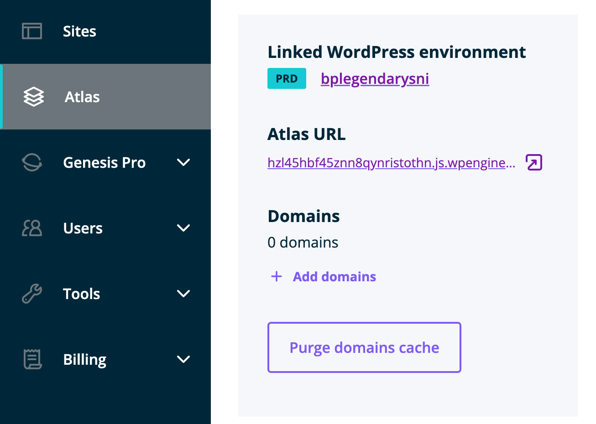
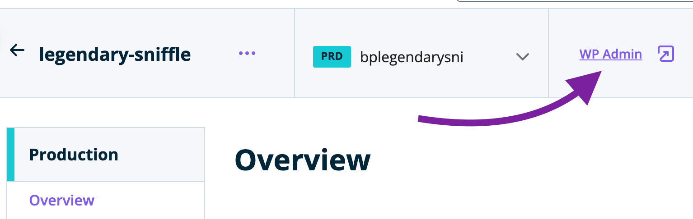

Now that you have [chosen a blueprint](./blueprint-repository), you can clone it to any supported repository hosting service provider (GitHub, GitLab or Bitbucket) and then deploy it to Atlas. Pushing changes to your `main` branch in your chosen repository hosting service provider will then deploy updates to Atlas automatically.

Atlas blueprints use the [Faust.js](https://faustjs.org/) framework based on [Next.js](https://nextjs.org/). Atlas also supports other frameworks that run on Node.js.

## Create Atlas App

### 1. Connect to a supported repository provider (GitHub, GitLab, Bitbucket)

Connect to your chosen repository provider so you can clone Atlas blueprints.

1. Under `Connect to a Git repository`, select one of the `Connect` button for your chosen provider.

2. The Atlas connect page opens in another tab of your web browser. Give WP Engine permission to access your chosen provider's repositories in order to proceed.

After Atlas connects to your provider's account, the connect page tab will close and the `Connect` button will now indicate that you are `Connected`.

### 2. Create a repository

Now that your chosen repository provider is connected, it's time to create a repository where your Blueprint code is going to be stored.

1. Select your repository provider's account (or 'namespace', if BitBucket)

Use the dropdown list or start typing to filter available repository account/ namespace.

If you have selected GitHub as your GitProvider but don't see the account for which you'd like to create a repository under on the list, click on "Manage GitHub accounts" or "Add GitHub account" (if no GitHub account(s) connected yet) button presented (this is a GitHub only feature at present):

2. Name your repository

Depending on which Blueprint you chose, Atlas will suggest a repository name for you. The name of your repository should be unique within your chosen repository provider account/ namespace - If it's not, you'll see an error after clicking the "Create" button on the bottom of the page.

3. Select the visibility of your repository

If you want to limit your repository's visibility to only people that can access your chosen repository provier account/ namespace, make sure to check the "Private repository" checkbox.

4. Select a region for your Atlas app. The region you select will be used for all of your app's environments (production/staging/etc.) and cannot be changed once your Atlas application has been deployed.

5. Click `Create App`.

That's it! Track the initial build progress on the next screen that loads automatically.

### 3. Find the link to your frontend site and WordPress admin

A link to visit your live frontend using a temporary domain will appear under `Atlas URL` when the deploy completes.

To log in to the WordPress site linked to your Atlas app:

1. Click the link below the `Linked WordPress environment` title on your Atlas App environment page.

2. Click the WP Admin link at the top of the WordPress environment page.

## Next Steps

To make changes to the look and functionality of your app, see our [Local App Development](../local-app-development/overview) guide.
