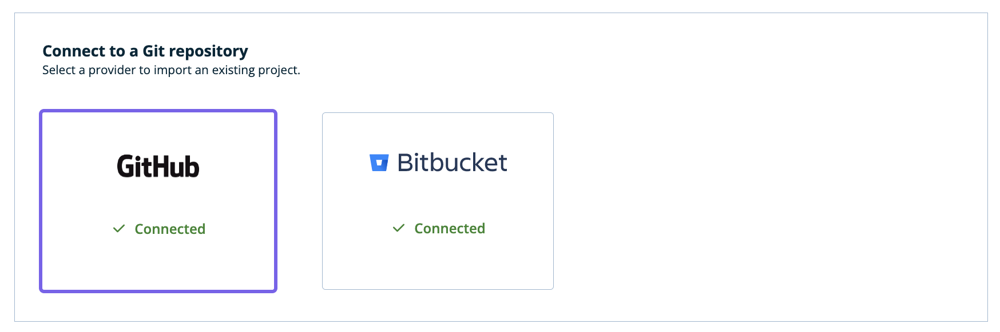
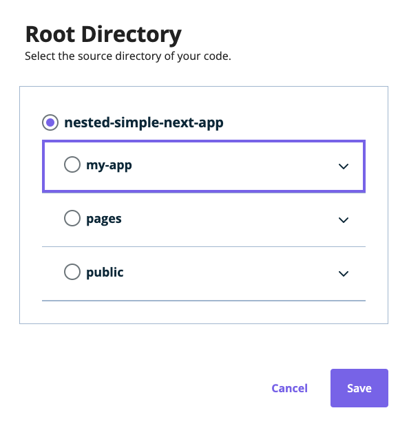
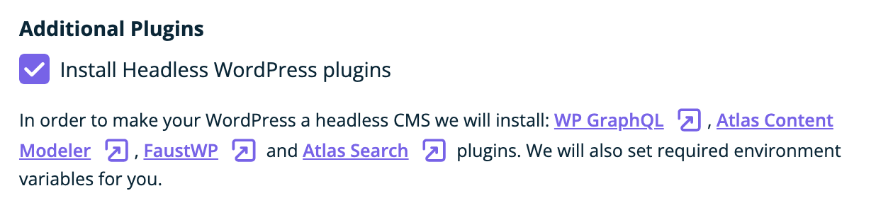
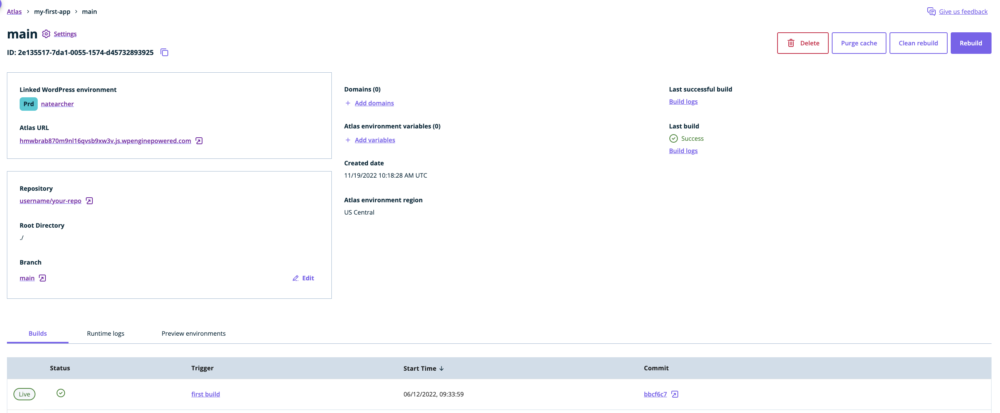

Now that you have [chosen to deploy from an existing repository](./blueprint-repository), you can select the repository and deploy it to Atlas. Pushing code changes to the branch of your choice in your repository will then deploy updates to Atlas automatically.

## Create Atlas App

### 1. Prepare your app for deployment

Atlas supports Node.js applications using many popular frameworks with minimal configuration. You can view our framework guides to see what may be required of your particular framework:
- [Astro](../framework-guides/astro)
- [Faust.js](../framework-guides/faust)
- [Gatsby](../framework-guides/gatsby) 
- [Next.js](../framework-guides/next)
- [Nuxt](../framework-guides/nuxt)
- [Remix](../framework-guides/remix)
- SvelteKit
- SolidStart
- [QwikCity](../framework-guides/qwik)

Some newer frameworks may not have a framework guide yet, but can still run on the Atlas platform using whatever Node.js-based adapters are provided by the framework or as SSG using a Node.js package to serve static assets like `http-server` or `express`.

#### Custom build and start commands

By default, the Atlas platform will run `npm run build` and `npm run start` to build and start your application. If you want to run different commands to build or start your application, you can reference the docs on [custom build commands](../customization/builds#custom-build-commands) or [custom start commands](../customization/builds#custom-start-commands) to review the various ways this can be implemented. 

#### Using the correct port

The platform expects your application to listen for traffic on one of the following ports: `8080`(default) or `3000`. You may receive an error during deployment if your application is using a different port value. In some frameworks, you may be able to use an environment variable named `PORT` to specify which port you application will listen on.

### 2. Connect to repository hosting service

Atlas supports three repository hosting service providers - GitHub, Bitbucket and GitLab. Connect your respective account so you can select the repository to deploy to Atlas.

1. In the `Connect to repository` section, select `Connect` under the provider you want to connect with.

2. GitHub, Bitbucket or GitLab opens in another tab of your web browser. Give WP Engine permission to access your repositories.

After Atlas connects to your account, the `Connected` label with green checkmark indicates that you are connected. A list of repositories associated with your account appears.

### 3. Select the repository to deploy

Now that you are connected to the provider of your choice, it's time to connect your repository.

1. From the list of repositories, select the one with your application's code.
2. Select `Continue` to proceed to the WP Engine Settings page.

### 4. Set your application settings

On the `WP Engine Settings` screen:

1. Fill out a name for your application. We recommend choosing a name similar to your repository's name. The application name cannot be changed once it has been deployed.

2. Select a region for your application. The region you select will be used for all of your app's environments (production/staging/etc.) and cannot be changed once your Atlas application has been deployed.

3. Click `Continue`.

### 5. Configure the environment

1. From the list of your repository's branches, select the branch you want to base your environment on. Whenever changes are pushed to this branch, your app will be automatically re-deployed.

Examples:

- If you want to create a production environment, you could use your repo's `main` branch
- If you want to create a staging environment, you could use your repository's `staging` branch

2. If your project is stored in a folder within your repository, specify the path to your root folder by clicking on the `Edit` icon in the `Root Directory` field.

3. Enter a name for your Atlas environment. The name should represent how you intend to use the environment. For example, enter something like `prod` if it's a production environment, `staging` if it's a staging environment, etc.

4. Every headless environment is associated with a WordPress environment. Choose either:

   - `I already have a WordPress environment`: Use a WordPress site from your WP Engine account. Select the search bar and search for the name of your WordPress site.
   - `I want to create a new WordPress install`: WP Engine makes a new WordPress site and links it to your application. In the box, enter a name for your new WordPress site.

5. In order for your WordPress environment to become "headless", Atlas can install the [WP GraphQL](https://wordpress.org/plugins/wp-graphql/), [Atlas Content Modeler](https://wordpress.org/plugins/atlas-content-modeler/), [FaustWP](https://wordpress.org/plugins/faustwp/) and [Atlas Search](https://wordpress.org/plugins/atlas-search/) plugins. It can also automatically set the required environment variables for you so that the FaustWP plugin will work properly out-of-the-box.

6. Select `Create App`.

7. The Atlas app details page appears. When Atlas completes building your application, a checkmark appears under `Last Build`.

8. To visit your headless WordPress app once the first deploy finishes, click the link under the `Atlas URL` heading. Your Atlas app opens in a new browser tab. Enjoy!

### Set Environment Variables (Optional)

To add environment variables for your app, click `Add environment variable`.

Enter the `Key` and `Value` pairs for each environment variable.

For example, you may need to add a `NEXT_PUBLIC_WORDPRESS_URL` key with a URL as its value to specify which WordPress site should be used as the data source for the app. You may also need to specify additional environment variables to store sensitive data such as API keys and secrets.

Please refer to your JavaScript framework's documentation if you're unsure what environment variables are required for your app.

## Next Steps

To make changes to the look and functionality of your app, see our [Local App Development](../local-app-development/overview) guide.
