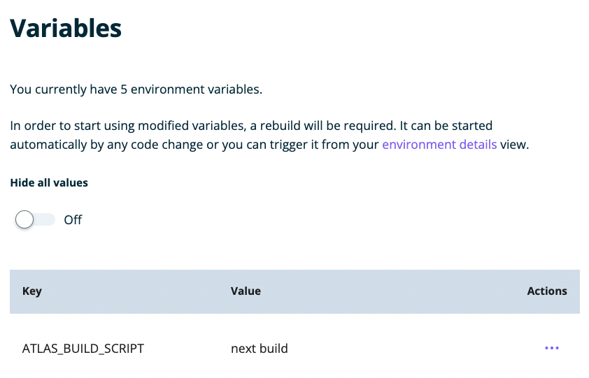
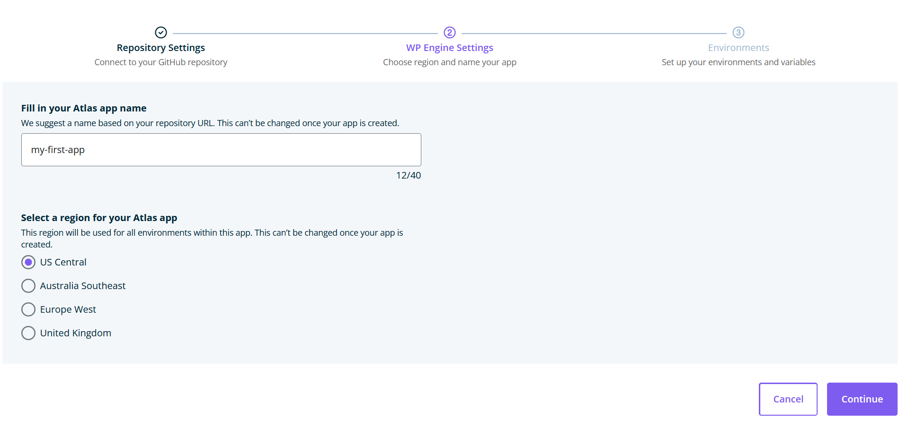
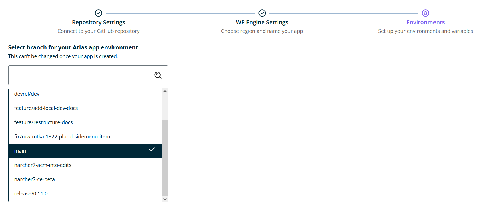
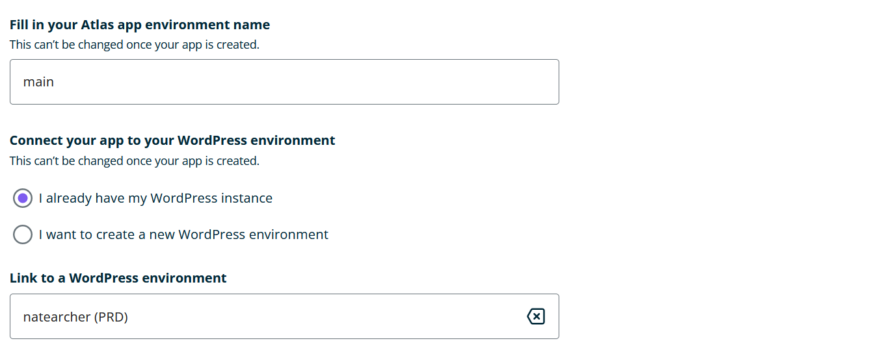
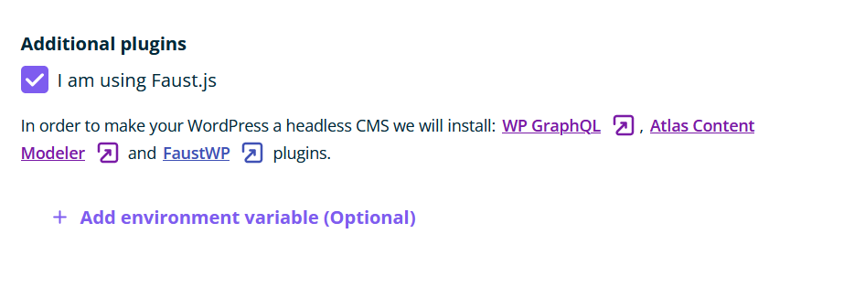
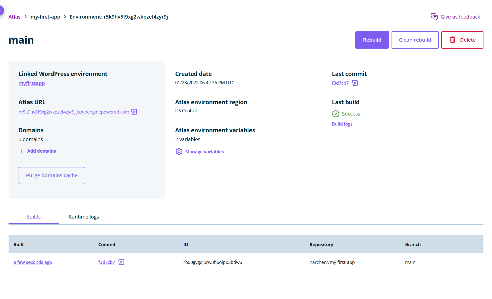
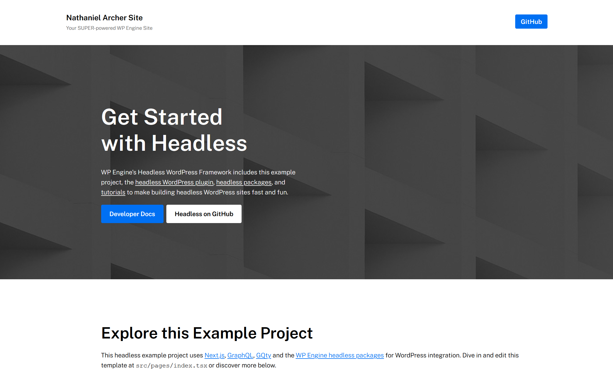

Now that you have [chosen to deploy from an existing repository](./blueprint-repository), you can select the repository and deploy it to Atlas. Pushing to your main branch in GitHub will then deploy updates to Atlas automatically.

Atlas supports Node.js applications using popular frameworks like [Faust.js](https://faustjs.org/), [Next.js](https://nextjs.org/), [Gatsby](https://www.gatsbyjs.com/), [Nuxt](https://nuxtjs.org/), [SvelteKit](https://kit.svelte.dev/), etc.

## Create Atlas App

### 1. Prepare your app for deployment

When building the front-end app, WP Engine will use `npm run build` by default. If you want to specify a build command, you can do so in one of two ways:

1. Add a `wpe-build` script in the `package.json` file for your app.

```json
  "scripts": {
    "wpe-build": "next build",
    // etc.
  },
```

3. Create a `ATLAS_BUILD_SCRIPT` environmental variable in the User Portal, with the command to be run as its value. 




>If you don't know what command needs to be run to build your app, please refer to the your JavaScript framework's documentation.

### 2. Connect to GitHub

Connect your GitHub account so you can select the repo to deploy to Atlas.

1. In the `Repository Settings` view, select `Connect`.

2. GitHub opens in another tab of your web browser. Give WP Engine permission to access your repositories.

After Atlas connects to your GitHub account, the `Connect` button indicates that you are `Connected`. A list of repositories associated with your GitHub account appears.


### 3. Select the repository to deploy

Now that GitHub is connected, it's time to connect your repository.

1. From the list of repositories, select the one with your application's code.

2. Select `Continue` to proceed to the WP Engine Settings page.

### 4. Set your application settings

On the `WP Engine Settings` screen:

1. Fill out a name for your application. We recommend choosing a name similar to your GitHub repository's name. The application name cannot be changed once it has been deployed.

2. Select a region for your application. The region you select will be used for all of your app's environments (production/staging/etc.) and cannot be changed once your Atlas application has been deployed.

3. Click `Continue`.



### 5. Configure the environment

1. From the list of your repository's branches, select the branch you want to base your environment on. Whenever changes are pushed to this branch, your app will be automatically re-deployed.

Examples:

- If you want to create a production environment, you could use your repo's `main` branch
- If you want to create a staging environment, you could use your repository's `staging` branch



2. Enter a name for your Atlas environment. The name should represent how you intend to use the environment. For example, enter something like `prod` if it's a production environment, `staging` if it's a staging environment, etc.

3. Every headless environment is associated with a WordPress environment. Choose either:

   - `I already have a WordPress environment`: Use a WordPress site from your WP Engine account. Select the search bar and search for the name of your WordPress site.
   - `I want to create a new WordPress environment`: WP Engine makes a new WordPress site and links it to your application. In the box, enter a name for your new WordPress site.



4. In order for your WordPress environment to become "headless", Atlas installs the [WP GraphQL](https://wordpress.org/plugins/wp-graphql/) and [Atlas Content Modeler](https://wordpress.org/plugins/atlas-content-modeler/) plugins.

If you're using the Faust.js Starter Kit or an existing Faust.js app repository, check the `I am using Faust.js` checkbox. This will ensure that the [FaustWP](https://wordpress.org/plugins/faustwp/) plugin is also installed.



**NOTE:** If you're using an existing application (rather than the Faust.js Starter Kit), see the [Environment variables (Optional)](#environment-variables--optional-) section below to set up environment variables before proceeding with the steps below.

5. Select `Create App`.

6. The Atlas app details page appears. When Atlas completes building your application, a checkmark appears under `Last Build`.



7. To visit your headless WordPress app once the first deploy finishes, click the link under the `Atlas URL` heading. Your Atlas app opens in a new browser tab. Enjoy!



### Set Environment Variables (Optional)

To add environment variables for your app, click `Add environment variable`.

Enter the `Key` and `Value` pairs for each environment variable.

For example, you may need to add a `NEXT_PUBLIC_WORDPRESS_URL` key with a URL as its value to specify which WordPress site should be used as the data source for the app. You may also need to specify additional environment variables to store sensitive data such as API keys and secrets.

Please refer to your JavaScript framework's documentation if you're unsure what environment variables are required for your app.

## Next Steps

To make changes to the look and functionality of your app, see our [Local App Development](../local-app-development/overview) guide.
