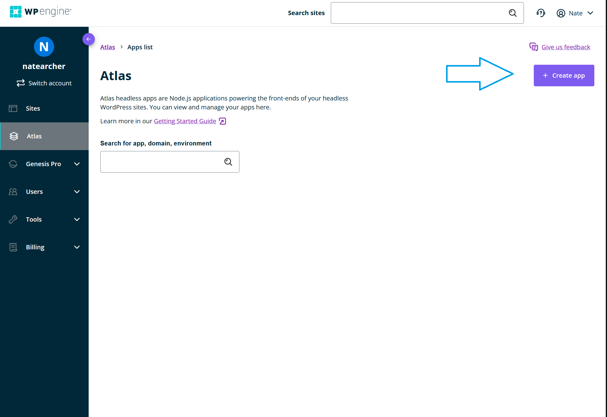

No matter where you are in your Headless journey, Atlas provides two starting points for you to get your first up running in Atlas. Before you get started, make sure you have:

- A WP Engine [Atlas](https://wpengine.com/atlas) account
- An Atlas app repository hosted on [GitHub](https://github.com/) or self-hosted [GitHub Enterprise Server](https://github.com/enterprise)

Whether using an existing app or creating one with our Faust.js starter, every Atlas app starts in the Atlas User Portal. To access the Portal and start building your Atlas application.

1. Log into [Atlas](https://wpengine.com/atlas). 

2. Select the **Atlas** tab. 

3. From the Atlas site view, select **Create app**. 

The [repository settings](./set-repository-settings) appears. 

## Next Step

Decide on your [repository settings](./set-repository-settings).
