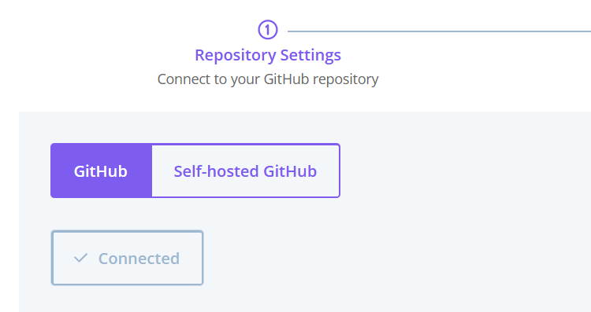
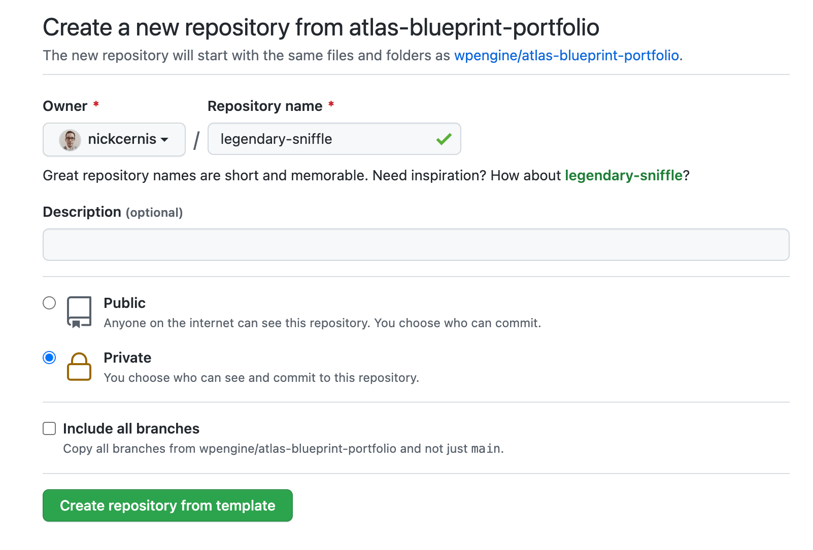

This page outlines how to connect your newly created Atlas app to a code repository.

Atlas apps are Node.js applications. Popular frameworks like [Faust.js](https://faustjs.org/), [Next.js](https://nextjs.org/), [Gatsby](https://www.gatsbyjs.com/), [Nuxt](https://nuxtjs.org/), [SvelteKit](https://kit.svelte.dev/), etc. are supported.

## 1. Connect to GitHub

Before creating an Atlas application, you must connect your GitHub account.

1. In the `Repository Settings` view, select `Connect`.

2. GitHub opens in another tab of your web browser. Give WP Engine permission to access your repositories.

After Atlas connects to your GitHub account, the `Connect` button indicates that you are `Connected`. A list of repositories associated with your GitHub account appears.

## 2. Select a Repository

Now that GitHub is connected, it's time to select the repository.

If you want to start from scratch with a preconfigured codebase built on WP Engine's headless WordPress framework, [Faust.js](https://faustjs.org/), follow the `Use the Faust.js Starter Kit` steps below. Otherwise, if you already have a JavaScript application repository you'd like to use, follow the `User an Existing App` steps.

### Use the Faust.js Starter Kit

To use the Faust.js starter kit, do the following:

1. Select `Clone Faust.js starter`. This option opens another tab in GitHub.

2. On the `Create a new repository` page, set your new git repository settings.

- Under `Owner`, select the username you associated with your repository.
- For `Repository name`, enter a name in a format similar to `repository-name`. Avoid capitalization or spaces to make it easy to navigate your repository in the future.
- (Optional) Enter a `description` for your repository.
- Choose whether to make your repository `Public` or `Private`.
- Leave `Include all branches` unchecked.

3. With your new repository named, select `Create repository from template`.

4. Navigate back to the WP Engine User Portal. Select your new repository from the repository list.

5. Select `Continue` and move on to [App Settings](./app-settings).

### Use an Existing App

Before using an existing app, make sure that you've pushed your application's code to GitHub repository.

If you're not familiar with pushing code to a GitHub repository, see this guide: [Adding an existing project to GitHub using the command line](https://docs.github.com/en/get-started/importing-your-projects-to-github/importing-source-code-to-github/adding-an-existing-project-to-github-using-the-command-line).

1. Select `Add repository`. A list of repositories in your GitHub account appears.

1. From the list of repositories, select the one with your application's code.

1. Select `Continue`. The WP Engine Settings page appears.

## Next Steps

[Set your App Settings &#8594;](./app-settings)
