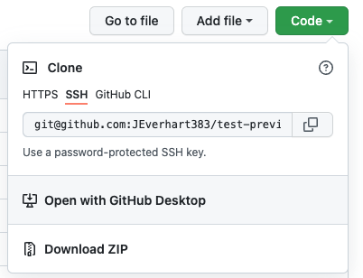
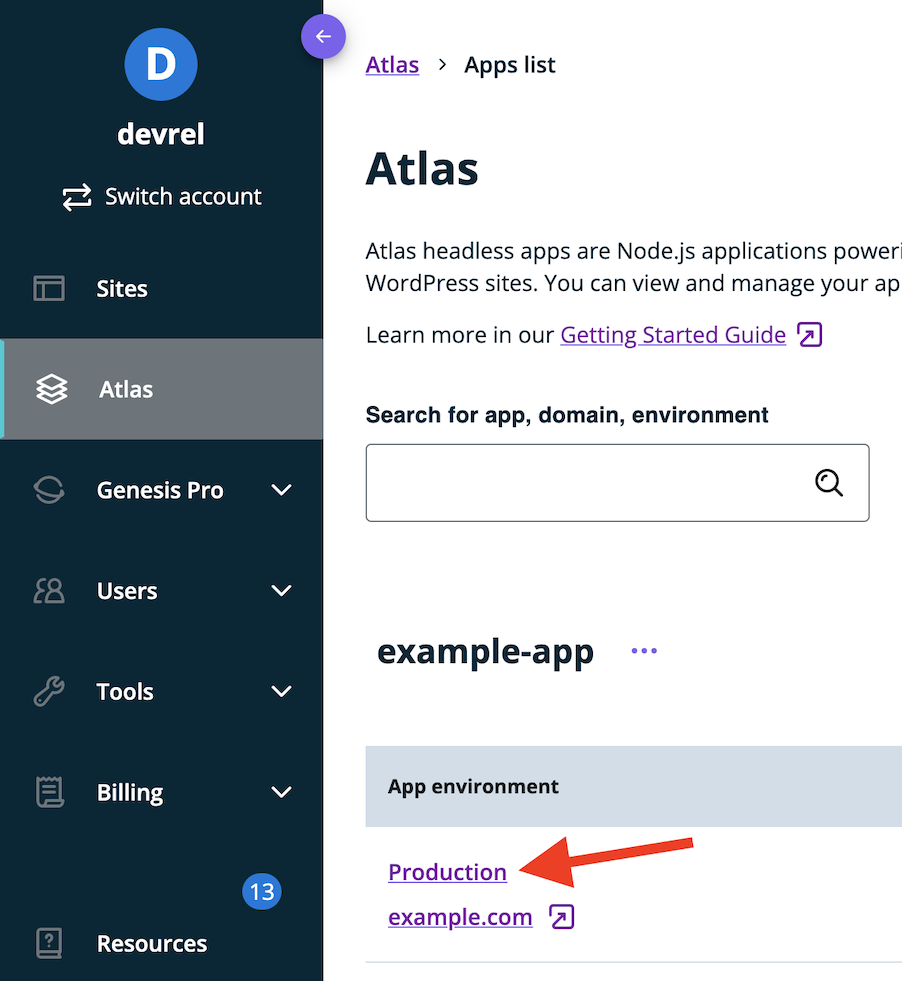
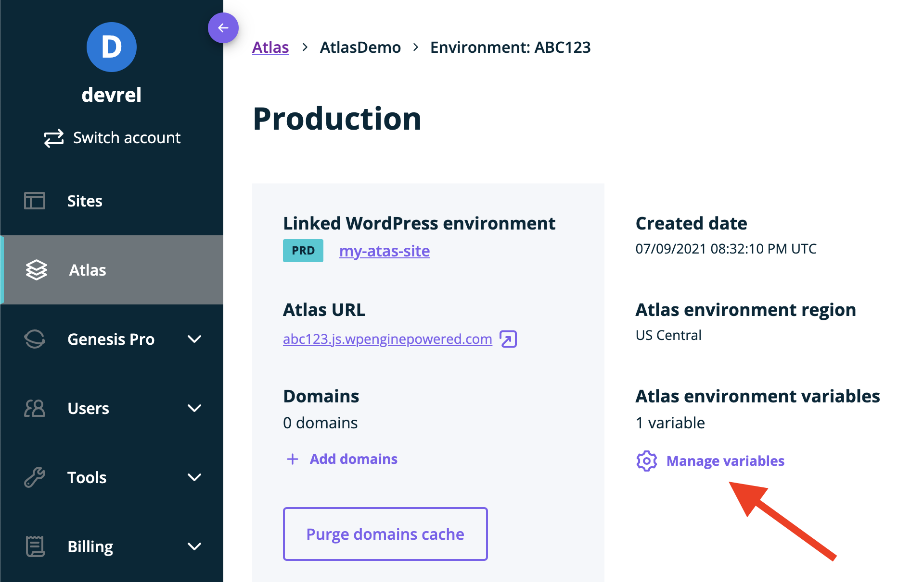
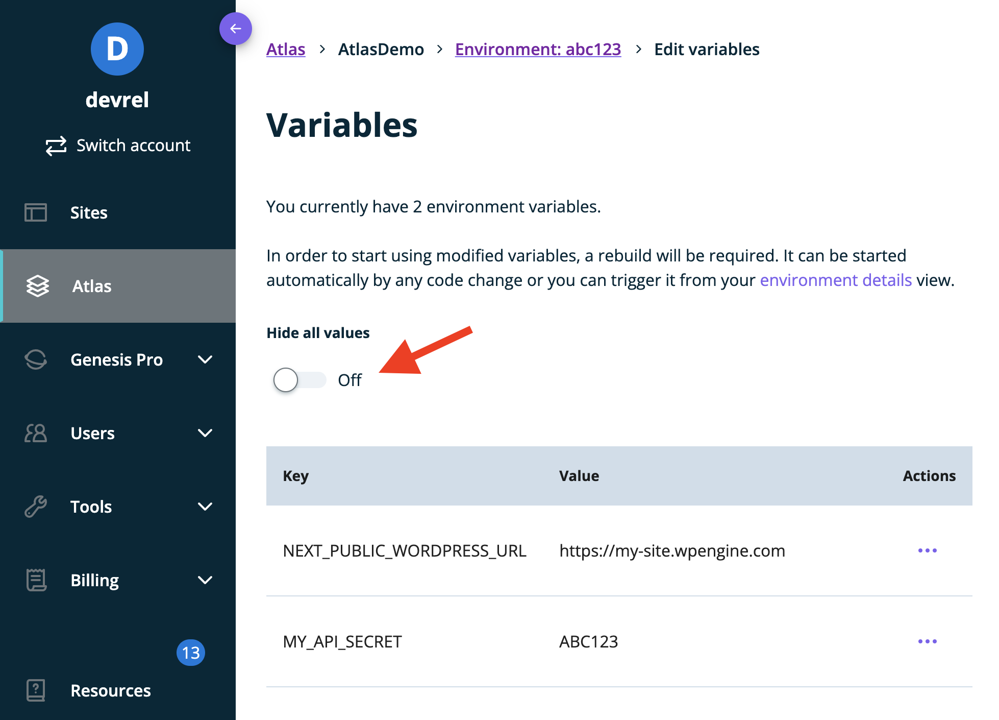
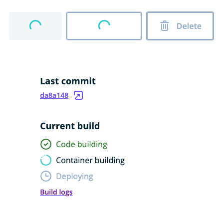
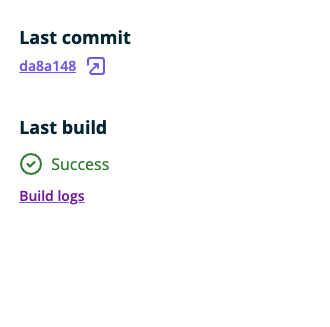

This page will guide you through configuring your Atlas frontend JavaScript application for local development. You'll learn how to:

1. [Clone the project repository to your machine](#1--clone-repo)
1. [Define environment variables](#2--define-environment-variables)
1. [Install the project dependencies and start the app](#3--install-dependencies-and-start-app)
1. [Push your local changes to GitHub and the Atlas Platform](#4--push-changes-to-atlas)

## 1. Clone Repo

Visit the GitHub repository page for your frontend JavaScript app and copy the SSH address of your repository.  


With your terminal open, run the following commands: 
```
cd <directory_to_clone_into>
git clone git@github.com:<your_username>/<your_repository>
cd <your_repository>
``` 
This will clone your repository to a local folder to access for development and set it as your current directory. If you need additional guidance, you can reference GitHub's documentation on [cloning repositories](https://docs.github.com/en/repositories/creating-and-managing-repositories/cloning-a-repository) to your local machine. If you are new to using Git on the command line, [GitHub provides a Desktop version](https://desktop.github.com/) that helps you manage your repos with a user interface. 

## 2. Define Environment Variables

With your repository cloned and set to the current directory in your terminal, open the codebase in a code editor. When your app was deployed to the Atlas platform, an environment variable file was automatically provisioned. Most apps rely on environment variable files to store critical information your app will rely on, like the URLs of backend APIs, API keys, or other configuration details that should not get checked into source control. 

In the following steps, you will recreate that file in your local project for development.

### Create Environment Variables File

Create a file in the root directory of the project where you can define environment variables. The name of this file varies depending on the JavaScript framework you're using.

- Faust.js, Next.js and SvelteKit apps typically use `.env.local`
- Gatsby apps typically use `.env.development`
- Nuxt.js environment variables are typically defined inside of your `nuxt.config.js` file, or in a `.env` file if you're using the `@nuxtjs/dotenv` module.

If you're using another framework, please reference your framework's documentation to learn how to define environment variables.

You can create the file for Faust.js starter projects via the command line using the following command:
```
touch .env.local
```

### Add Variables to Environment Variables File

With your environment variable file created, you can access your live app 

1. In a web browser, log into the WP Engine [User Portal](https://my.wpengine.com/atlas). Click `Atlas` in the sidebar, then click on the name of the Atlas app associated with this project.



2. Click `Manage variables` under the `Atlas environment variables` heading.



3. On the `Variables` page that opens, toggle the `Hide all values` control to the `off` position.



4. Copy and paste the `Key` and `Value` pairs for each environment variable into your local environment variables file.

As an example, if your app has these two environment variables listed in the User Portal:

```
| Key                       | Value                        |
| ------------------------- | ---------------------------- |
| NEXT_PUBLIC_WORDPRESS_URL | https://my-site.wpengine.com |
| FAUSTWP_SECRET_KEY        | ABC123                       |
```

You would need to add them to your environment variables file (`.env.local`/`.env.development`/other) in this format:

```
NEXT_PUBLIC_WORDPRESS_URL=https://my-site.wpengine.com
FAUSTWP_SECRET_KEY=ABC123
```

## 3. Install Dependencies and Start App

To install your frontend app's npm dependencies, run the `npm install` command in the terminal.

Once your dependencies have finished installing, you can run the command to start your JavaScript app in development mode. If your site was created with the Faust.js starter, the command `npm run dev` will start your app in development mode and make it available at `localhost:3000` in a web browser. 

If you are using another framework, you will need to reference that framework's docs or `package.json` file.

## 4. Push Changes to Atlas

With your site running in development mode, the app running in the browser is sourcing your local JavaScript files for the frontend, but still pulling data from your remote WordPress install on WP Engine's servers. In the next step of this guide, you will learn how to create a separate WordPress instance locally to isolate your development work, but now is a great time to test your connection to GitHub and the Atlas Platform.

Make some basic changes to your site locally: add a component, change the way posts or pages are displayed or update the site styles with your own CSS.

Once you are ready to push your changes, you can trigger a rebuild of your site by pushing to GitHub. A basic workflow assuming SSH configuration would look like this:

```
git add .
# This command adds all of the changed files to Git for staging
git commit -m "A description of my changes"
# This command commits my changes with a helpful but succinct message
git push -v 
# This command will push your changes from your local machine to GitHub
```
Using the `-v` or verbose flag should give you feedback in the terminal window after you run the command. 

Once your changes are processed by GitHub, Atlas will automatically begin rebuilding your application based on your latest commit. If you open the [User Portal](https://my.wpengine.com/atlas) in the browser, and navigate to the associated Atlas environment, you can get feedback regarding the build and deployment states of your app. 



Once the app has successfully finished building and deploying, you will see a success message that looks like this:



TODO: Link to Troubleshooting Atlas Build Guide

## Done!

In this guide, you learned how to clone your Atlas app from GitHub, get it running locally, and then push your local changes to GitHub, triggering a rebuild on the Atlas platform. While your JavaScript app is running on your local machine, the app is still pulling data from your production WordPress instance on WP Engine servers. In the next step of the guide, you'll learn how to get a copy of your remote WordPress site running locally to help create a fully isolated development environment.

## Next Step

[WordPress Site Configuration &#8594;](./wordpress-site-config)