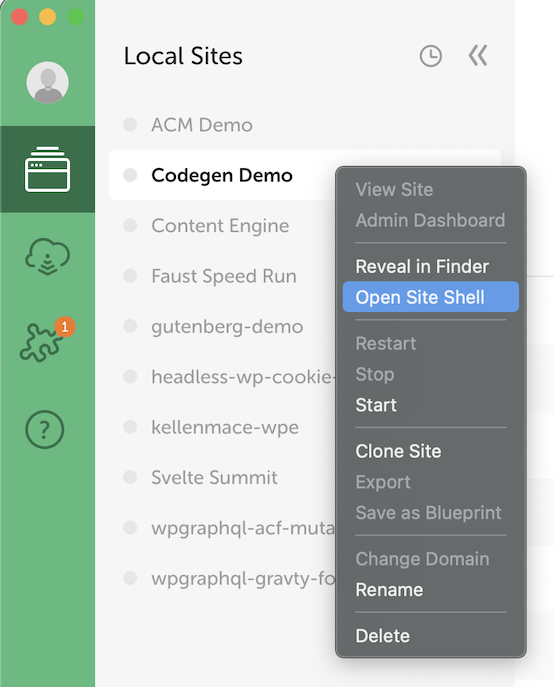

This page will guide you through configuring your local headless WordPress backend site for local development. Your frontend JavaScript application (which we set up on the [Frontend App Configuration](./frontend-app-config) page) will source its data from this WordPress site.

Depending on your existing development tools and needs, there are multiple ways to source data as you develop your site locally. WP Engine's [Local](https://localwp.com/) WordPress development environment offers existing WP Engine or Flywheel customers the most robust feature set, but we understand that Atlas users may have different tooling or wish to develop directly against their production WordPress instance. Below you can find a short summary of the various approaches to working with a local headless WordPress site:
1. [Connect Directly to the Remote WordPress Site](#connect-directly-to-remote-wordpress-site)
1. [Non-Local WordPress Development Environments](#local-alternatives)
1. [WP Engine's Local Development Environment](#local)

After you've decided on the method you will use to connect your local JavaScript app to a WordPress instance, you may need to [replace the WordPress URL in your environment variables file](#replace-wordpress-site-url) to finish the connection.

## Connect Directly to Remote WordPress Site

Technically speaking, you could run your frontend JavaScript application locally and connect it directly to a remote WordPress site hosted online rather than a local WordPress site. While this seems like the simplest approach, it is generally discouraged if your app will make changes to data or if other people will continue updating posts, pages, menus or other settings during development. Some developers may choose to pursue this option early in the development process, but they should be aware of possible side effects. 

If you choose this method, no local WordPress site setup is required.

## Local Alternatives

If you don't want to use Local, you can use an alternative such as [MAMP](https://www.mamp.info/en/mac/), [XAMPP](https://www.apachefriends.org/index.html) or [DesktopServer](https://serverpress.com/) and pull down your site using using [WP Migrate DB Pro](https://deliciousbrains.com/wp-migrate-db-pro/) or a similar tool.

If you choose this method, please follow the the documentation those products provide for getting set up for local WordPress site development and migrating a copy of your WordPress site to your local machine.

## Local

[Local](https://localwp.com/) is a free app for local WordPress site development, and its Local Connect feature allows you to easily pull down a WP Engine-hosted WordPress site to your local machine.

Here are the steps to follow:

1. Install [Local](https://localwp.com/) if you don't already have it on your computer.
1. Follow the [Local Connect documentation](https://localwp.com/help-docs/connect/local-connect/). Select WP Engine as the hosting provider you'd like to connect to and pull down the WordPress site associated with your Atlas app.

When finished, you should have a local version of the WordPress site set up.

See the [Local Help Docs](https://localwp.com/help-docs/) for further documentation on working with Local.

**NOTE:** There is a known issue using Local's SSL certificates on MacOS versions Monterey and Big Sur. If you are using one of those versions, you will need to [manually trust the certificates](https://localwp.com/help-docs/ssl/managing-local-sites-ssl-certificate-in-macos/) to use HTTPS.

### Password Reset

If you created your WordPress site from the [WP Engine User Portal](https://my.wpengine.com/), you may not know the password for your WordPress user account. You'll need that in order to log into the WordPress admin on your local machine. Here's how you can reset your password:

1. Make sure your site is up and running in Local.

2. Right-click on your site's name in the sidebar and click `Open site shell`.



Your command line app will open and a command will be executed to open an SSH connection to the local WordPress site. You should see output similar to this:

```
$ /Users/john.smith/Library/Application\ Support/Local/ssh-entry/WLLn7jJ4a.sh; exit
-n -e
Setting Local environment variables...
----
WP-CLI:   WP-CLI 2.5.0
Composer: 2.1.5 2021-07-23
PHP:      7.4.1
MySQL:    mysql  Ver 8.0.16 for macos10.14 on x86_64 (MySQL Community Server - GPL)
----
Launching shell: /bin/zsh ...
```

3. Run `wp user update john.smith@example.com --user_pass=password` on the command line, where `john.smith@example.com` is the email address for your WP Engine account and `password` is the new password you'd like to use to log into your local WordPress site.

If your password was updated successfully, you will see output similar to this on the command line:

```
Success: Updated user 1.
```

You should now be able to click the [`Admin` button](https://localwp.com/help-docs/local-features/using-one-click-admin/) in Local and log into the WordPress admin using the email address for your WP Engine account and the new password you set.


## Replace WordPress Site URL

One of your environment variables will be the URL of the WordPress site where the app sources its data. If you want the app to source its data from your local WordPress site instead, replace this value with the URL of your local WordPress site.

As an example, if your project has a `NEXT_PUBLIC_WORDPRESS_URL` environment variable and your local WordPress site URL is `http://my-site.local`, then that environment variable should be updated to `NEXT_PUBLIC_WORDPRESS_URL=http://my-site.local`.

When finished, save the environment variables file.

## Next Step

TODO: Check out additional guides
