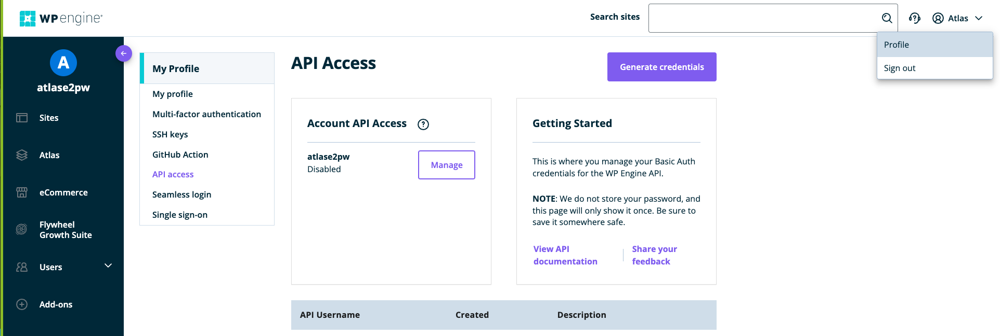
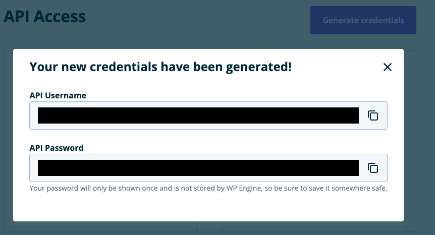

# Purpose
This functionality allows us to update code for an existing upload-enabled Atlas environment, from a local zip, without using `Atlas CLI` (still not possible with Portal). The target local repo must be zipped to upload.

# Prerequsites
In order to allow this functionality you must first create API access by generating auth credentials in User Portal - `Portal > Username dropdown > Profile > API access (tab) > Generate credentials`. The screenshots below walk you through what you will see. Next, copy the API credentials & ensure you have your target repo zipfile & CURL installed locally. Finally, you will need the target Portal Account Name, along with an existing App Name & Env Id (UUID).




# Running Zip Command in CURL
Run the following command, replacing the path capitals with your own values, to replace the existing Atlas environment with your new code. After this the app will rebuild automatically, so allow some time time for this to reflact your changes:

```bash
curl -X POST -H "Content-Type: multipart/form-data" -F "repository=@PATH-TO-FILE.zip" -u "PUT_API_USERNAME_HERE:PUT_API_PASSWORD_HERE" https://js.wpengineapi.com/fu/v1/accounts/{PUT_ACCOUNT_NAME_HERE}/apps/{PUT_APP_NAME_HERE}/environments/{PUT_ENVIRONMENT_UUID}:upload
```
The following is what the CURL command with populated credentials should look like:
```bash
curl -X POST -H "Content-Type: multipart/form-data" -F "repository=@express-simple-server-main.zip" -u "user_name:password" https://js.wpengineapi.com/fu/v1/accounts/wpengineaccount/apps/faust-app-001/environments/135788ee-e49f-0670-1a83-9c4eeede01f9:upload
```

###Notes:
CURL HTTP Response will give `200` status, but will not return a response body, if successful. If you would like more detail add the `-i` (include the HTTP response headers in the output) or `-v` (makes curl verbose during the operation) flag to the above CURL command. You can also check Portal to see the Atlas Environment rebuilding state.
