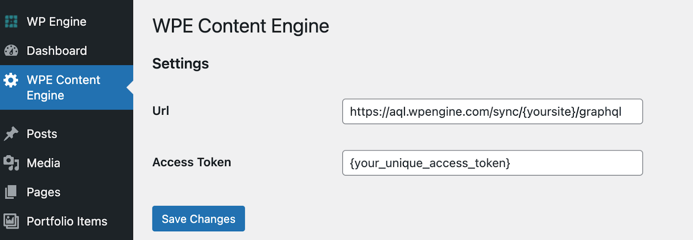
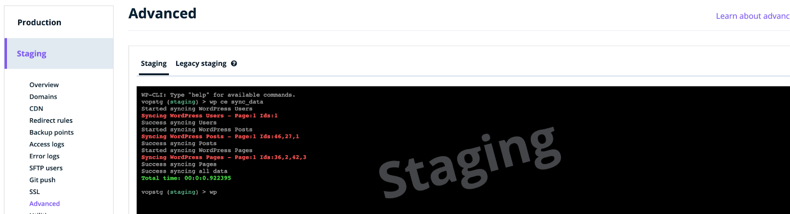
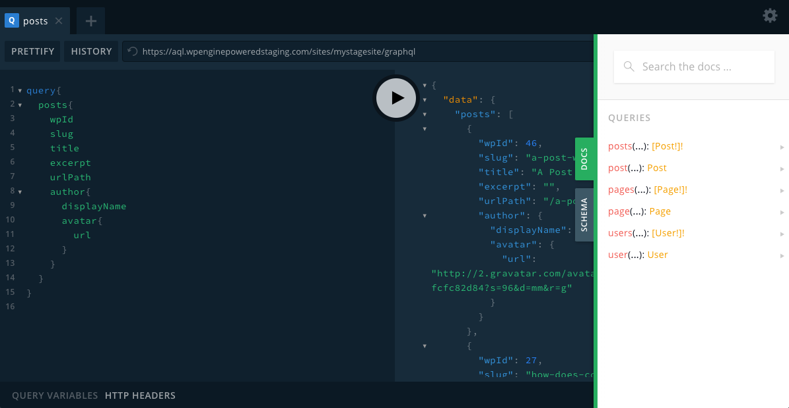

When using the WordPress API through WPGraphQL, pulling content from WordPress can be slow and cumbersome. Content Engine increases the speed from which your front-end applications retrieve WordPress content.

Content Engine offers the following benefits over WPGraphQL:

1. Content Engine uses a custom query language that’s faster than WPGraphQL
2. Content Engine provides a logical, easy-to-use schema for content retrieval

## Pre-requisites

1. A free-tier WP Engine account is required to use Content Engine. If you do not have an account, please reach out to ce-beta@wpengine.com.
2. A WordPress site with either posts, pages, or users.

When you enroll in testing Content Engine, you'll receive an email with:

- A PDF for getting started
- A zip file with the Content Engine plugin
- Your Atlas URL and Access Token

## Install the Content Engine plugin

Content Engine, like other WordPress customizations, uses a plugin to enable its use.

1. In your WordPress control panel, install the **Atlas Content Engine** plugin.
2. Install and activate the plugin on the WordPress instance you want to enable. After activation, **WPE Content Engine** appears in the side panel.
3. On the WPE Content Engine settings, set the following:
   - URL: https://aql.wpengine.com/sync/:site/graphql
   - Access Token: See the email sent to you during enrollment.



## Sync content for the first time

With Content Engine fully integrated into your WordPress instance, you can sync your data with WordPress CLI. Open a terminal on the WordPress instance and enter `wp ce sync_data`.



Content Engine then syncs users, posts, and pages. Upon completion, CLI returns a message `Success syncing all data`.

If you do not receive this message, ensure that your access token is set correctly and that the Content Engine plugin is installed.

With your data synced, you can begin to query your data with Atlas Query Language.

## Atlas Query Language

Atlas Query Language (AQL) provides an intuitive schema for modern javascript developers and can retrieve content with low latency and high throughput, ensuring maximization for a site's SEO and user experience.

## Use AQL

To begin querying data with AQL:

1. Navigate to your site's AQL URL, https://aql.wpengine.com/sites/:site/graphql. Replace `site:` with your site’s name.

2. Upon entering the endpoint, the GraphQL console appears. Use the following query to sync posts from your WordPress instance:

   ```text
   query {
       posts {
           wpID
           slug
           title
           excerpt
           urlPath
           author {
               displayName
               avatar {
                   url
               }
           }
       }
   }
   ```

3. Select the **Play** icon to begin querying. All post data will show in a JSON format, which includes all metadata related to each post.



## Available Content

Currently, Content Engine supports retrieval for the following:

- Posts
- Pages
- Users

As Content Engine matures, more WordPress content will become available. If you have suggestions for what type of content you would like to see, fill out this [feedback form](https://docs.google.com/forms/d/e/1FAIpQLSecvuZ_EMiTIOlTSwcW1JnPQcFbAcCOwGlhURkzBI8Ps9vFzA/viewform).

## Feedback

- **Questions?** Email us ce-beta@wpengine.com
- **Feedback**: Your feedback helps shape the future of Content Engine. To provide feedback, fill out our [Content Engine Feedback Form](https://docs.google.com/forms/d/e/1FAIpQLSecvuZ_EMiTIOlTSwcW1JnPQcFbAcCOwGlhURkzBI8Ps9vFzA/viewform).
