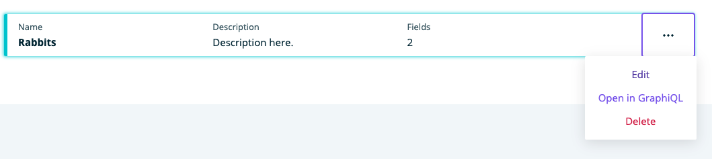
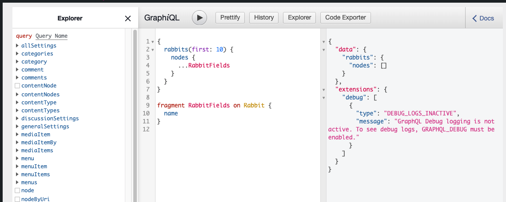

**Note**: GraphiQL is not an ACM specific plugin. It is used in conjunction with ACM. These tutorials assume that you have already [installed the plugin](../../introduction.mdx).

### Reference
---
1. [GraphiQL - NPM](https://www.npmjs.com/package/graphiql)

## GraphiQL

GraphiQL is a plugin that allows you to run queries and has many other features.

### Use GraphiQL with Models
---
1. Click on Content Modeler in the WordPress side menu

    

1. If it's not on Models, click Models under Content Modeler in the WordPress side menu

1. A model is required to use GraphiQL, if you don't have one, you will have to [Create a Model](../models/create.mdx) first

1. Click on the triple dot menu next to a model and click **Open in GraphiQL** 

    

1. You will be taken to the GraphiQL screen for the chosen model

    

1. For directions on how to use GraphiQL, go to [GraphiQL](https://www.npmjs.com/package/graphiql)

## Feedback
---
- **Questions?** Email us ce-beta@wpengine.com
- **Feedback**: Your feedback helps shape the future of Content Engine. To provide feedback, fill out our [Content Engine Feedback Form](https://docs.google.com/forms/d/e/1FAIpQLSecvuZ_EMiTIOlTSwcW1JnPQcFbAcCOwGlhURkzBI8Ps9vFzA/viewform).
